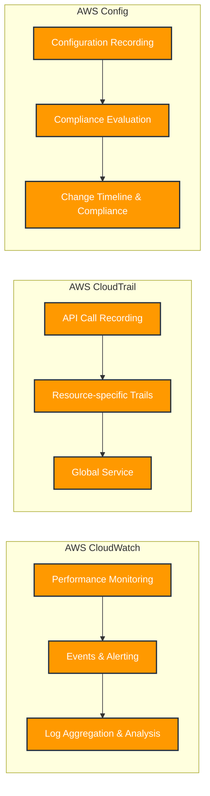
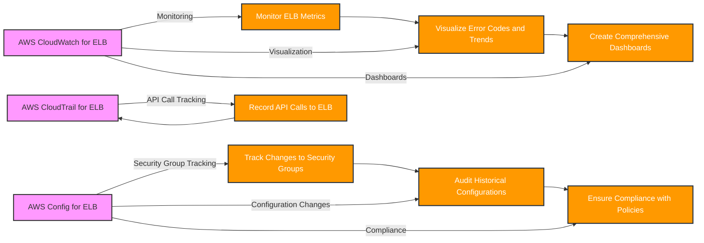

# Comparison AWS CloudWatch, CloudTrail, and Config.

```mermaid
graph LR
    subgraph AWS CloudWatch
        A[Performance Monitoring]
        B[Events & Alerting]
        C[Log Aggregation & Analysis]
    end

    subgraph AWS CloudTrail
        D[API Call Recording]
        E[Resource-specific Trails]
        F[Global Service]
    end

    subgraph AWS Config
        G[Configuration Recording]
        H[Compliance Evaluation]
        I[Change Timeline & Compliance]
    end

    classDef defaultStyle fill:#f9f,stroke:#333,stroke-width:2px;
    classDef aws fill:#FF9900,color:#fff,stroke:#232F3E,stroke-width:2px;
    class A,B,C,D,E,F,G,H,I defaultStyle;
    class A,B,C,D,E,F,G,H,I aws;

    A --> B --> C
    D --> E --> F
    G --> H --> I


```

```mermaid
graph LR
A[AWS CloudWatch for ELB] -->|Monitoring| B[Monitor ELB Metrics]
A -->|Visualization| C[Visualize Error Codes and Trends]
A -->|Dashboards| D[Create Comprehensive Dashboards]

    E[AWS Config for ELB] -->|Security Group Tracking| F[Track Changes to Security Groups]
    E -->|Configuration Changes| G[Audit Historical Configurations]
    E -->|Compliance| H[Ensure Compliance with Policies]

    I[AWS CloudTrail for ELB] -->|API Call Tracking| J[Record API Calls to ELB]

    classDef defaultStyle fill:#f9f,stroke:#333,stroke-width:2px;
    classDef aws fill:#FF9900,color:#fff,stroke:#232F3E,stroke-width:2px;
    class A,E,I defaultStyle;
    class B,C,D,F,G,H,J aws;

    B --> C --> D
    F --> G --> H
    J --> I
```