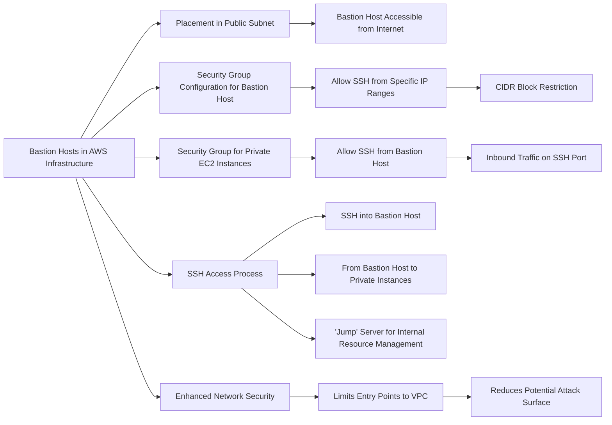

# Bastion Host

```mermaid
graph LR
    A[Bastion Hosts in AWS Infrastructure] --> B[Placement in Public Subnet]
    A --> C[Security Group Configuration for Bastion Host]
    A --> D[Security Group for Private EC2 Instances]
    A --> E[SSH Access Process]

    B --> F[Bastion Host Accessible from Internet]

    C --> G[Allow SSH from Specific IP Ranges]
    G --> H[CIDR Block Restriction]

    D --> I[Allow SSH from Bastion Host]
    I --> J[Inbound Traffic on SSH Port]

    E --> K[SSH into Bastion Host]
    E --> L[From Bastion Host to Private Instances]
    E --> M['Jump' Server for Internal Resource Management]

    A --> N[Enhanced Network Security]
    N --> O[Limits Entry Points to VPC]
    O --> P[Reduces Potential Attack Surface]


```
