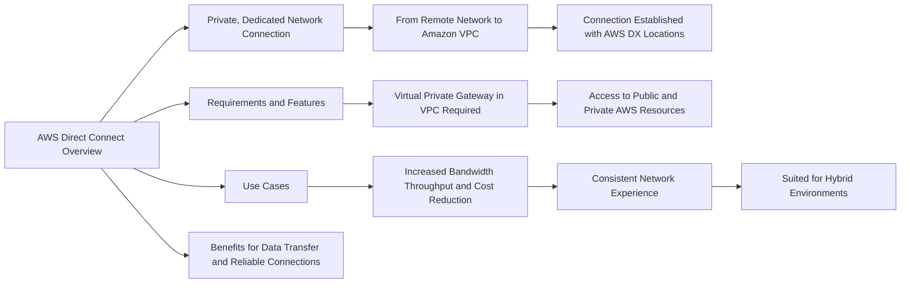
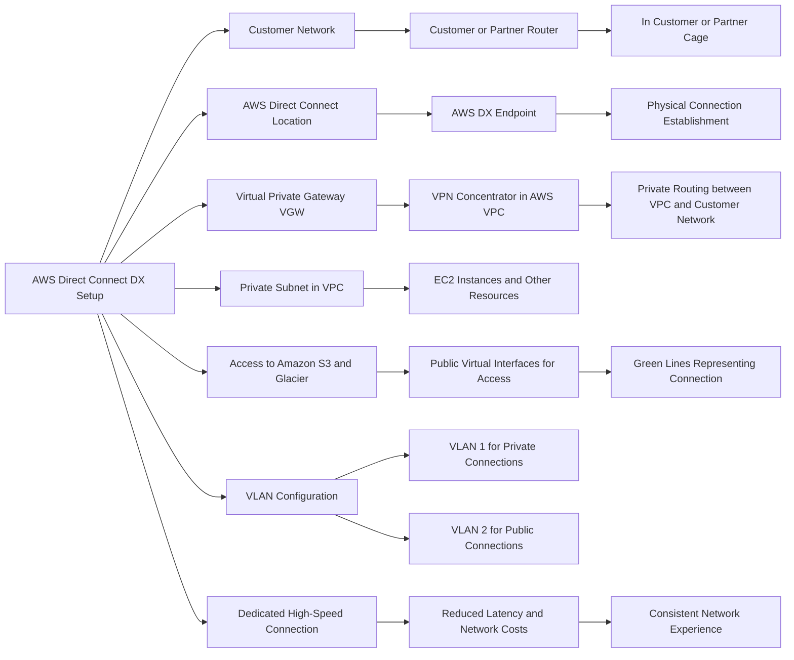
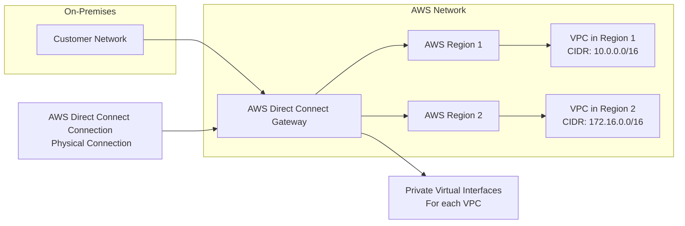
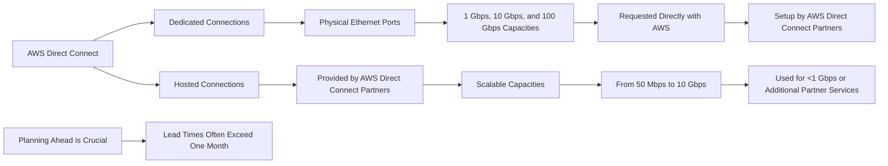
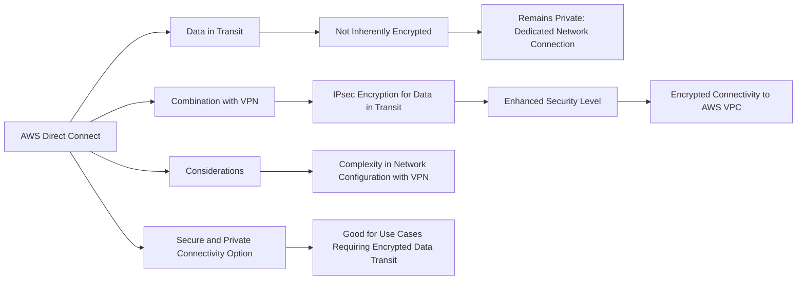
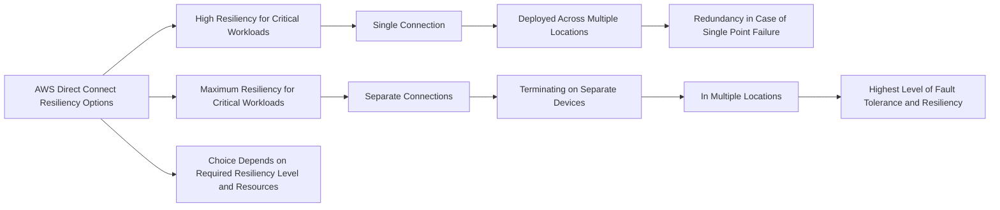
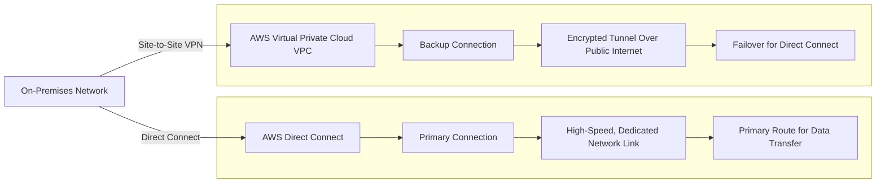

# Site to site VPN

```mermaid
graph LR
    A[AWS Direct Connect Overview] --> B[Private, Dedicated Network Connection]
    A --> C[Requirements and Features]
    A --> D[Use Cases]

    B --> E[From Remote Network to Amazon VPC]
    E --> F[Connection Established with AWS DX Locations]

    C --> G[Virtual Private Gateway in VPC Required]
    G --> H[Access to Public and Private AWS Resources]

    D --> I[Increased Bandwidth Throughput and Cost Reduction]
    I --> J[Consistent Network Experience]
    J --> K[Suited for Hybrid Environments]

    A --> L[Benefits for Data Transfer and Reliable Connections]

```

```mermaid
graph LR
    A[AWS Direct Connect DX Setup] --> B[Customer Network]
    A --> C[AWS Direct Connect Location]
    A --> D[Virtual Private Gateway VGW]
    A --> E[Private Subnet in VPC]
    A --> F[Access to Amazon S3 and Glacier]
    A --> G[VLAN Configuration]

    B --> H[Customer or Partner Router]
    H --> I[In Customer or Partner Cage]

    C --> J[AWS DX Endpoint]
    J --> K[Physical Connection Establishment]

    D --> L[VPN Concentrator in AWS VPC]
    L --> M[Private Routing between VPC and Customer Network]

    E --> N[EC2 Instances and Other Resources]

    F --> O[Public Virtual Interfaces for Access]
    O --> P[Green Lines Representing Connection]

    G --> Q[VLAN 1 for Private Connections]
    G --> R[VLAN 2 for Public Connections]

    A --> S[Dedicated High-Speed Connection]
    S --> T[Reduced Latency and Network Costs]
    T --> U[Consistent Network Experience]

```

```mermaid
graph LR
    A[AWS Direct Connect Gateway] --> B[AWS Region 1]
    A --> C[AWS Region 2]
    B --> D[VPC in Region 1<br> CIDR: 10.0.0.0/16]
    C --> E[VPC in Region 2<br> CIDR: 172.16.0.0/16]
    A --> F[Private Virtual Interfaces<br> For each VPC ]
    G[Customer Network] --> A
    H[AWS Direct Connect Connection<br> Physical Connection] --> A

    subgraph On-Premises
    G
    end

    subgraph AWS Network
    A
    B
    C
    D
    E
    end

```

```mermaid
graph LR
    A[AWS Direct Connect] --> B[Dedicated Connections]
    A --> C[Hosted Connections]

    B --> D[Physical Ethernet Ports]
    D --> E[1 Gbps, 10 Gbps, and 100 Gbps Capacities]
    E --> F[Requested Directly with AWS]
    F --> G[Setup by AWS Direct Connect Partners]

    C --> H[Provided by AWS Direct Connect Partners]
    H --> I[Scalable Capacities]
    I --> J[From 50 Mbps to 10 Gbps]
    J --> K[Used for <1 Gbps or Additional Partner Services]

    L[Planning Ahead is Crucial] --> M[Lead Times Often Exceed One Month]

```

```mermaid
graph LR
    A[AWS Direct Connect] --> B[Data in Transit]
    B --> C[Not Inherently Encrypted]
    C --> D[Remains Private: Dedicated Network Connection]

    A --> E[Combination with VPN]
    E --> F[IPsec Encryption for Data in Transit]
    F --> G[Enhanced Security Level]
    G --> H[Encrypted Connectivity to AWS VPC]

    A --> I[Considerations]
    I --> J[Complexity in Network Configuration with VPN]

    A --> K[Secure and Private Connectivity Option]
    K --> L[Good for Use Cases Requiring Encrypted Data Transit]


```

```mermaid
graph LR
    A[AWS Direct Connect Resiliency Options] --> B[High Resiliency for Critical Workloads]
    A --> C[Maximum Resiliency for Critical Workloads]

    B --> D[Single Connection]
    D --> E[Deployed Across Multiple Locations]
    E --> F[Redundancy in Case of Single Point Failure]

    C --> G[Separate Connections]
    G --> H[Terminating on Separate Devices]
    H --> I[In Multiple Locations]
    I --> J[Highest Level of Fault Tolerance and Resiliency]

    A --> K[Choice Depends on Required Resiliency Level and Resources]

```

```mermaid
graph LR
    A[On-Premises Network] -->|Direct Connect| B[AWS Direct Connect]
    A -->|Site-to-Site VPN| C[AWS Virtual Private Cloud VPC]
    B --> D[Primary Connection]
    C --> E[Backup Connection]
    
    D --> F[High-Speed, Dedicated Network Link]
    E --> G[Encrypted Tunnel Over Public Internet]

    F --> H[Primary Route for Data Transfer]
    G --> I[Failover for Direct Connect]

    subgraph " "
    B
    D
    F
    H
    end

    subgraph " "
    C
    E
    G
    I
    end

```