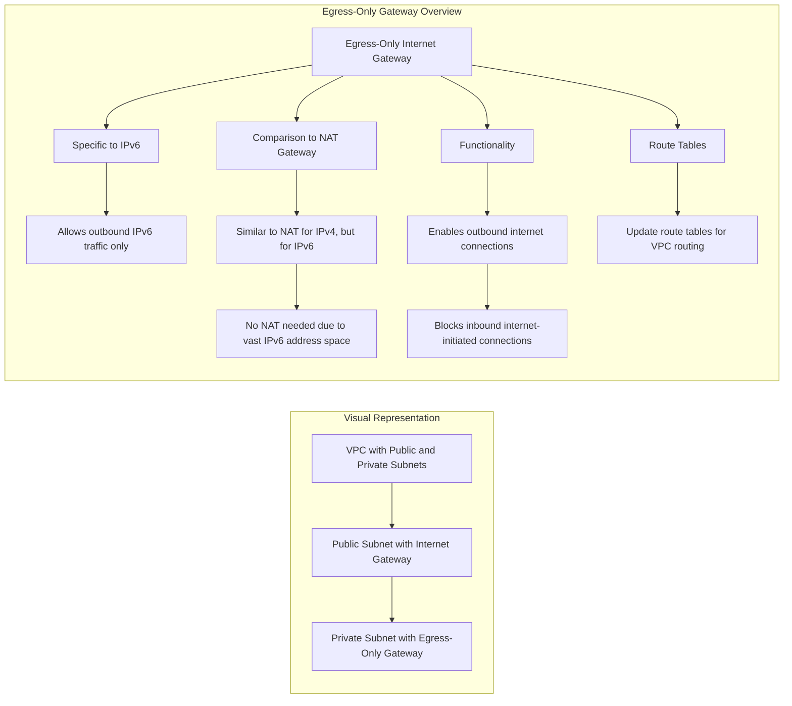
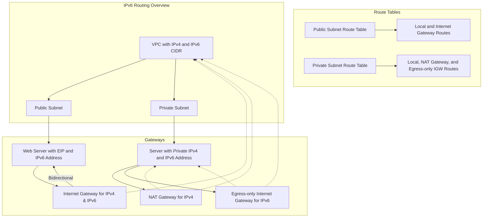

# Egress-Only Internet Gateway

```mermaid
graph LR
    A[Egress-Only Internet Gateway] --> B[Specific to IPv6]
    B --> C[Allows outbound IPv6 traffic only]

    A --> D[Comparison to NAT Gateway]
    D --> E[Similar to NAT for IPv4, but for IPv6]
    E --> F[No NAT needed due to vast IPv6 address space]

    A --> G[Functionality]
    G --> H[Enables outbound internet connections]
    H --> I[Blocks inbound internet-initiated connections]

    A --> J[Route Tables]
    J --> K[Update route tables for VPC routing]

    subgraph "Visual Representation"
        L[VPC with Public and Private Subnets] --> M[Public Subnet with Internet Gateway]
        M --> N[Private Subnet with Egress-Only Gateway]
    end

    subgraph "Egress-Only Gateway Overview"
        A
        B
        C
        D
        E
        F
        G
        H
        I
        J
        K
    end


```

```mermaid
graph TB
    A[VPC with IPv4 and IPv6 CIDR] --> B[Public Subnet]
    A --> C[Private Subnet]

    B --> D[Web Server with EIP and IPv6 Address]
    C --> E[Server with Private IPv4 and IPv6 Address]

    subgraph "Gateways"
    F[NAT Gateway for IPv4] -.-> E
    G[Internet Gateway for IPv4 & IPv6] -- Bidirectional --> D
    H[Egress-only Internet Gateway for IPv6] -.-> E
    end

    subgraph "Route Tables"
    I[Public Subnet Route Table] --> J[Local and Internet Gateway Routes]
    K[Private Subnet Route Table] --> L[Local, NAT Gateway, and Egress-only IGW Routes]
    end

    D --> G
    E --> F
    E --> H
    G -.-> A
    F -.-> A
    H -.-> A

    subgraph "IPv6 Routing Overview"
    A
    B
    C
    D
    E
    F
    G
    H
    I
    J
    K
    L
    end

```
