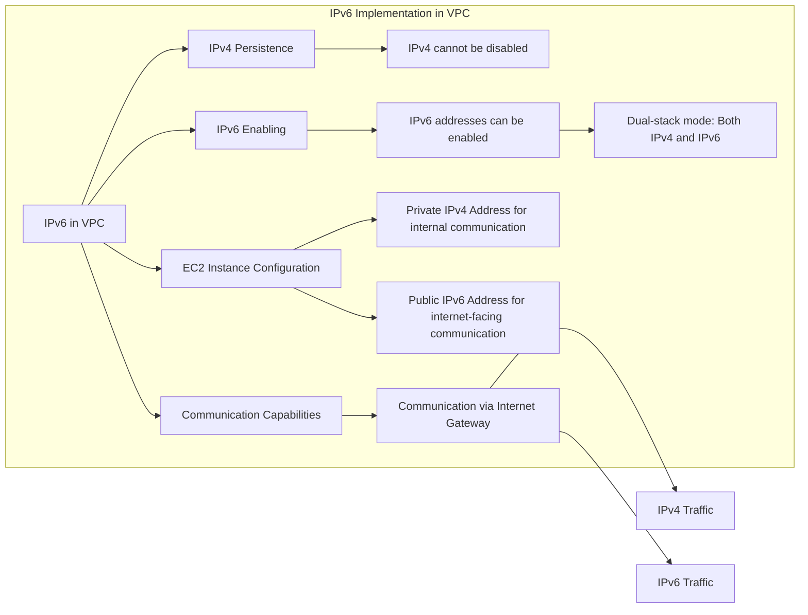
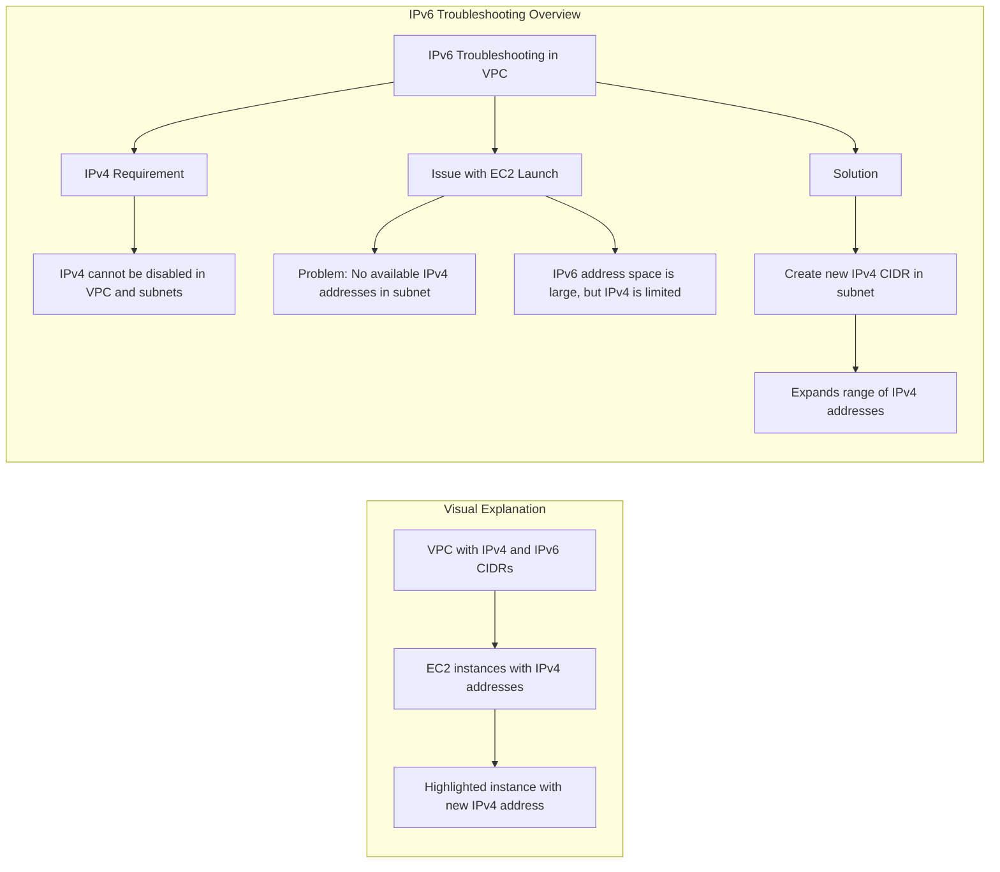

# IPv6

```mermaid
graph LR
    A[IPv6 in VPC] --> B[IPv4 Persistence]
    B --> C[IPv4 cannot be disabled]

    A --> D[IPv6 Enabling]
    D --> E[IPv6 addresses can be enabled]
    E --> F[Dual-stack mode: Both IPv4 and IPv6]

    A --> G[EC2 Instance Configuration]
    G --> H[Private IPv4 Address for internal communication]
    G --> I[Public IPv6 Address for internet-facing communication]

    A --> J[Communication Capabilities]
    J --> K[Communication via Internet Gateway]
    K --> L1[IPv4 Traffic]
    K --> L2[IPv6 Traffic]

    subgraph "IPv6 Implementation in VPC"
        A
        B
        C
        D
        E
        F
        G
        H
        I
        J
        K
    end

```

```mermaid
graph LR
    A[IPv6 Troubleshooting in VPC] --> B[IPv4 Requirement]
    B --> C[IPv4 cannot be disabled in VPC and subnets]

    A --> D[Issue with EC2 Launch]
    D --> E[Problem: No available IPv4 addresses in subnet]
    D --> F[IPv6 address space is large, but IPv4 is limited]

    A --> G[Solution]
    G --> H[Create new IPv4 CIDR in subnet]
    H --> I[Expands range of IPv4 addresses]

    subgraph "Visual Explanation"
    J[VPC with IPv4 and IPv6 CIDRs] --> K[EC2 instances with IPv4 addresses]
    K --> L[Highlighted instance with new IPv4 address]
    end

    subgraph "IPv6 Troubleshooting Overview"
    A
    B
    C
    D
    E
    F
    G
    H
    I
    end

```
