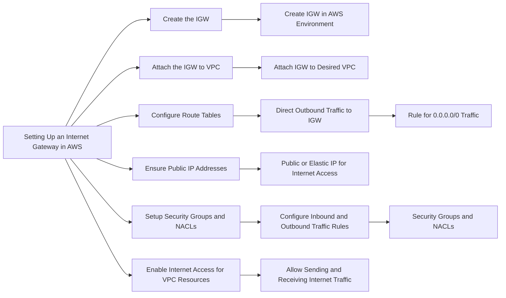

# Internet Gateway 

```mermaid
graph LR
    A[Setting Up an Internet Gateway in AWS] --> B[Create the IGW]
    A --> C[Attach the IGW to VPC]
    A --> D[Configure Route Tables]
    A --> E[Ensure Public IP Addresses]
    A --> F[Setup Security Groups and NACLs]

    B --> G[Create IGW in AWS Environment]

    C --> H[Attach IGW to Desired VPC]

    D --> I[Direct Outbound Traffic to IGW]
    I --> J[Rule for 0.0.0.0/0 Traffic]

    E --> K[Public or Elastic IP for Internet Access]

    F --> L[Configure Inbound and Outbound Traffic Rules]
    L --> M[Security Groups and NACLs]

    A --> N[Enable Internet Access for VPC Resources]
    N --> O[Allow Sending and Receiving Internet Traffic]

```
