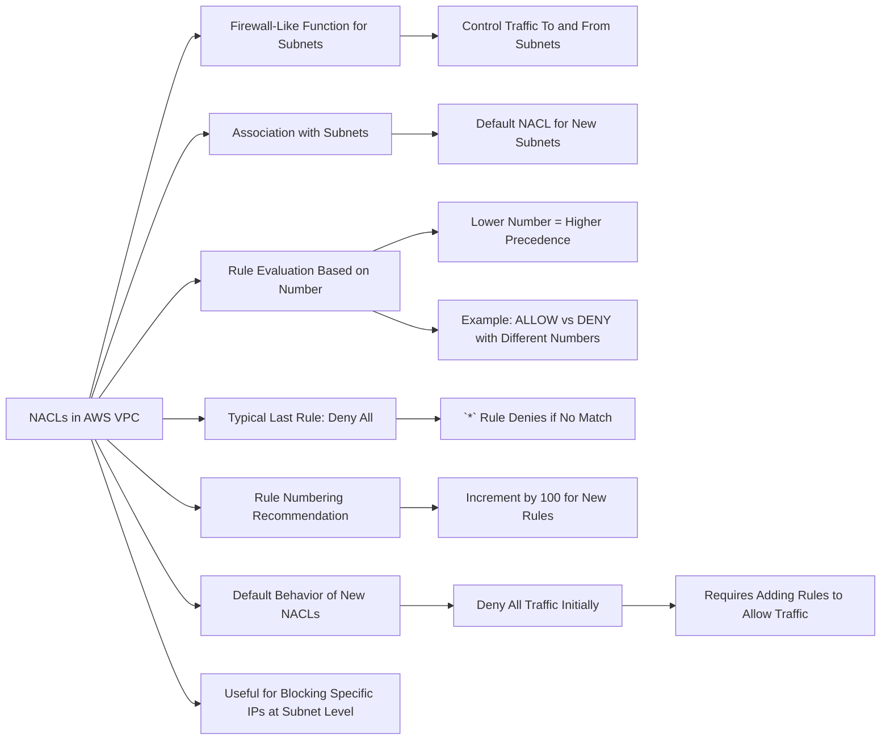
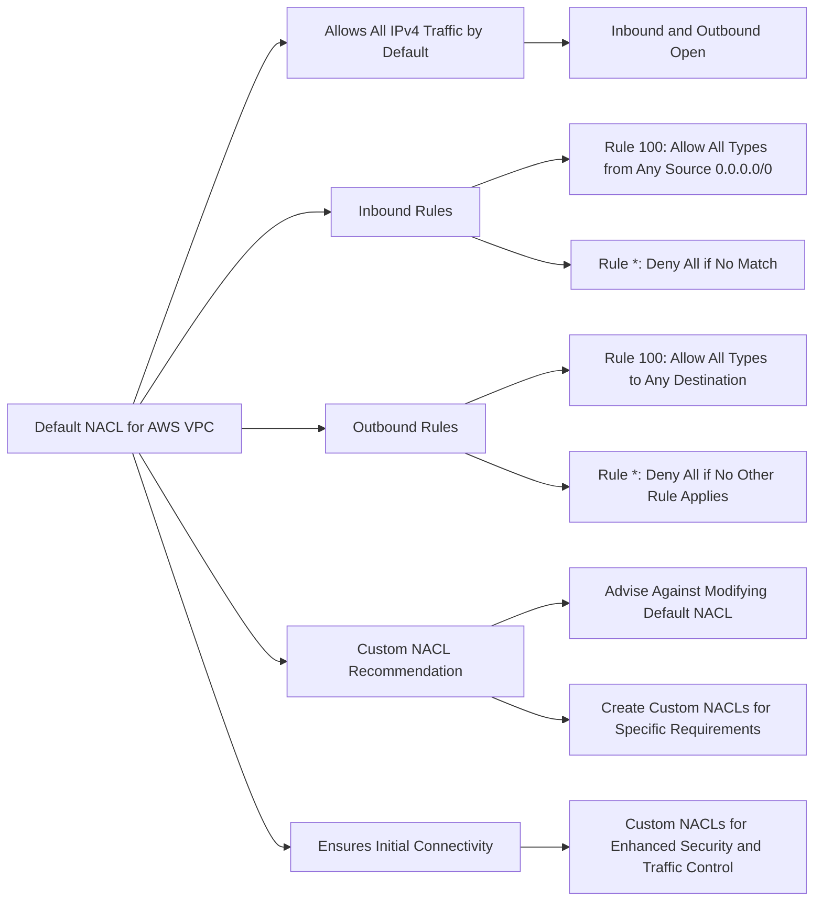
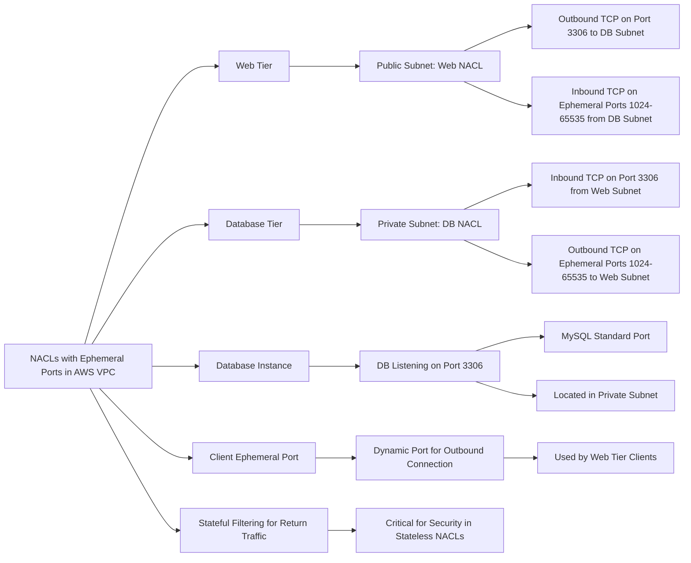

# NACL

# Security Group vs NACL Comparison

| Feature           | Security Group          | NACL                      |
|-------------------|-------------------------|---------------------------|
| Level of Operation| Instance level          | Subnet level              |
| Rule Support      | Allow rules only        | Allow and Deny rules      |
| State             | Stateful                | Stateless                 |
| Traffic Evaluation| All rules evaluated before decision | Rules evaluated in order, first match wins |
| Assignment        | Applies when specified by user | Automatically applies to all instances in subnet |

*Note: This table is created based on the details provided and should be verified with AWS documentation for accuracy.*
