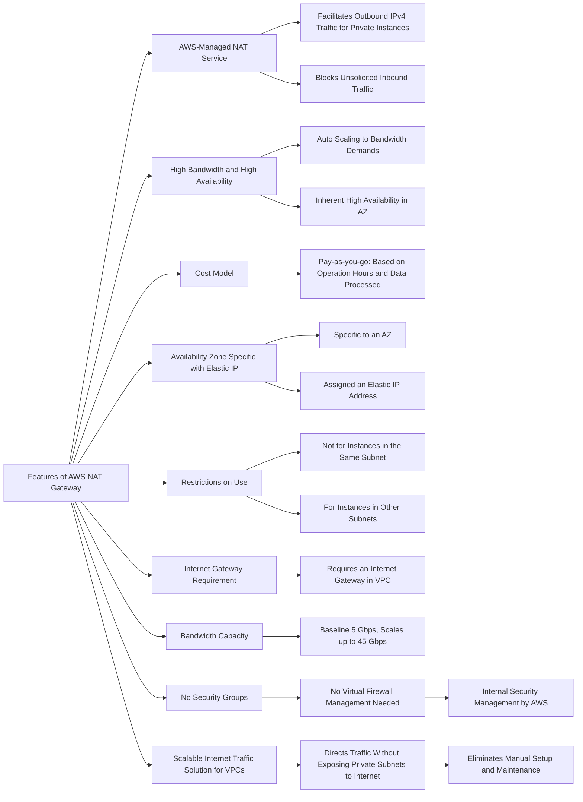
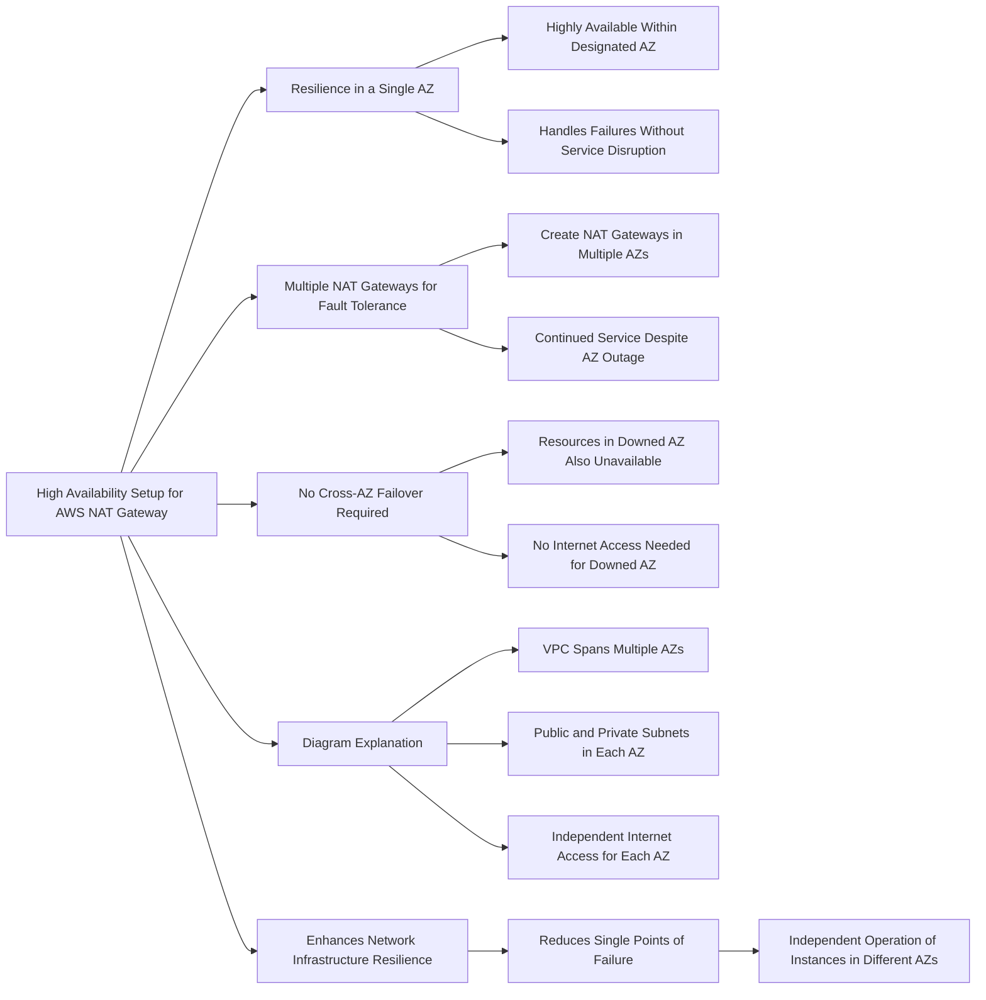

# NAT Gateway

| Feature              | NAT Gateway                      | NAT Instance                        |
|----------------------|----------------------------------|-------------------------------------|
| Availability         | Highly available within AZ       | Script managed failover             |
|                      | (create in another AZ for HA)    | between instances                   |
| Bandwidth            | Up to 45 Gbps                    | Depends on EC2 instance type        |
| Maintenance          | Managed by AWS                   | Managed by you (e.g., software,     |
|                      |                                  | OS patches, etc.)                   |
| Cost                 | Per hour & amount of data        | Per hour, EC2 instance type and     |
|                      | transferred                      | size, + network costs               |
| Public IPv4          | Yes                              | Yes                                 |
| Private IPv4         | Yes                              | Yes                                 |
| Security Groups      | No                               | Yes                                 |
| Use as Bastion Host? | No                               | Yes                                 |

