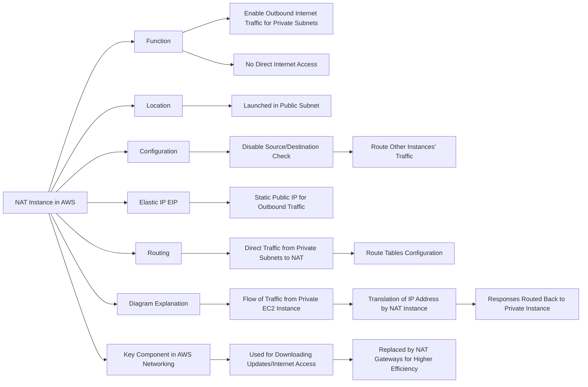
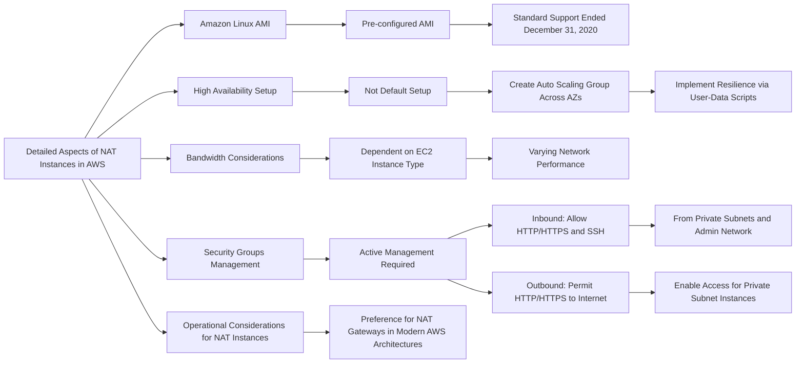

# NAT Instance

```mermaid
graph LR
    A[NAT Instance in AWS] --> B[Function]
    A --> C[Location]
    A --> D[Configuration]
    A --> E[Elastic IP EIP]
    A --> F[Routing]
    A --> G[Diagram Explanation]

    B --> H[Enable Outbound Internet Traffic for Private Subnets]
    B --> I[No Direct Internet Access]

    C --> J[Launched in Public Subnet]

    D --> K[Disable Source/Destination Check]
    K --> L[Route Other Instances' Traffic]

    E --> M[Static Public IP for Outbound Traffic]

    F --> N[Direct Traffic from Private Subnets to NAT]
    N --> O[Route Tables Configuration]

    G --> P[Flow of Traffic from Private EC2 Instance]
    P --> Q[Translation of IP Address by NAT Instance]
    Q --> R[Responses Routed Back to Private Instance]

    A --> S[Key Component in AWS Networking]
    S --> T[Used for Downloading Updates/Internet Access]
    T --> U[Replaced by NAT Gateways for Higher Efficiency]

```

```mermaid
graph LR
    A[Detailed Aspects of NAT Instances in AWS] --> B[Amazon Linux AMI]
    A --> C[High Availability Setup]
    A --> D[Bandwidth Considerations]
    A --> E[Security Groups Management]

    B --> F[Pre-configured AMI]
    F --> G[Standard Support Ended December 31, 2020]

    C --> H[Not Default Setup]
    H --> I[Create Auto Scaling Group Across AZs]
    I --> J[Implement Resilience via User-Data Scripts]

    D --> K[Dependent on EC2 Instance Type]
    K --> L[Varying Network Performance]

    E --> M[Active Management Required]
    M --> N[Inbound: Allow HTTP/HTTPS and SSH]
    N --> O[From Private Subnets and Admin Network]
    M --> P[Outbound: Permit HTTP/HTTPS to Internet]
    P --> Q[Enable Access for Private Subnet Instances]

    A --> R[Operational Considerations for NAT Instances]
    R --> S[Preference for NAT Gateways in Modern AWS Architectures]


```
