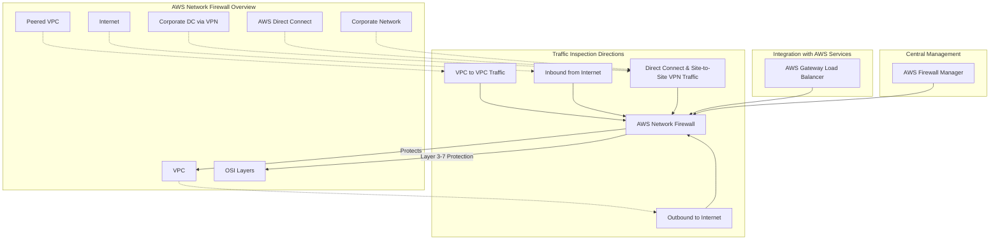

# Network Firewall

```mermaid
graph TB
    A[AWS Network Firewall] -->|Protects| B[VPC]
    A -->|Layer 3-7 Protection| C[OSI Layers]

    subgraph "Traffic Inspection Directions"
        D[VPC to VPC Traffic] --> A
        E[Outbound to Internet] --> A
        F[Inbound from Internet] --> A
        G[Direct Connect & Site-to-Site VPN Traffic] --> A
    end

    subgraph "Integration with AWS Services"
        H[AWS Gateway Load Balancer] --> A
    end

    subgraph "Central Management"
        I[AWS Firewall Manager] --> A
    end

    J[Internet] -.-> F
    B -.-> E
    K[Peered VPC] -.-> D
    L[Corporate DC via VPN] -.-> G
    M[AWS Direct Connect] -.-> G
    N[Corporate Network] -.-> G

    subgraph "AWS Network Firewall Overview"
        A
        B
        C
        D
        E
        F
        G
        H
        I
        J
        K
        L
        M
        N
    end


```
