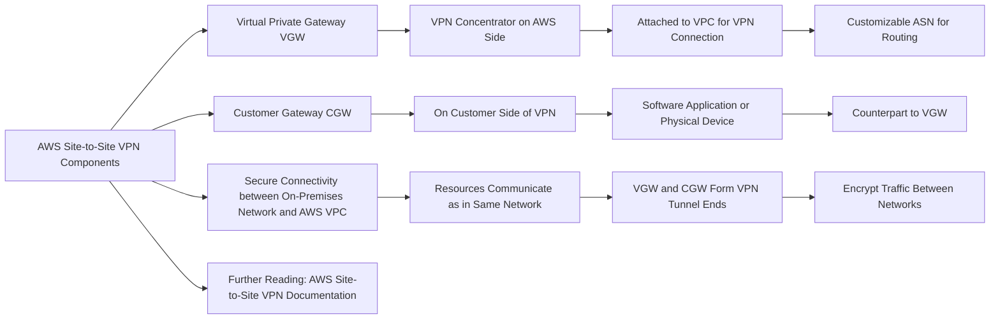
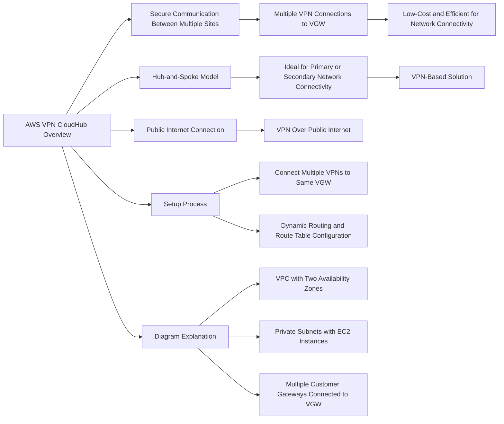

# Site to site VPN

```mermaid
graph LR
    A[AWS Site-to-Site VPN Components] --> B[Virtual Private Gateway VGW]
A --> C[Customer Gateway CGW]

B --> D[VPN Concentrator on AWS Side]
D --> E[Attached to VPC for VPN Connection]
E --> F[Customizable ASN for Routing]

C --> G[On Customer Side of VPN]
G --> H[Software Application or Physical Device]
H --> I[Counterpart to VGW]

A --> J[Secure Connectivity between On-Premises Network and AWS VPC]
J --> K[Resources Communicate as in Same Network]
K --> L[VGW and CGW Form VPN Tunnel Ends]
L --> M[Encrypt Traffic Between Networks]

A --> N[Further Reading: AWS Site-to-Site VPN Documentation]

```

```mermaid
graph LR
    A[AWS VPN CloudHub Overview] --> B[Secure Communication Between Multiple Sites]
    A --> C[Hub-and-Spoke Model]
    A --> D[Public Internet Connection]

    B --> E[Multiple VPN Connections to VGW]
    E --> F[Low-Cost and Efficient for Network Connectivity]

    C --> G[Ideal for Primary or Secondary Network Connectivity]
    G --> H[VPN-Based Solution]

    D --> I[VPN Over Public Internet]

    A --> J[Setup Process]
    J --> K[Connect Multiple VPNs to Same VGW]
    J --> L[Dynamic Routing and Route Table Configuration]

    A --> M[Diagram Explanation]
    M --> N[VPC with Two Availability Zones]
    M --> O[Private Subnets with EC2 Instances]
    M --> P[Multiple Customer Gateways Connected to VGW]

```
