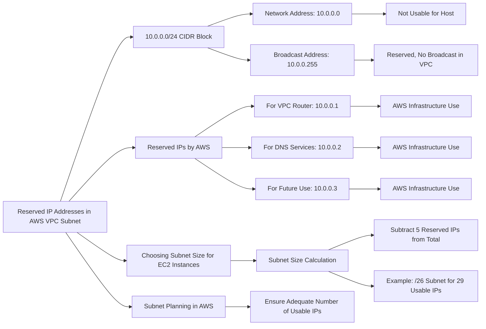
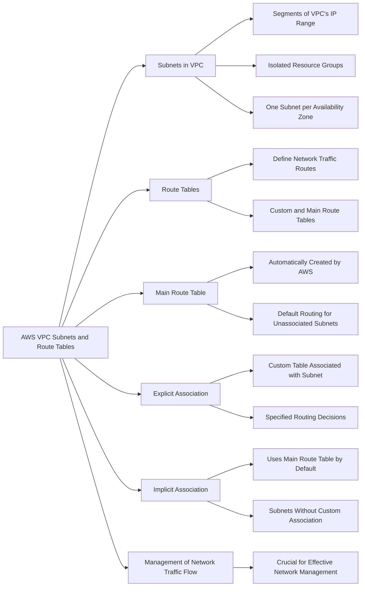

# Subnet 

```mermaid
graph LR
    A[Reserved IP Addresses in AWS VPC Subnet] --> B[10.0.0.0/24 CIDR Block]
    A --> C[Reserved IPs by AWS]
    A --> D[Choosing Subnet Size for EC2 Instances]

    B --> E[Network Address: 10.0.0.0]
    B --> F[Broadcast Address: 10.0.0.255]

    C --> G[For VPC Router: 10.0.0.1]
    C --> H[For DNS Services: 10.0.0.2]
    C --> I[For Future Use: 10.0.0.3]

    D --> J[Subnet Size Calculation]
    J --> K[Subtract 5 Reserved IPs from Total]
    J --> L[Example: /26 Subnet for 29 Usable IPs]

    E --> M[Not Usable for Host]
    F --> N[Reserved, No Broadcast in VPC]
    G --> O[AWS Infrastructure Use]
    H --> P[AWS Infrastructure Use]
    I --> Q[AWS Infrastructure Use]

    A --> R[Subnet Planning in AWS]
    R --> S[Ensure Adequate Number of Usable IPs]

```

```mermaid
graph LR
    A[AWS VPC Subnets and Route Tables] --> B[Subnets in VPC]
    A --> C[Route Tables]
    A --> D[Main Route Table]
    A --> E[Explicit Association]
    A --> F[Implicit Association]

    B --> G[Segments of VPC's IP Range]
    B --> H[Isolated Resource Groups]
    B --> I[One Subnet per Availability Zone]

    C --> J[Define Network Traffic Routes]
    C --> K[Custom and Main Route Tables]

    D --> L[Automatically Created by AWS]
    D --> M[Default Routing for Unassociated Subnets]

    E --> N[Custom Table Associated with Subnet]
    E --> O[Specified Routing Decisions]

    F --> P[Uses Main Route Table by Default]
    F --> Q[Subnets Without Custom Association]

    A --> R[Management of Network Traffic Flow]
    R --> S[Crucial for Effective Network Management]

```