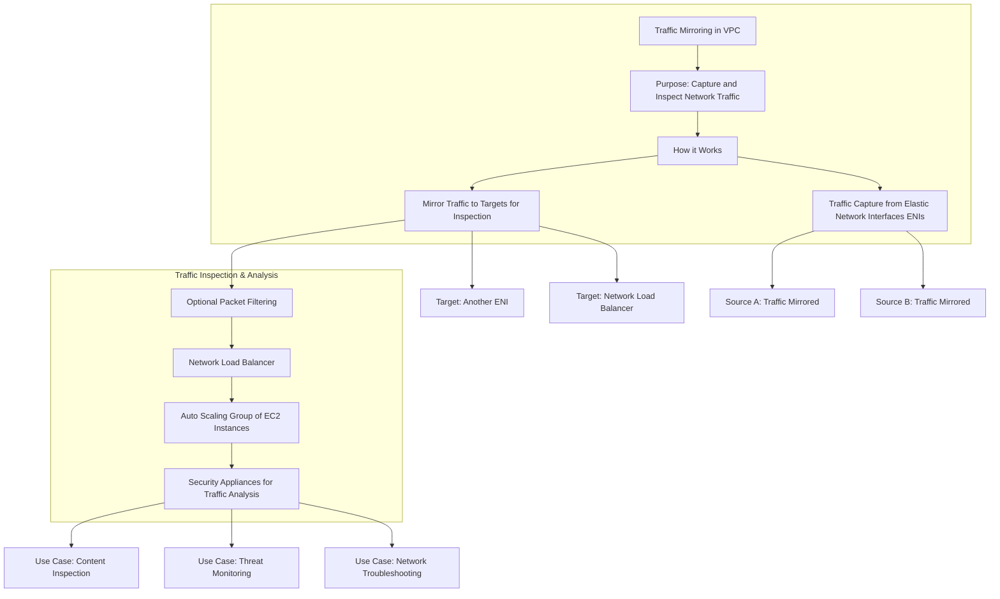

# Traffic Mirroring

```mermaid
graph TD
    A[Traffic Mirroring in VPC] --> B[Purpose: Capture and Inspect Network Traffic]
    B --> C[How it Works]
    C --> D[Traffic Capture from Elastic Network Interfaces ENIs]
C --> E[Mirror Traffic to Targets for Inspection]

E --> F1[Target: Another ENI]
E --> F2[Target: Network Load Balancer]

D --> G1[Source A: Traffic Mirrored]
D --> G2[Source B: Traffic Mirrored]

E --> H[Optional Packet Filtering]
H --> I[Network Load Balancer]
I --> J[Auto Scaling Group of EC2 Instances]
J --> K[Security Appliances for Traffic Analysis]

K --> L1[Use Case: Content Inspection]
K --> L2[Use Case: Threat Monitoring]
K --> L3[Use Case: Network Troubleshooting]

subgraph " "
A
B
C
D
E
end

subgraph "Traffic Inspection & Analysis"
H
I
J
K
end

```
