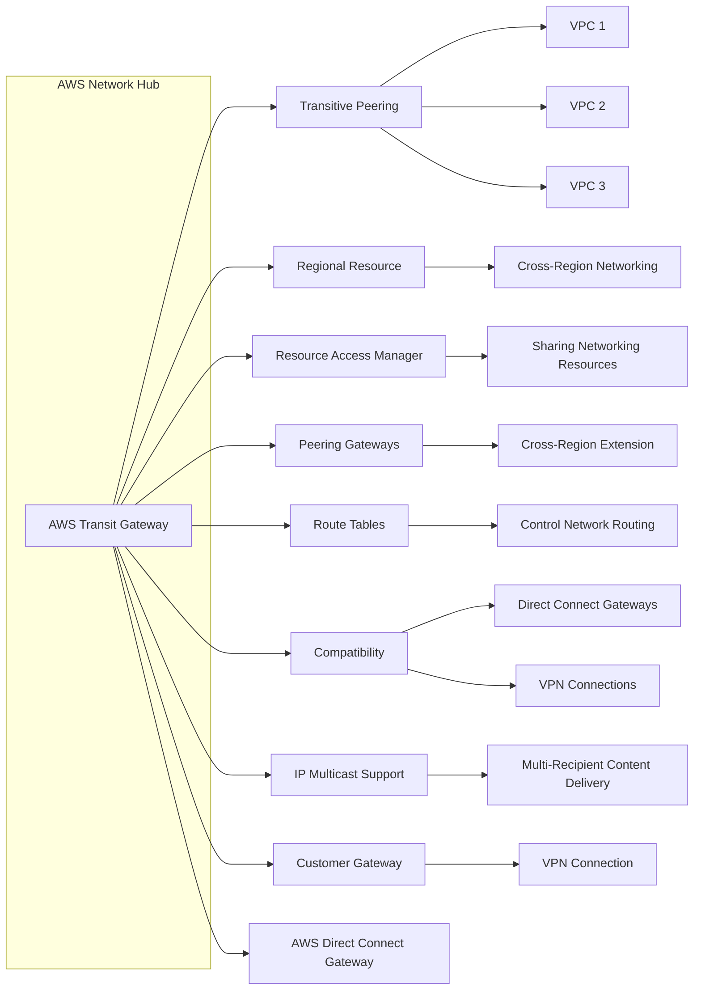
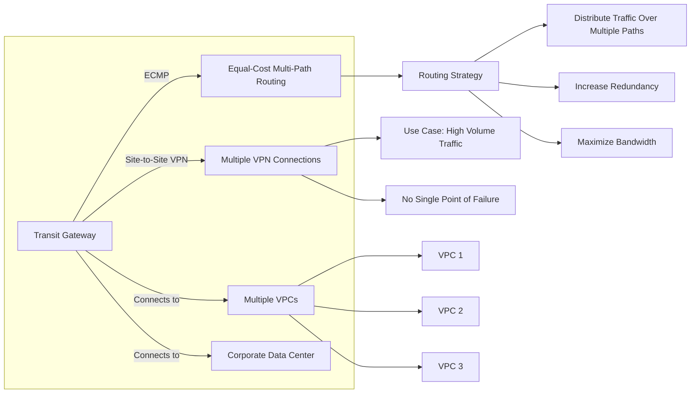
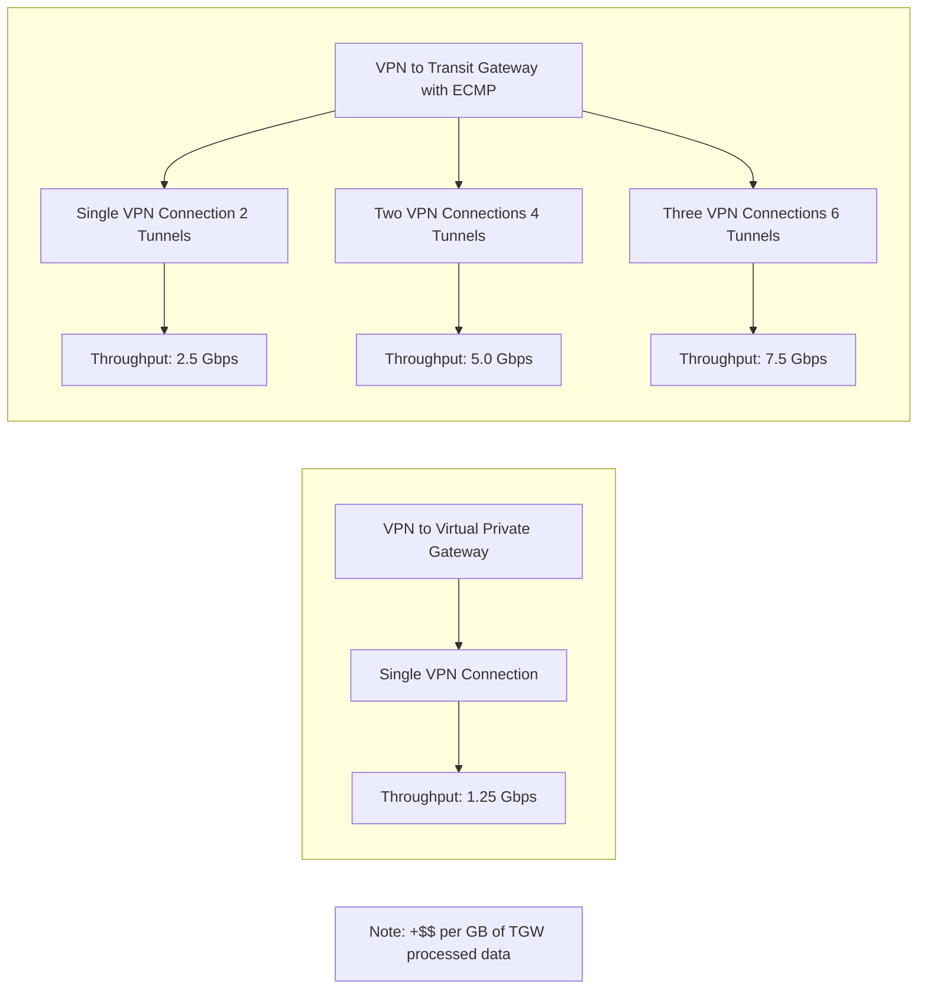
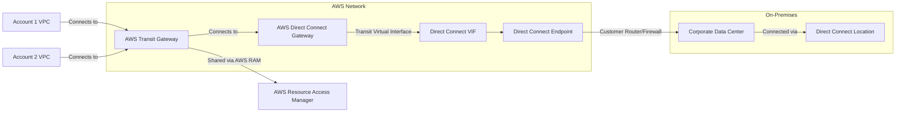

# Transit Gateway 

```mermaid
graph LR
    TG[AWS Transit Gateway] --> TP[Transitive Peering]
    TP --> VPC1[VPC 1]
    TP --> VPC2[VPC 2]
    TP --> VPC3[VPC 3]
    TG --> RR[Regional Resource]
    RR --> CRN[Cross-Region Networking]
    TG --> RAM[Resource Access Manager]
    RAM --> SN[Sharing Networking Resources]
    TG --> PG[Peering Gateways]
    PG --> CREG[Cross-Region Extension]
    TG --> RT[Route Tables]
    RT --> CNR[Control Network Routing]
    TG --> COMP[Compatibility]
    COMP --> DXG[Direct Connect Gateways]
    COMP --> VPN[VPN Connections]
    TG --> IM[IP Multicast Support]
    IM --> MC[Multi-Recipient Content Delivery]
    TG --> CG[Customer Gateway]
    CG --> VPN2[VPN Connection]
    TG --> DXG2[AWS Direct Connect Gateway]

    subgraph "AWS Network Hub"
        TG
    end


```

```mermaid
graph LR
    A[Transit Gateway] -->|ECMP| B[Equal-Cost Multi-Path Routing]
    B --> C[Routing Strategy]
    C --> D1[Distribute Traffic Over Multiple Paths]
    C --> D2[Increase Redundancy]
    C --> D3[Maximize Bandwidth]

    A -->|Site-to-Site VPN| E[Multiple VPN Connections]
    E --> F[Use Case: High Volume Traffic]
    E --> G[No Single Point of Failure]

    A -->|Connects to| H[Multiple VPCs]
    H --> I[VPC 1]
    H --> J[VPC 2]
    H --> K[VPC 3]

    A -->|Connects to| L[Corporate Data Center]

    subgraph " "
    A
    B
    E
    H
    L
    end

```

```mermaid
graph LR
    A[VPN to Virtual Private Gateway] --> B[Single VPN Connection]
    B --> C[Throughput: 1.25 Gbps]

    D[VPN to Transit Gateway with ECMP] --> E[Single VPN Connection 2 Tunnels]
    E --> F[Throughput: 2.5 Gbps]
    D --> G[Two VPN Connections 4 Tunnels]
    G --> H[Throughput: 5.0 Gbps]
    D --> I[Three VPN Connections 6 Tunnels]
    I --> J[Throughput: 7.5 Gbps]

    K["Note: +$$ per GB of TGW processed data"]

    subgraph " "
    A
    B
    C
    end

    subgraph " "
    D
    E
    F
    G
    H
    I
    J
    end

```

```mermaid
graph LR
    A[Account 1 VPC] -->|Connects to| TG[AWS Transit Gateway]
    B[Account 2 VPC] -->|Connects to| TG
    TG -->|Connects to| DXGW[AWS Direct Connect Gateway]
    DXGW -->|Transit Virtual Interface| DVIF[Direct Connect VIF]
    DVIF --> DC[Direct Connect Endpoint]
    DC -->|Customer Router/Firewall| CDC[Corporate Data Center]
    CDC -->|Connected via| DX[Direct Connect Location]
    TG -->|Shared via AWS RAM| RAM[AWS Resource Access Manager]

    subgraph "AWS Network"
    TG
    DXGW
    DVIF
    DC
    end

    subgraph "On-Premises"
    CDC
    DX
    end

```