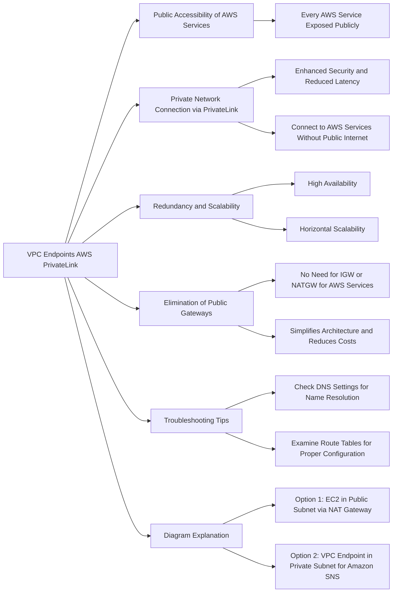
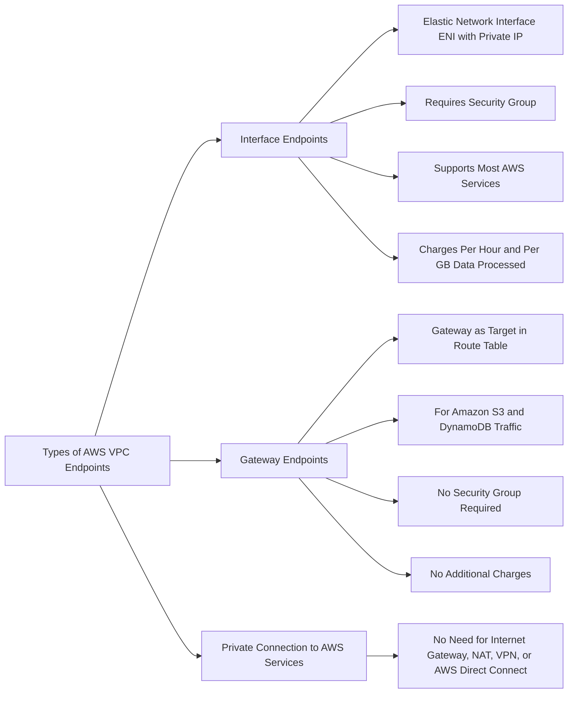
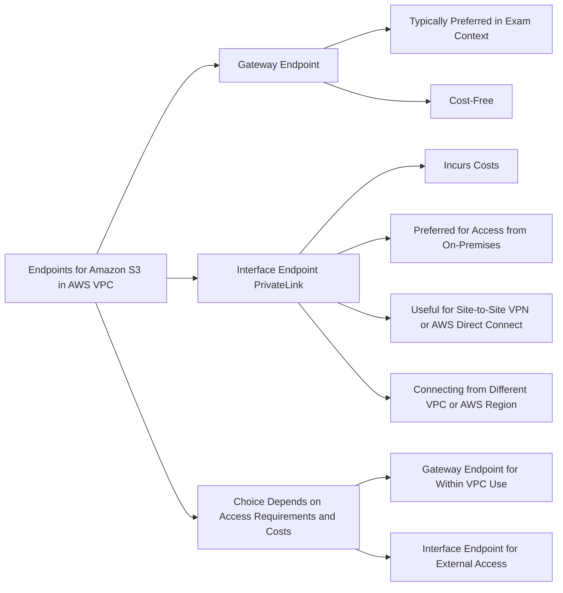

# VPC Endpoint

```mermaid
graph LR
    A[VPC Endpoints AWS PrivateLink] --> B[Public Accessibility of AWS Services]
    A --> C[Private Network Connection via PrivateLink]
    A --> D[Redundancy and Scalability]
    A --> E[Elimination of Public Gateways]
    A --> F[Troubleshooting Tips]

    B --> G[Every AWS Service Exposed Publicly]

    C --> H[Enhanced Security and Reduced Latency]
    C --> I[Connect to AWS Services Without Public Internet]

    D --> J[High Availability]
    D --> K[Horizontal Scalability]

    E --> L[No Need for IGW or NATGW for AWS Services]
    E --> M[Simplifies Architecture and Reduces Costs]

    F --> N[Check DNS Settings for Name Resolution]
    F --> O[Examine Route Tables for Proper Configuration]

    A --> P[Diagram Explanation]
    P --> Q[Option 1: EC2 in Public Subnet via NAT Gateway]
    P --> R[Option 2: VPC Endpoint in Private Subnet for Amazon SNS]

```

```mermaid
graph LR
    A[Types of AWS VPC Endpoints] --> B[Interface Endpoints]
    A --> C[Gateway Endpoints]

    B --> D[Elastic Network Interface ENI with Private IP]
    B --> E[Requires Security Group]
    B --> F[Supports Most AWS Services]
    B --> G[Charges Per Hour and Per GB Data Processed]

    C --> H[Gateway as Target in Route Table]
    C --> I[For Amazon S3 and DynamoDB Traffic]
    C --> J[No Security Group Required]
    C --> K[No Additional Charges]

    A --> L[Private Connection to AWS Services]
    L --> M[No Need for Internet Gateway, NAT, VPN, or AWS Direct Connect]

```

```mermaid
graph LR
    A[Endpoints for Amazon S3 in AWS VPC] --> B[Gateway Endpoint]
    A --> C[Interface Endpoint PrivateLink]

    B --> D[Typically Preferred in Exam Context]
    B --> E[Cost-Free]

    C --> F[Incurs Costs]
    C --> G[Preferred for Access from On-Premises]
    C --> H[Useful for Site-to-Site VPN or AWS Direct Connect]
    C --> I[Connecting from Different VPC or AWS Region]

    A --> J[Choice Depends on Access Requirements and Costs]
    J --> K[Gateway Endpoint for Within VPC Use]
    J --> L[Interface Endpoint for External Access]

```