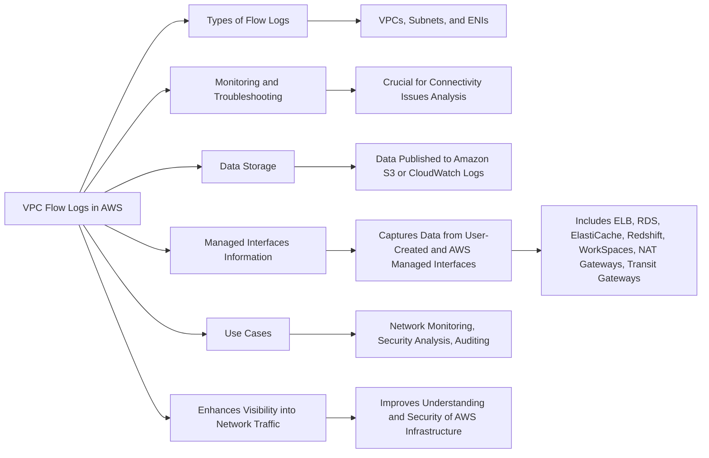
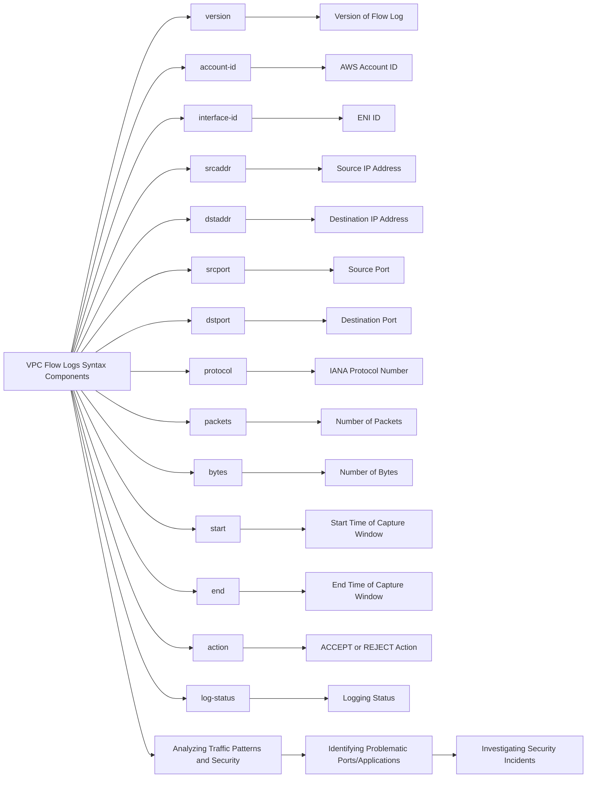
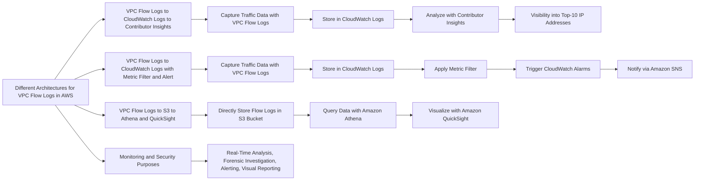

# VPC Flow logs

```mermaid
graph LR
    A[VPC Flow Logs in AWS] --> B[Types of Flow Logs]
    A --> C[Monitoring and Troubleshooting]
    A --> D[Data Storage]
    A --> E[Managed Interfaces Information]
    A --> F[Use Cases]

    B --> G[VPCs, Subnets, and ENIs]

    C --> H[Crucial for Connectivity Issues Analysis]

    D --> I[Data Published to Amazon S3 or CloudWatch Logs]

    E --> J[Captures Data from User-Created and AWS Managed Interfaces]
    J --> K[Includes ELB, RDS, ElastiCache, Redshift, WorkSpaces, NAT Gateways, Transit Gateways]

    F --> L[Network Monitoring, Security Analysis, Auditing]

    A --> M[Enhances Visibility into Network Traffic]
    M --> N[Improves Understanding and Security of AWS Infrastructure]

```

```mermaid
graph LR
    A[VPC Flow Logs Syntax Components] --> B[version]
    A --> C[account-id]
    A --> D[interface-id]
    A --> E[srcaddr]
    A --> F[dstaddr]
    A --> G[srcport]
    A --> H[dstport]
    A --> I[protocol]
    A --> J[packets]
    A --> K[bytes]
    A --> L[start]
    A --> M[end]
    A --> N[action]
    A --> O[log-status]

    B --> P[Version of Flow Log]
    C --> Q[AWS Account ID]
    D --> R[ENI ID]
    E --> S[Source IP Address]
    F --> T[Destination IP Address]
    G --> U[Source Port]
    H --> V[Destination Port]
    I --> W[IANA Protocol Number]
    J --> X[Number of Packets]
    K --> Y[Number of Bytes]
    L --> Z[Start Time of Capture Window]
    M --> AA[End Time of Capture Window]
    N --> AB[ACCEPT or REJECT Action]
    O --> AC[Logging Status]

    A --> AD[Analyzing Traffic Patterns and Security]
    AD --> AE[Identifying Problematic Ports/Applications]
    AE --> AF[Investigating Security Incidents]

```

```mermaid
graph LR
    A[Different Architectures for VPC Flow Logs in AWS] --> B[VPC Flow Logs to CloudWatch Logs to Contributor Insights]
    A --> C[VPC Flow Logs to CloudWatch Logs with Metric Filter and Alert]
    A --> D[VPC Flow Logs to S3 to Athena and QuickSight]

    B --> E[Capture Traffic Data with VPC Flow Logs]
    E --> F[Store in CloudWatch Logs]
    F --> G[Analyze with Contributor Insights]
    G --> H[Visibility into Top-10 IP Addresses]

    C --> I[Capture Traffic Data with VPC Flow Logs]
    I --> J[Store in CloudWatch Logs]
    J --> K[Apply Metric Filter]
    K --> L[Trigger CloudWatch Alarms]
    L --> M[Notify via Amazon SNS]

    D --> N[Directly Store Flow Logs in S3 Bucket]
    N --> O[Query Data with Amazon Athena]
    O --> P[Visualize with Amazon QuickSight]

    A --> Q[Monitoring and Security Purposes]
    Q --> R[Real-Time Analysis, Forensic Investigation, Alerting, Visual Reporting]

```