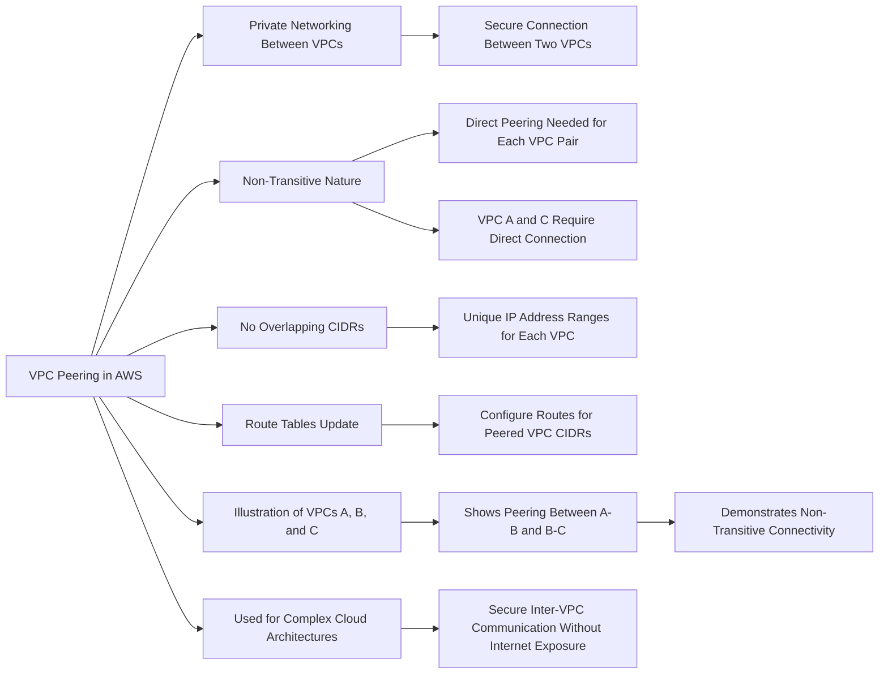
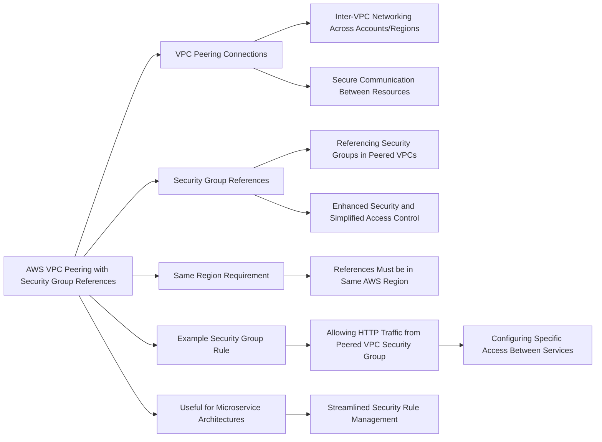

# VPC Peering

```mermaid
graph LR
    A[VPC Peering in AWS] --> B[Private Networking Between VPCs]
    A --> C[Non-Transitive Nature]
    A --> D[No Overlapping CIDRs]
    A --> E[Route Tables Update]
    A --> F[Illustration of VPCs A, B, and C]

    B --> G[Secure Connection Between Two VPCs]

    C --> H[Direct Peering Needed for Each VPC Pair]
    C --> I[VPC A and C Require Direct Connection]

    D --> J[Unique IP Address Ranges for Each VPC]

    E --> K[Configure Routes for Peered VPC CIDRs]

    F --> L[Shows Peering Between A-B and B-C]
    L --> M[Demonstrates Non-Transitive Connectivity]

    A --> N[Used for Complex Cloud Architectures]
    N --> O[Secure Inter-VPC Communication Without Internet Exposure]


```

```mermaid
graph LR
    A[AWS VPC Peering with Security Group References] --> B[VPC Peering Connections]
    A --> C[Security Group References]
    A --> D[Same Region Requirement]
    A --> E[Example Security Group Rule]

    B --> F[Inter-VPC Networking Across Accounts/Regions]
    B --> G[Secure Communication Between Resources]

    C --> H[Referencing Security Groups in Peered VPCs]
    C --> I[Enhanced Security and Simplified Access Control]

    D --> J[References Must be in Same AWS Region]

    E --> K[Allowing HTTP Traffic from Peered VPC Security Group]
    K --> L[Configuring Specific Access Between Services]

    A --> M[Useful for Microservice Architectures]
    M --> N[Streamlined Security Rule Management]

```

