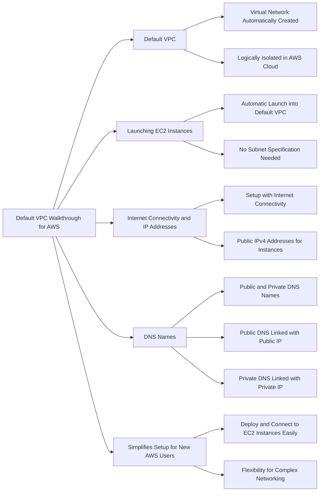
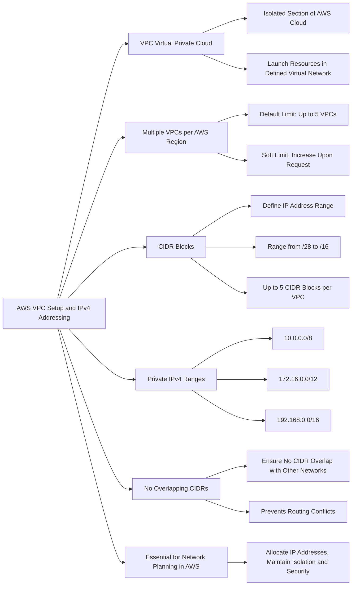

# VPC 

```mermaid
graph LR
    A[Default VPC Walkthrough for AWS] --> B[Default VPC]
    A --> C[Launching EC2 Instances]
    A --> D[Internet Connectivity and IP Addresses]
    A --> E[DNS Names]

    B --> F[Virtual Network Automatically Created]
    B --> G[Logically Isolated in AWS Cloud]

    C --> H[Automatic Launch into Default VPC]
    C --> I[No Subnet Specification Needed]

    D --> J[Setup with Internet Connectivity]
    D --> K[Public IPv4 Addresses for Instances]

    E --> L[Public and Private DNS Names]
    E --> M[Public DNS Linked with Public IP]
    E --> N[Private DNS Linked with Private IP]

    A --> O[Simplifies Setup for New AWS Users]
    O --> P[Deploy and Connect to EC2 Instances Easily]
    O --> Q[Flexibility for Complex Networking]

```

```mermaid
graph LR
    A[AWS VPC Setup and IPv4 Addressing] --> B[VPC Virtual Private Cloud]
    A --> C[Multiple VPCs per AWS Region]
    A --> D[CIDR Blocks]
    A --> E[Private IPv4 Ranges]
    A --> F[No Overlapping CIDRs]

    B --> G[Isolated Section of AWS Cloud]
    B --> H[Launch Resources in Defined Virtual Network]

    C --> I[Default Limit: Up to 5 VPCs]
    C --> J[Soft Limit, Increase Upon Request]

    D --> K[Define IP Address Range]
    D --> L[Range from /28 to /16]
    D --> M[Up to 5 CIDR Blocks per VPC]

    E --> N[10.0.0.0/8]
    E --> O[172.16.0.0/12]
    E --> P[192.168.0.0/16]

    F --> Q[Ensure No CIDR Overlap with Other Networks]
    F --> R[Prevents Routing Conflicts]

    A --> S[Essential for Network Planning in AWS]
    S --> T[Allocate IP Addresses, Maintain Isolation and Security]

```
