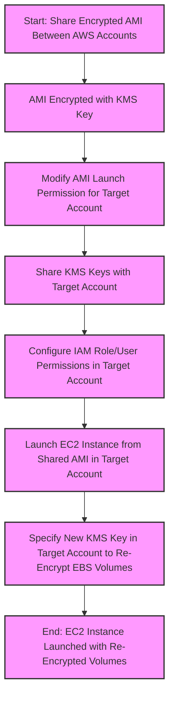

# Start: Share Encrypted AMI Between AWS Accounts

```mermaid
graph TD
    A[Start: Share Encrypted AMI Between AWS Accounts] --> B[AMI Encrypted with KMS Key]

    B --> C[Modify AMI Launch Permission for Target Account]

    C --> D[Share KMS Keys with Target Account]
    D --> E[Configure IAM Role/User Permissions in Target Account]
    E --> F[Launch EC2 Instance from Shared AMI in Target Account]

    F --> G[Specify New KMS Key in Target Account to Re-Encrypt EBS Volumes]
    G --> H[End: EC2 Instance Launched with Re-Encrypted Volumes]

    classDef default fill:#f9f,stroke:#333,stroke-width:2px;
    class A,B,C,D,E,F,G,H default;


```
