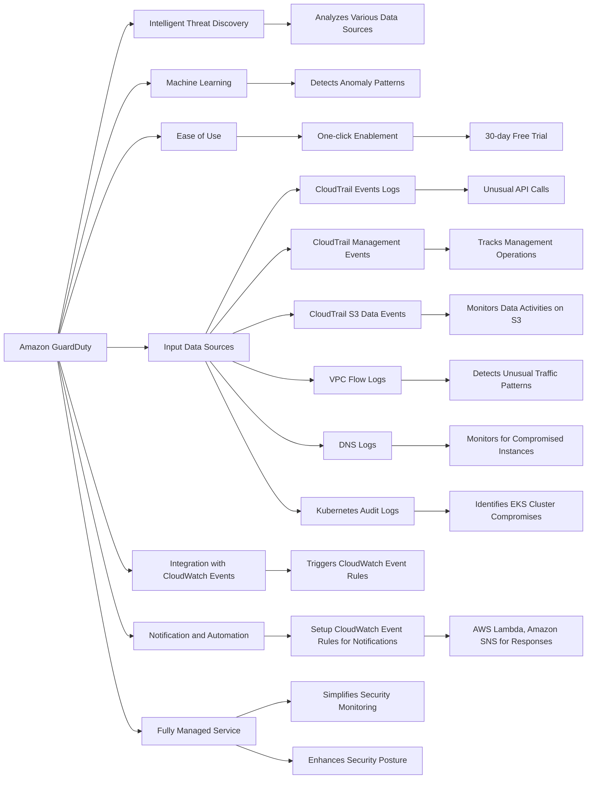

# Guard Duty

```mermaid
graph LR
    A[Amazon GuardDuty] --> B[Intelligent Threat Discovery]
    A --> C[Machine Learning]
    A --> D[Ease of Use]
    A --> E[Input Data Sources]
    A --> F[Integration with CloudWatch Events]
    A --> G[Notification and Automation]

    B --> H[Analyzes Various Data Sources]
    C --> I[Detects Anomaly Patterns]
    D --> J[One-click Enablement]
    J --> K[30-day Free Trial]

    E --> L[CloudTrail Events Logs]
    E --> M[CloudTrail Management Events]
    E --> N[CloudTrail S3 Data Events]
    E --> O[VPC Flow Logs]
    E --> P[DNS Logs]
    E --> Q[Kubernetes Audit Logs]

    L --> R[Unusual API Calls]
    M --> S[Tracks Management Operations]
    N --> T[Monitors Data Activities on S3]
    O --> U[Detects Unusual Traffic Patterns]
    P --> V[Monitors for Compromised Instances]
    Q --> W[Identifies EKS Cluster Compromises]

    F --> X[Triggers CloudWatch Event Rules]
    G --> Y[Setup CloudWatch Event Rules for Notifications]
    Y --> Z[AWS Lambda, Amazon SNS for Responses]

    A --> AA[Fully Managed Service]
    AA --> BB[Simplifies Security Monitoring]
    AA --> CC[Enhances Security Posture]


```
