# KMS

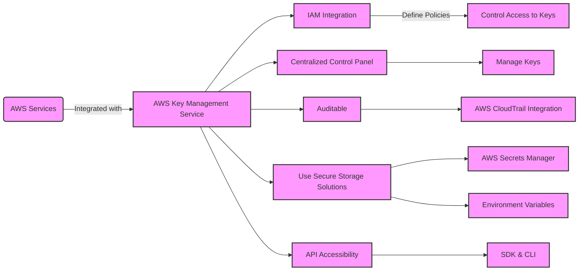

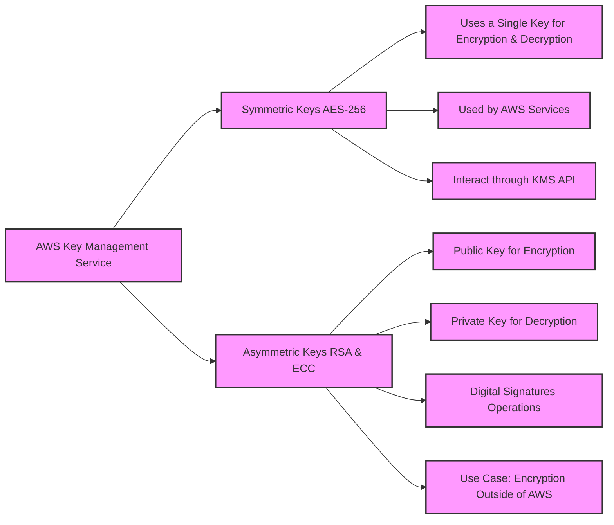

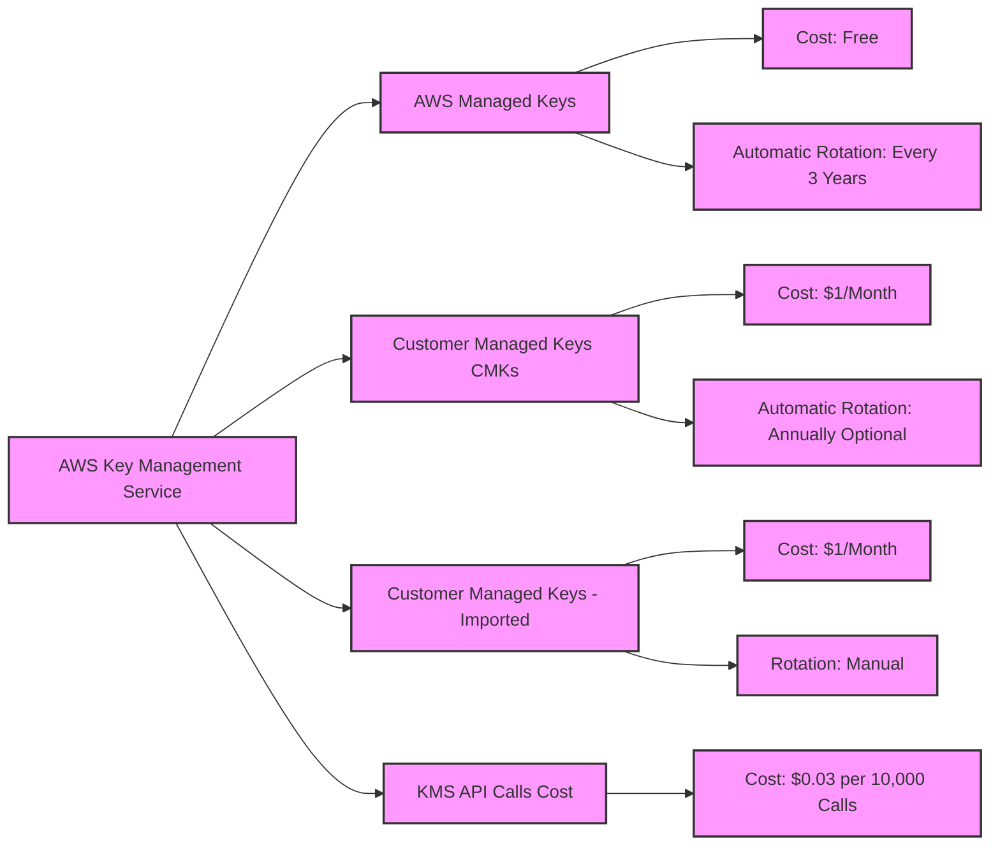

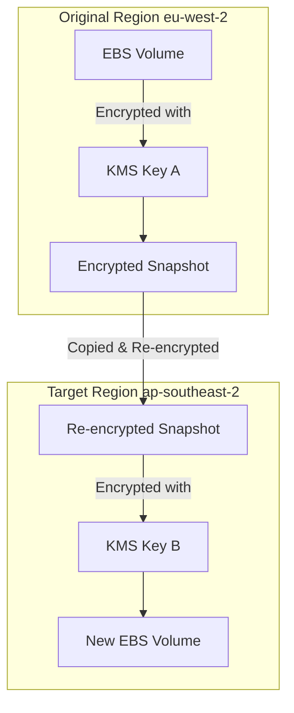

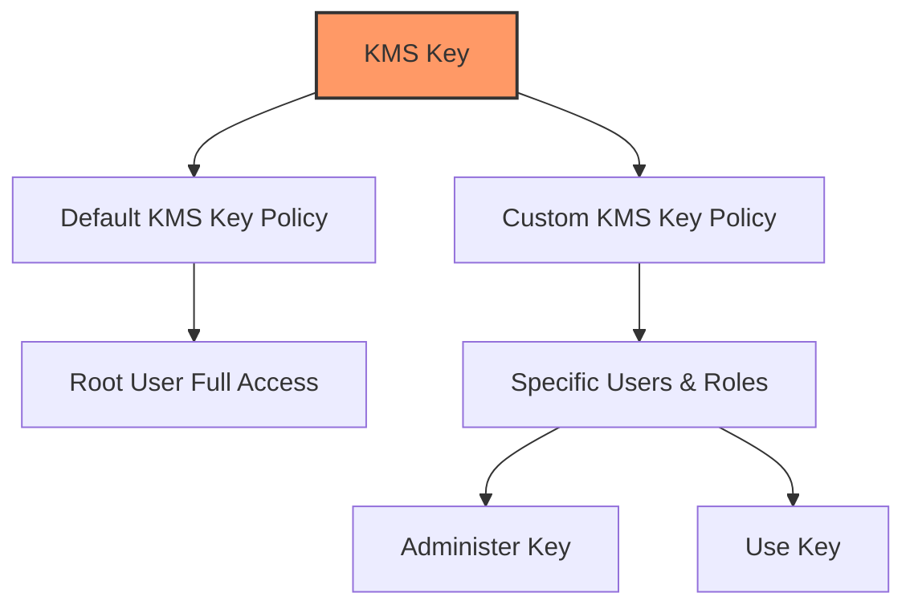

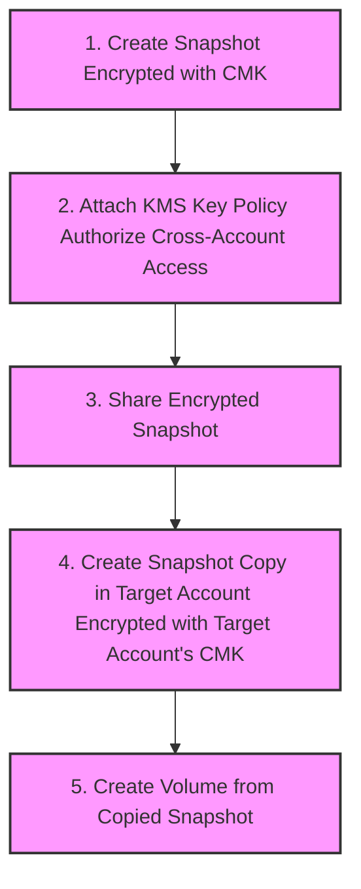

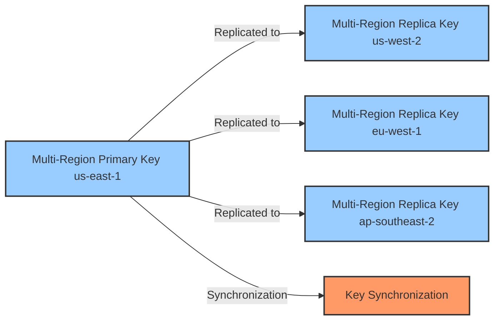

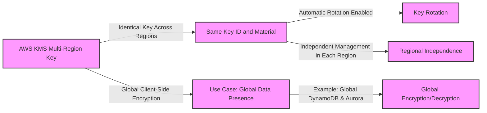

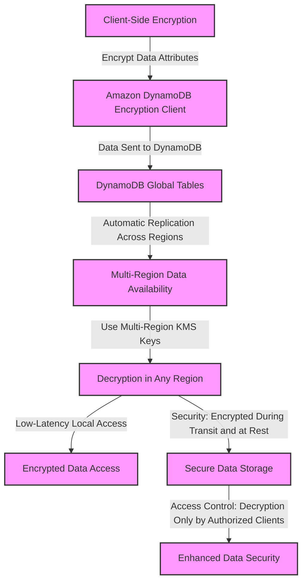

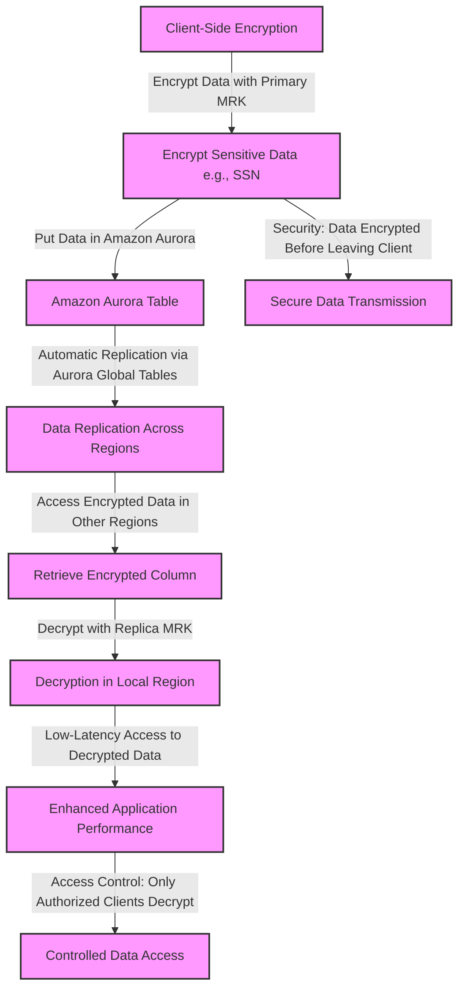

## For exam

1. A US-based healthcare startup is building an interactive diagnostic tool for COVID-19 related assessments. The users would be required to capture their personal health records via this tool. As this is sensitive health information, the backup of the user data must be kept encrypted in Amazon Simple Storage Service (Amazon S3). The startup does not want to provide its own encryption keys but still wants to maintain an audit trail of when an encryption key was used and by whom.

Which of the following is the BEST solution for this use-case?

***Answer*** Use server-side encryption with AWS Key Management Service keys (SSE-KMS) to encrypt the user data on Amazon S3

AWS Key Management Service (AWS KMS) is a service that combines secure, highly available hardware and software to provide a key management system scaled for the cloud. When you use server-side encryption with AWS KMS (SSE-KMS), you can specify a customer-managed CMK that you have already created. SSE-KMS provides you with an audit trail that shows when your CMK was used and by whom. Therefore SSE-KMS is the correct solution for this use-case.

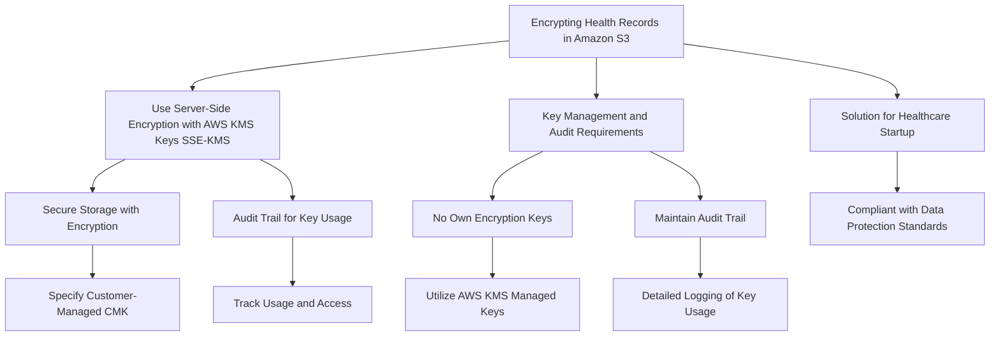

2. A social photo-sharing company uses Amazon Simple Storage Service (Amazon S3) to store the images uploaded by the users. These images are kept encrypted in Amazon S3 by using AWS Key Management Service (AWS KMS) and the company manages its own AWS KMS keys for encryption. A member of the DevOps team accidentally deleted the AWS KMS key a day ago, thereby rendering the user's photo data unrecoverable. You have been contacted by the company to consult them on possible solutions to this crisis.

As a solutions architect, which of the following steps would you recommend to solve this issue?

***Answer:***As the AWS KMS key was deleted a day ago, it must be in the 'pending deletion' status and hence you can just cancel the KMS key deletion and recover the key

AWS Key Management Service (KMS) makes it easy for you to create and manage cryptographic keys and control their use across a wide range of AWS services and in your applications. AWS KMS is a secure and resilient service that uses hardware security modules that have been validated under FIPS 140-2.

Deleting an AWS KMS key in AWS Key Management Service (AWS KMS) is destructive and potentially dangerous. Therefore, AWS KMS enforces a waiting period. To delete a KMS key in AWS KMS you schedule key deletion. You can set the waiting period from a minimum of 7 days up to a maximum of 30 days. The default waiting period is 30 days. During the waiting period, the KMS key status and key state is Pending deletion. To recover the KMS key, you can cancel key deletion before the waiting period ends. After the waiting period ends you cannot cancel key deletion, and AWS KMS deletes the KMS key.

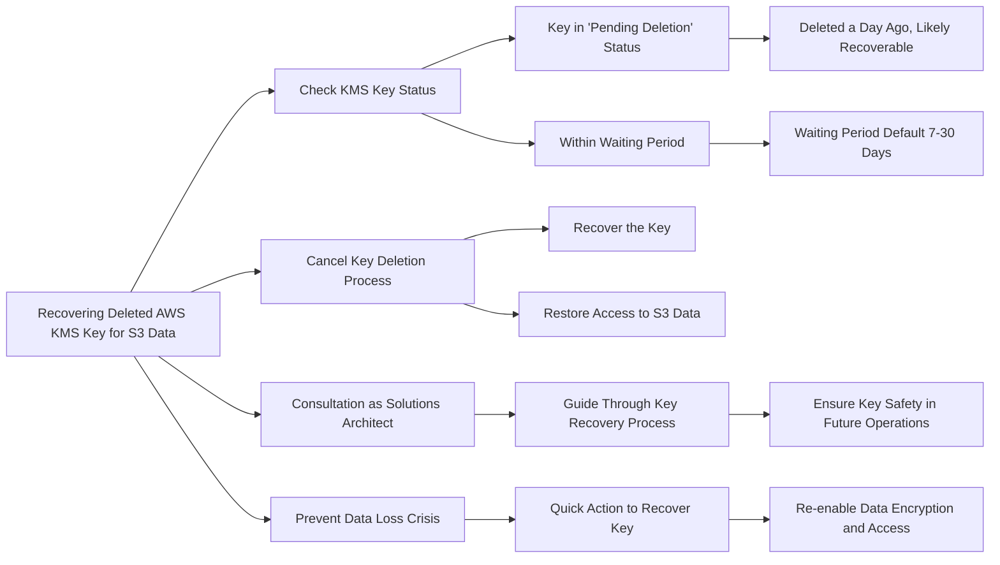