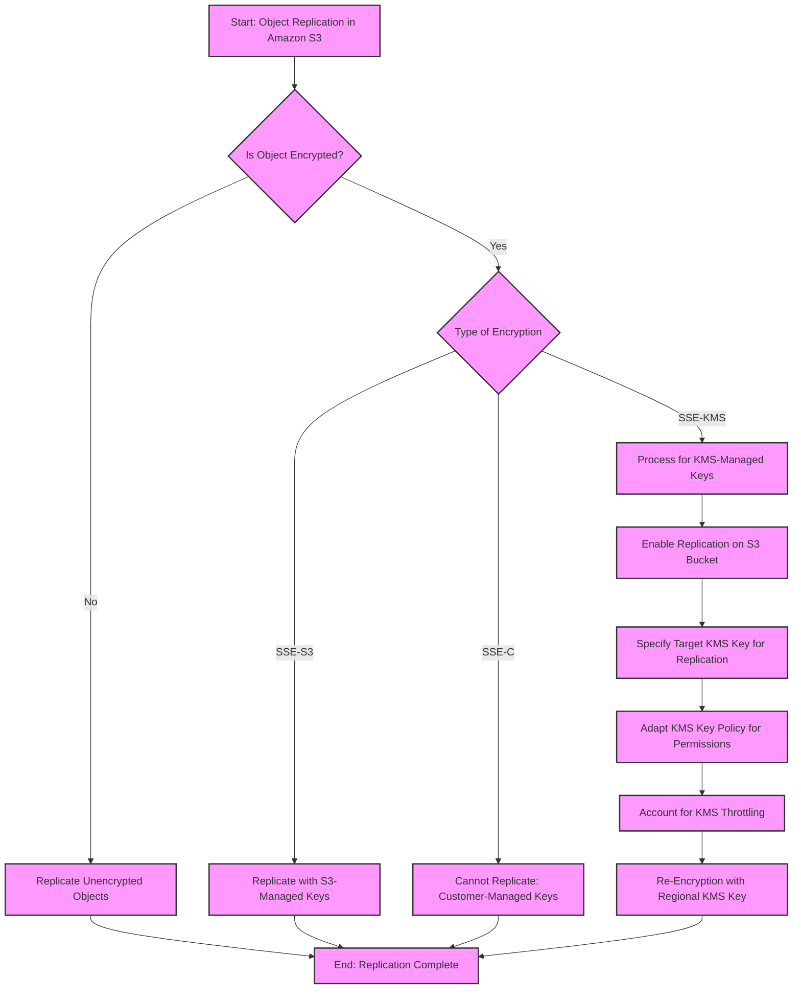

# Replication in Amazon S3

```mermaid
graph TD
    A[Start: Object Replication in Amazon S3] --> B{Is Object Encrypted?}

    B -->|No| C[Replicate Unencrypted Objects]
    B -->|Yes| D{Type of Encryption}

    D -->|SSE-S3| E[Replicate with S3-Managed Keys]
    D -->|SSE-C| F[Cannot Replicate: Customer-Managed Keys]
    D -->|SSE-KMS| G[Process for KMS-Managed Keys]

    G --> H[Enable Replication on S3 Bucket]
    H --> I[Specify Target KMS Key for Replication]
    I --> J[Adapt KMS Key Policy for Permissions]
    J --> K[Account for KMS Throttling]
    K --> L[Re-Encryption with Regional KMS Key]

    C --> M[End: Replication Complete]
    E --> M
    F --> M
    L --> M

classDef default fill:#f9f,stroke:#333,stroke-width:2px;
class A,B,C,D,E,F,G,H,I,J,K,L,M default;

```
