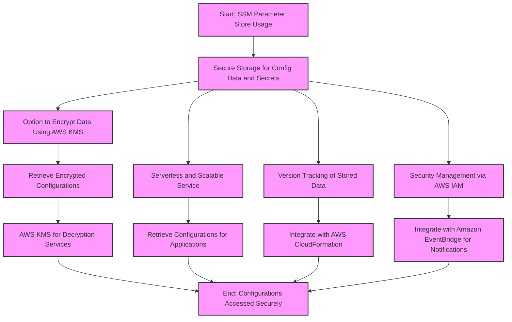
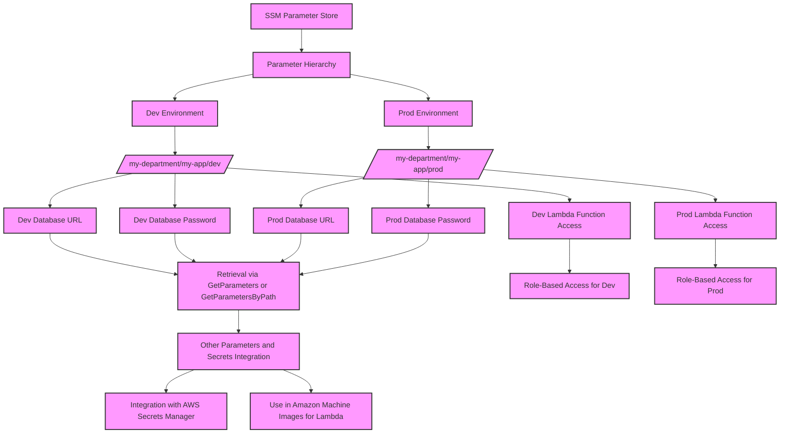
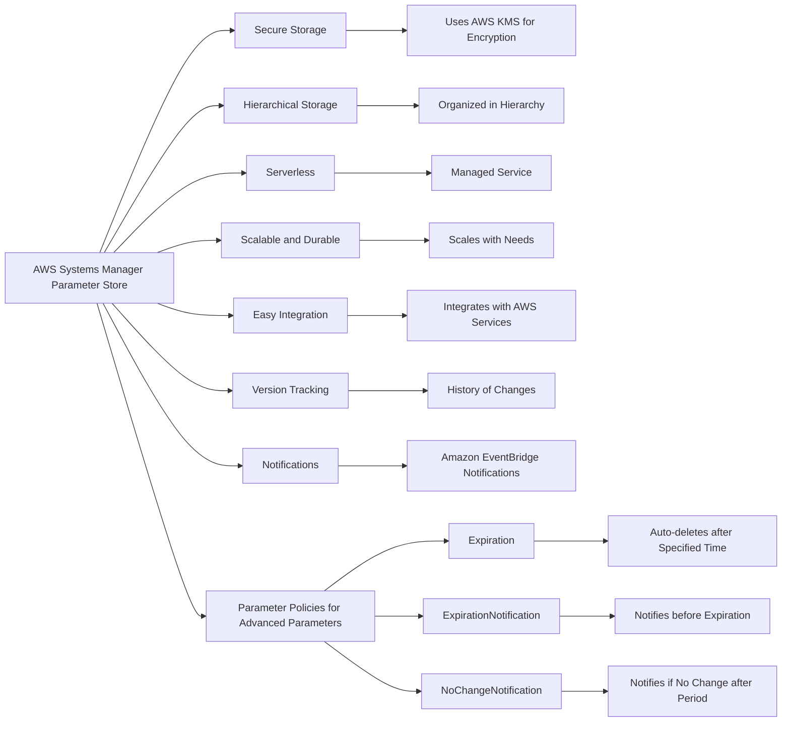

# SSM

## a table comparing the features of Standard and Advanced parameter tiers in the AWS Systems Manager Parameter Store

| Feature                                         | Standard   | Advanced           |
|-------------------------------------------------|------------|--------------------|
| Total number of parameters allowed (per AWS account and Region) | 10,000     | 100,000            |
| Maximum size of a parameter value               | 4 KB       | 8 KB               |
| Parameter policies available                    | No         | Yes                |
| Cost                                            | No additional charge | Charges apply       |
| Storage Pricing                                 | Free       | $0.05 per advanced parameter per month |

