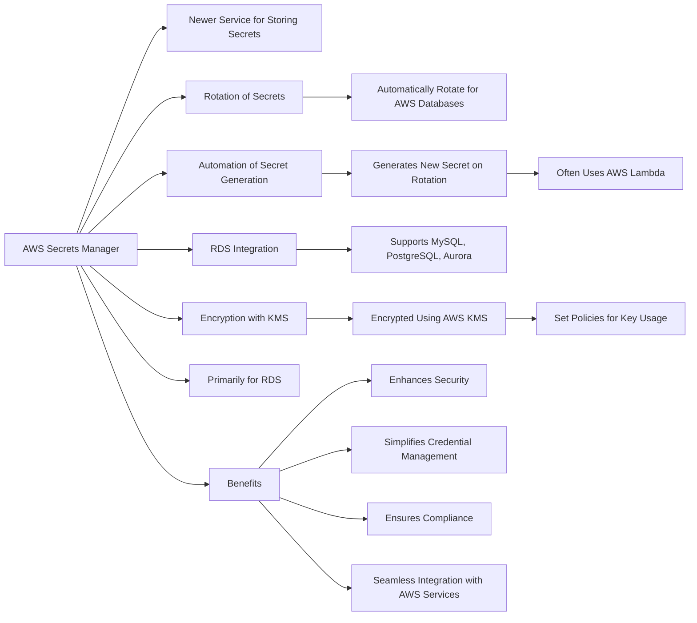

# AWS Secrets Manager

| Feature                           | SSM Parameter Store                                                       | AWS Secrets Manager                                                         |
|-----------------------------------|---------------------------------------------------------------------------|------------------------------------------------------------------------------|
| Purpose                           | Manage configuration data, secrets, and hierarchical parameters            | Securely manage and rotate secrets for databases and other services          |
| Type of Data                      | Configuration data, plaintext and encrypted secrets                       | Sensitive information such as database credentials, API keys, and tokens    |
| Hierarchy and Tagging             | Hierarchical storage of parameters, supports tagging                      | Supports tagging, lacks hierarchical organization                           |
| Size Limits                       | Up to 8 KB per parameter (Advanced Parameters)                            | Up to 64 KB per secret                                                      |
| KMS Integration                   | Can use KMS keys for parameter encryption                                 | Automatically uses KMS keys for encryption                                  |
| Rotation Support                  | No native rotation; manual rotation possible                              | Native automatic rotation capabilities for supported AWS services           |
| Versioning                        | Supports parameter versioning                                             | Supports versioning and secret recovery                                     |
| Pricing                           | Free for standard parameters; charges for advanced parameters and throughputs | Charged per secret per month and per 10,000 API calls                      |
| Access Control                    | IAM policies for access control                                           | Fine-grained IAM policies and resource-based policies                       |
| Notifications                     | Integration with CloudWatch Events for notifications                      | Supports notifications through CloudWatch Events                            |
| Cross-Region/Cross-Account Access | Limited support, usually requires custom solutions                        | Native support for cross-region and cross-account access                    |
| AWS Service Integrations          | - Amazon EC2
                                    - Amazon ECS (for passing secrets to containers)
                                    - AWS Lambda (for environment variables)
                                    - AWS CloudFormation (parameter references)  | - Amazon RDS (for database credentials)
                                    - Amazon Redshift
                                    - Amazon DocumentDB
                                    - Amazon ECS (for secrets in task definitions)
                                    - AWS Fargate
                                    - AWS CodeBuild
                                    - AWS CodePipeline                                                    |
| Typical Use Cases                 | Storing non-sensitive configuration parameters, environment configurations, application settings | Storing and automatically rotating database credentials, API keys, secure strings, and service-specific secrets |
