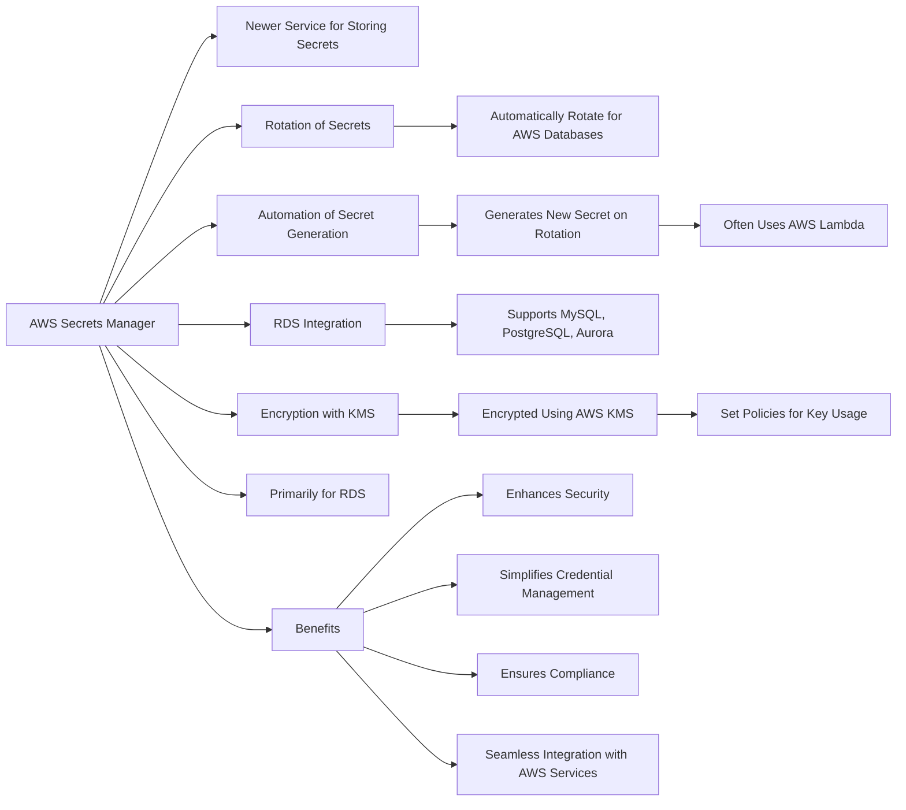

# AWS Secrets Manager

```mermaid
graph LR
    A[AWS Secrets Manager] --> B[Newer Service for Storing Secrets]
    A --> C[Rotation of Secrets]
    A --> D[Automation of Secret Generation]
    A --> E[RDS Integration]
    A --> F[Encryption with KMS]
    A --> G[Primarily for RDS]

    C --> H[Automatically Rotate for AWS Databases]
    D --> I[Generates New Secret on Rotation]
    I --> J[Often Uses AWS Lambda]
    E --> K[Supports MySQL, PostgreSQL, Aurora]
    F --> L[Encrypted Using AWS KMS]
    L --> M[Set Policies for Key Usage]

    N[Benefits] --> O[Enhances Security]
    N --> P[Simplifies Credential Management]
    N --> Q[Ensures Compliance]
    N --> R[Seamless Integration with AWS Services]

    A --> N


```
