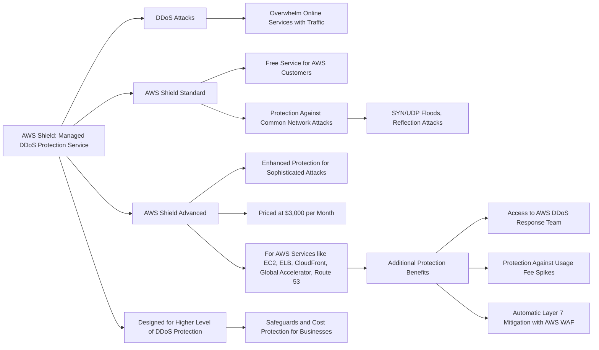
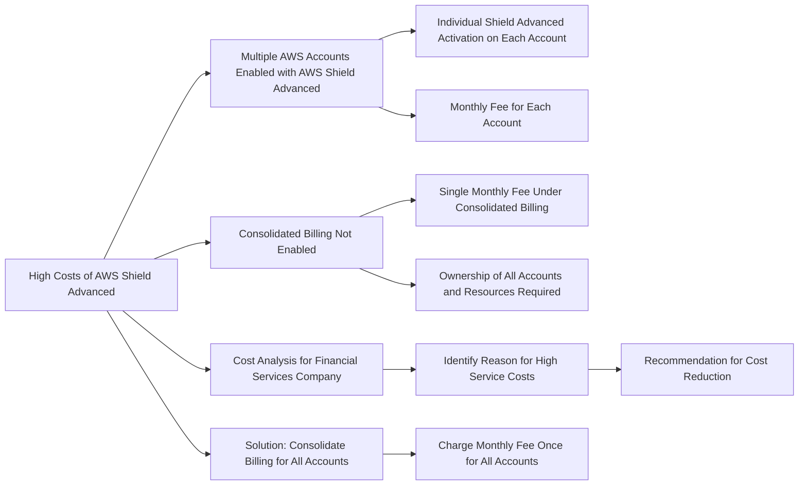

# Shield

## For exam:
1. A financial services company recently launched an initiative to improve the security of its AWS resources and it had enabled AWS Shield Advanced across multiple AWS accounts owned by the company. Upon analysis, the company has found that the costs incurred are much higher than expected.

Which of the following would you attribute as the underlying reason for the unexpectedly high costs for AWS Shield Advanced service?

***Answer:*** Consolidated billing has not been enabled. All the AWS accounts should fall under a single consolidated billing for the monthly fee to be charged only once

If your organization has multiple AWS accounts, then you can subscribe multiple AWS Accounts to AWS Shield Advanced by individually enabling it on each account using the AWS Management Console or API. You will pay the monthly fee once as long as the AWS accounts are all under a single consolidated billing, and you own all the AWS accounts and resources in those accounts.

