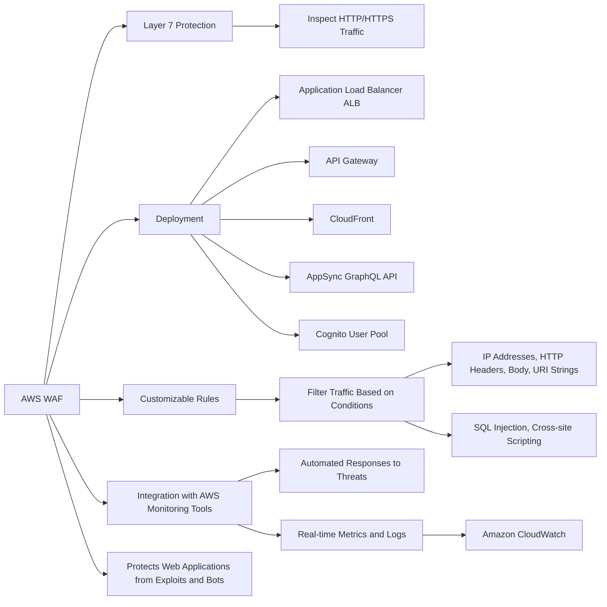
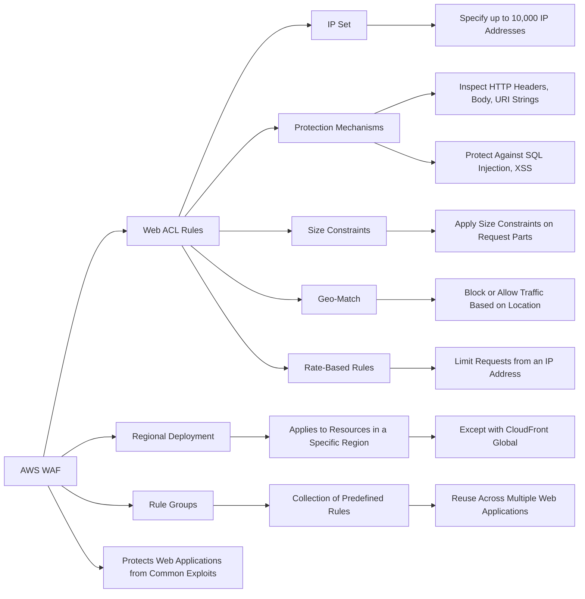
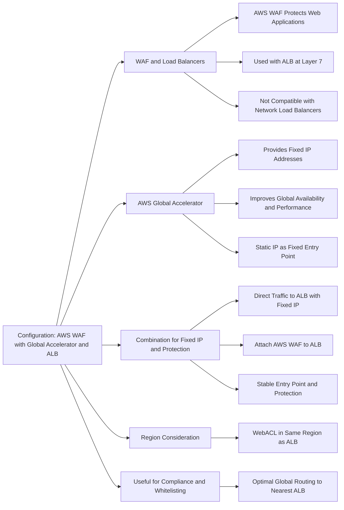
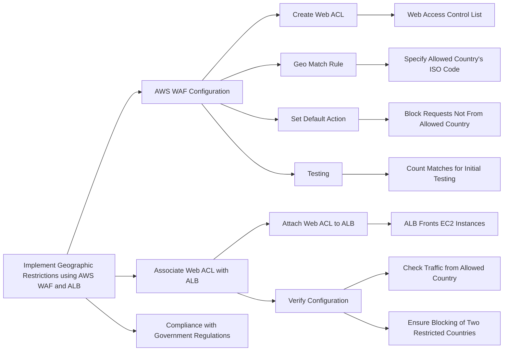

# WAF

## For exam:

1. A media company runs a photo-sharing web application that is accessed across three different countries. The application is deployed on several Amazon Elastic Compute Cloud (Amazon EC2) instances running behind an Application Load Balancer. With new government regulations, the company has been asked to block access from two countries and allow access only from the home country of the company.

Which configuration should be used to meet this changed requirement?

***Answer***: Configure AWS Web Application Firewall (AWS WAF) on the Application Load Balancer in a Amazon Virtual Private Cloud (Amazon VPC)

You can use AWS WAF with your Application Load Balancer to allow or block requests based on the rules in a web access control list (web ACL). Geographic (Geo) Match Conditions in AWS WAF allows you to use AWS WAF to restrict application access based on the geographic location of your viewers. With geo match conditions you can choose the countries from which AWS WAF should allow access.

Geo match conditions are important for many customers. For example, legal and licensing requirements restrict some customers from delivering their applications outside certain countries. These customers can configure a whitelist that allows only viewers in those countries. Other customers need to prevent the downloading of their encrypted software by users in certain countries. These customers can configure a blacklist so that end-users from those countries are blocked from downloading their software.

