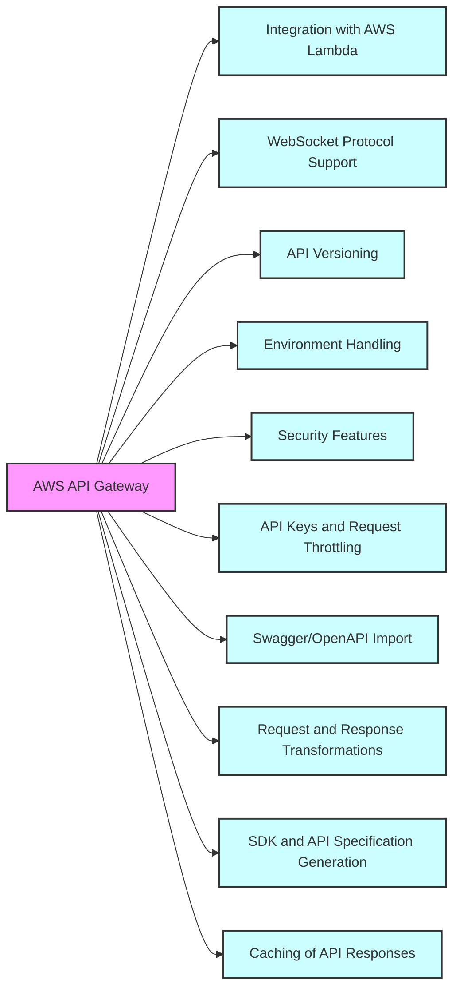
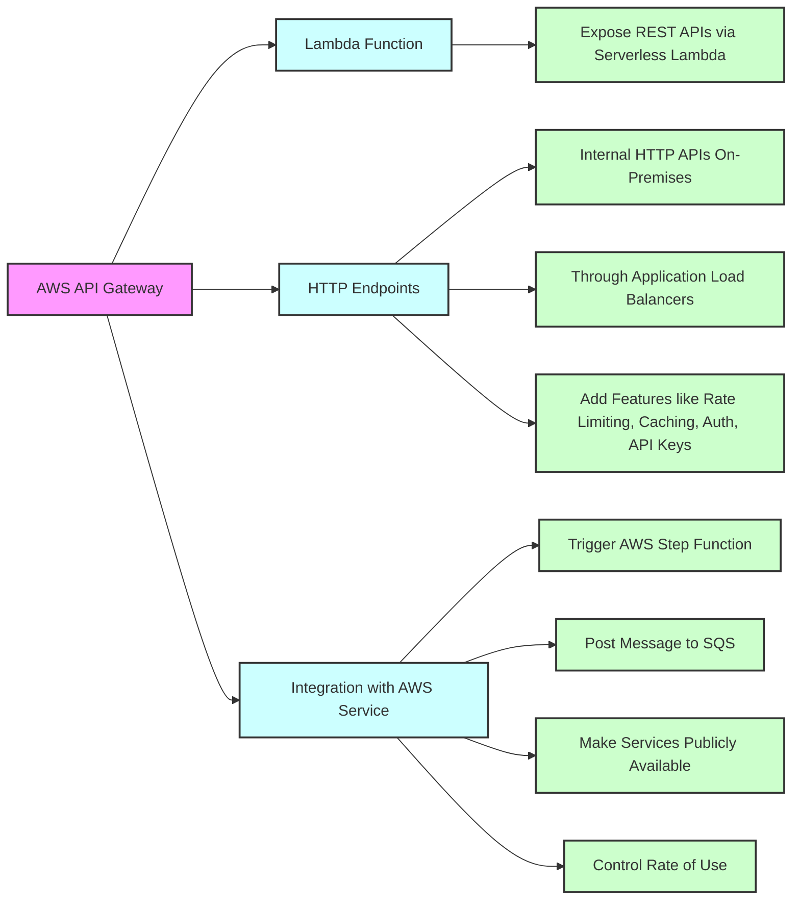
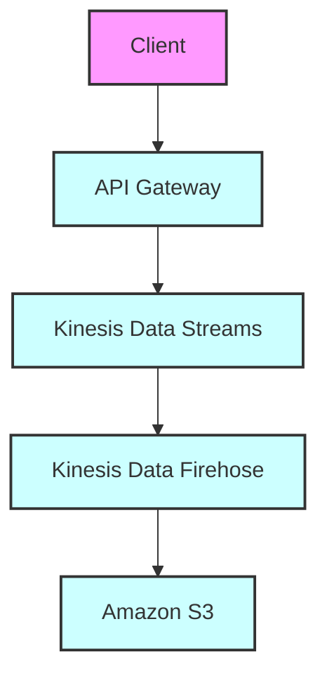
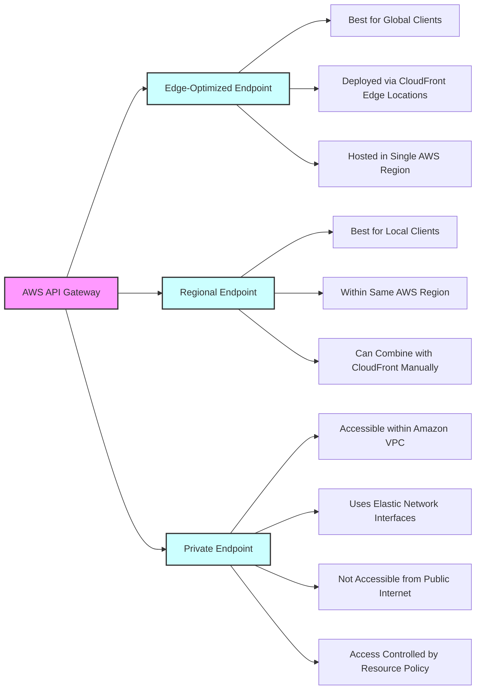
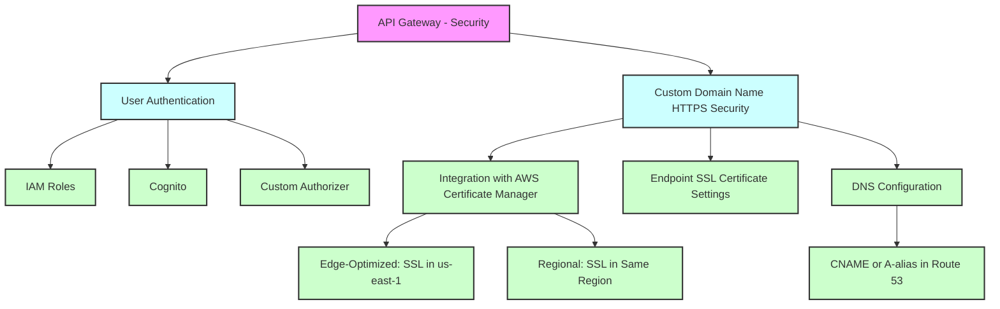
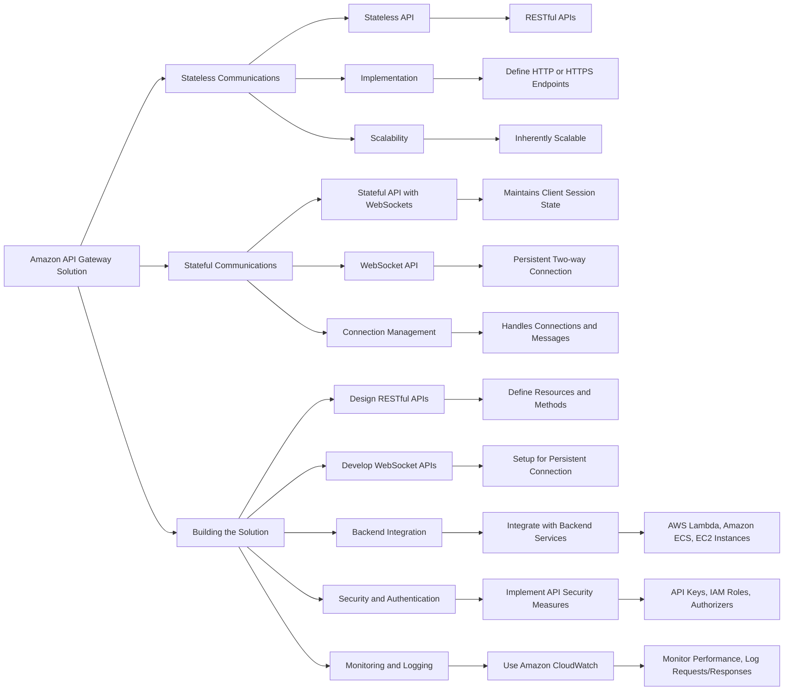

# AWS API Gateway

## API_Gateway --> Kinesis_Data_Streams

## API_Gateway --> Endpoints

| Feature/Endpoint Type | Edge-Optimized            | Regional                   | Private                    |
|-----------------------|---------------------------|----------------------------|----------------------------|
| Accessibility         | Global clients            | Clients within the same AWS region | Clients within a VPC          |
| Latency               | Improved via global edge locations | Potentially lower for regional clients | N/A (isolated to VPC)      |
| Hosting Region        | Single AWS region         | Single AWS region          | Single AWS region          |
| CloudFront            | Automatically integrated  | Can be manually combined   | Not applicable             |
| VPC Access            | Via internet              | Via internet               | Via VPC endpoint (ENI)     |
| Use Case              | General use with global access | Localized use with some control over caching | Strictly controlled internal access |
| Access Control        | Managed via API Gateway   | Managed via API Gateway and optionally CloudFront | Managed via VPC and resource policies |

## API Gateway - Security

# AWS API Gateway vs AWS Application Load Balancer (ALB) Comparison

| Feature | AWS API Gateway | AWS Application Load Balancer (ALB) |
|---------|-----------------|-------------------------------------|
| **Purpose** | Manages API calls with features like traffic management, authorization, monitoring, and API version management. | Distributes incoming application traffic across multiple targets in multiple Availability Zones. |
| **Protocol Support** | HTTP/HTTPS, WebSocket, RESTful APIs. | HTTP/HTTPS, WebSocket. |
| **Routing** | API path and method-based routing. | Content type, host, path, HTTP headers, methods, query parameters, source IP-based routing. |
| **Integration** | Direct integration with AWS services like Lambda and DynamoDB. | Targets EC2 instances, ECS services, and on-premises servers. |
| **Authentication** | AWS Cognito, Lambda authorizers for authentication and authorization. | AWS Cognito, OIDC, SAML 2.0 identity providers for authentication. |
| **Monitoring** | Detailed API monitoring through Amazon CloudWatch. | CloudWatch for basic monitoring, AWS X-Ray for detailed request tracing. |
| **Scaling** | Scales automatically with the number of API calls. | Scales automatically, distributing traffic according to routing rules. |
| **Use Cases** | Serverless architectures, RESTful API backends, real-time communication applications. | Load balancing HTTP/HTTPS traffic, microservice architectures. |
| **Cost** | Number of API calls, data transfer, and features like caching affect costs. | Charged based on Load Balancer Capacity Units (LCU) usage. |
| **Security** | Custom domain names with SSL/TLS certificates via AWS Certificate Manager. | Custom domain names with SSL/TLS certificates, advanced request routing for security. |
| **Deployment** | Managed service without infrastructure management. | Managed service, requires setup of target groups and health checks. |

## For exam

1. The product team at a startup has figured out a market need to support both stateful and stateless client-server communications via the application programming interface (APIs) developed using its platform. You have been hired by the startup as a solutions architect to build a solution to fulfill this market need using Amazon API Gateway.

Which of the following would you identify as correct?

