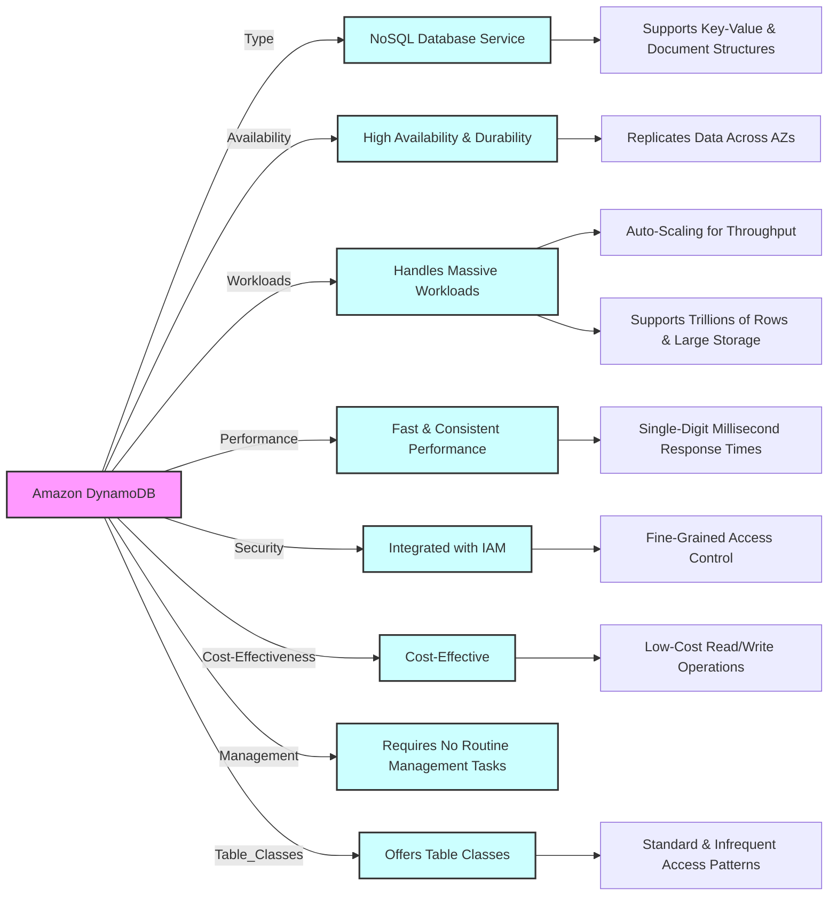
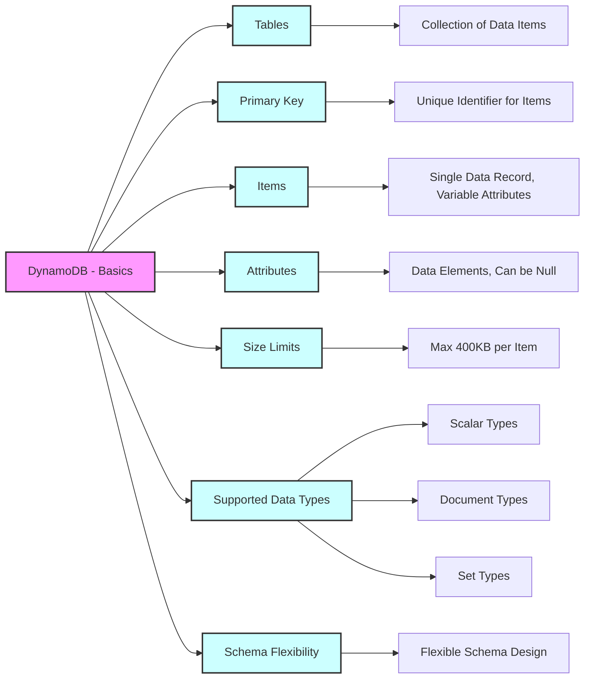
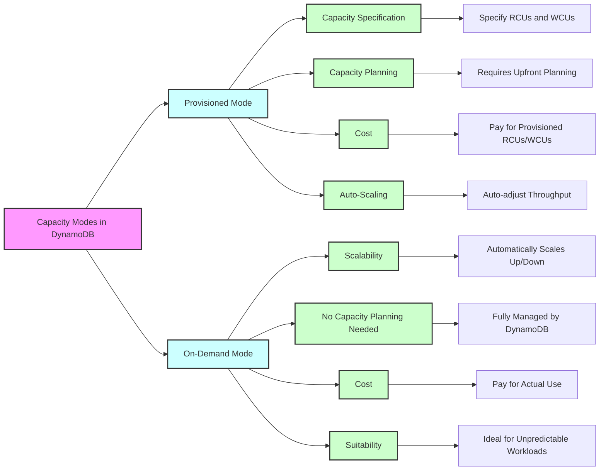
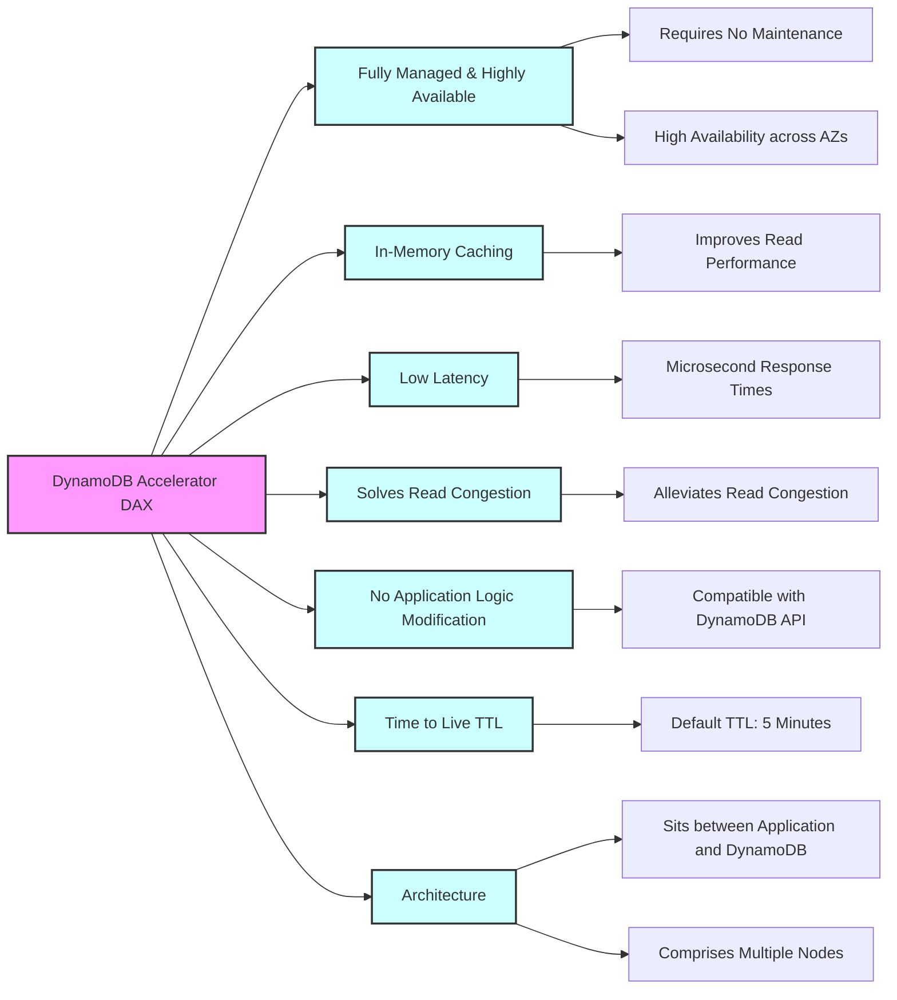
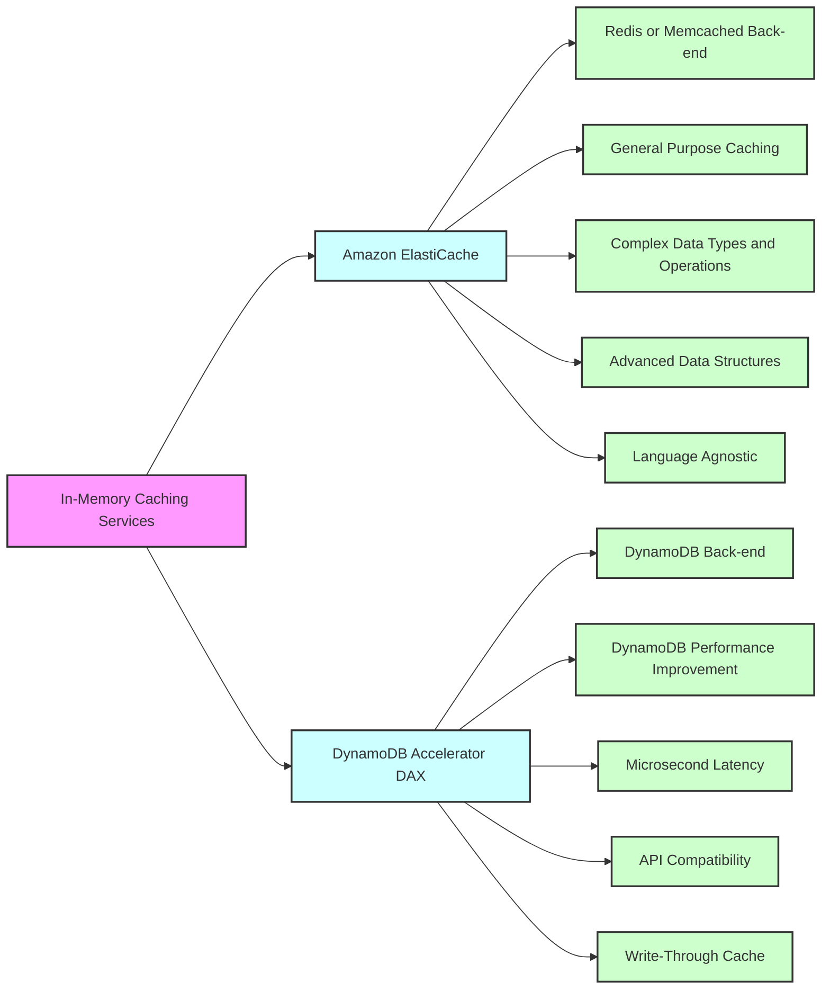
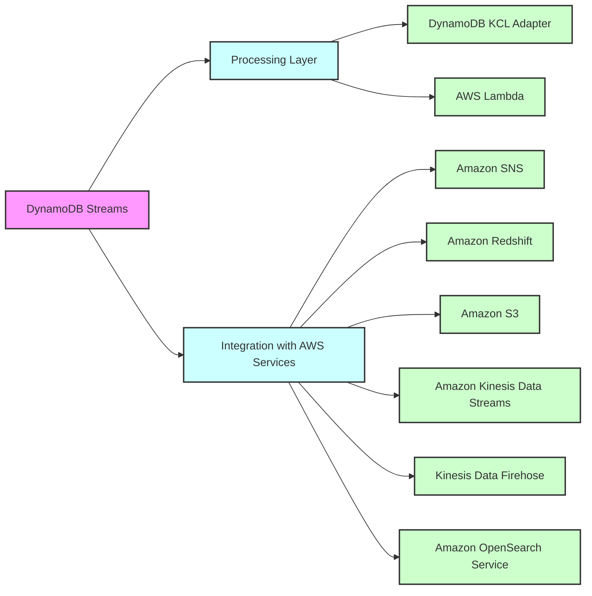
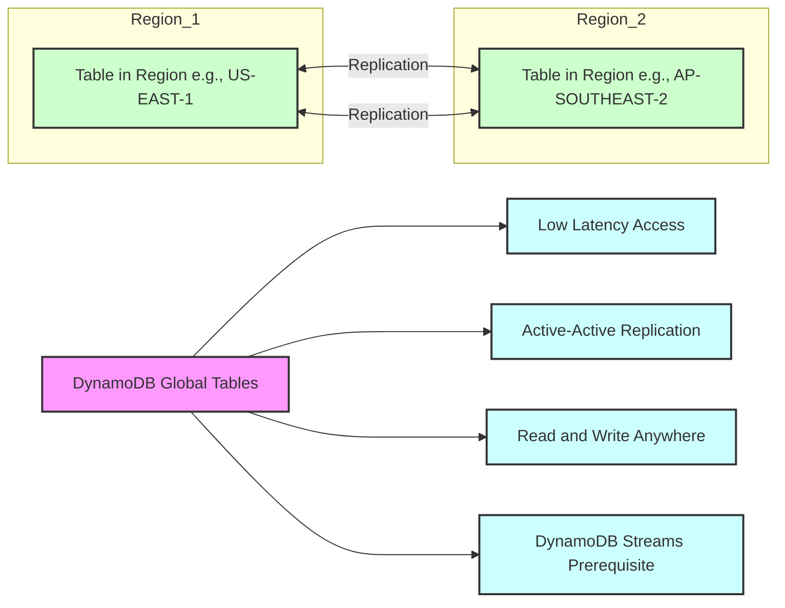
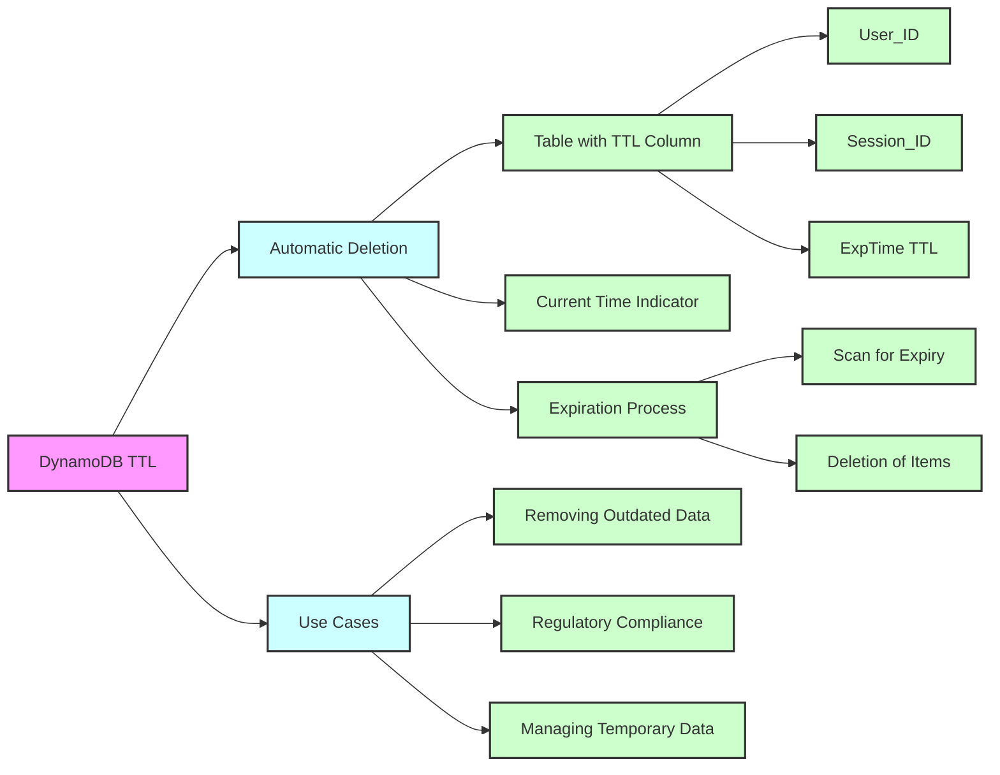
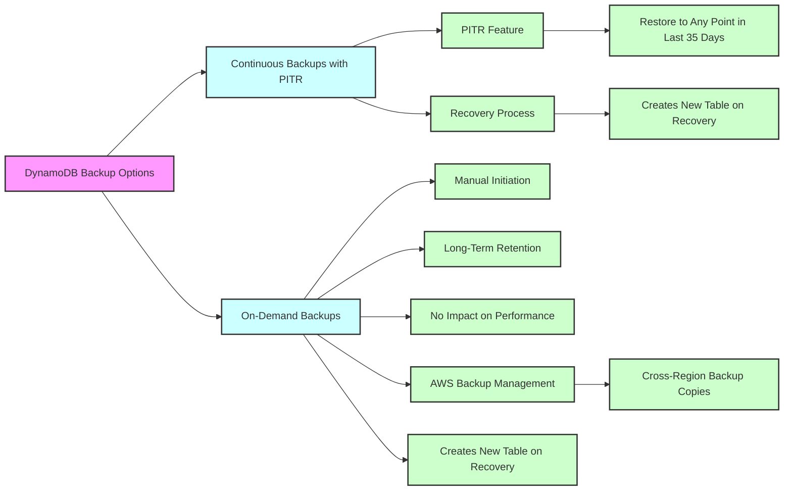
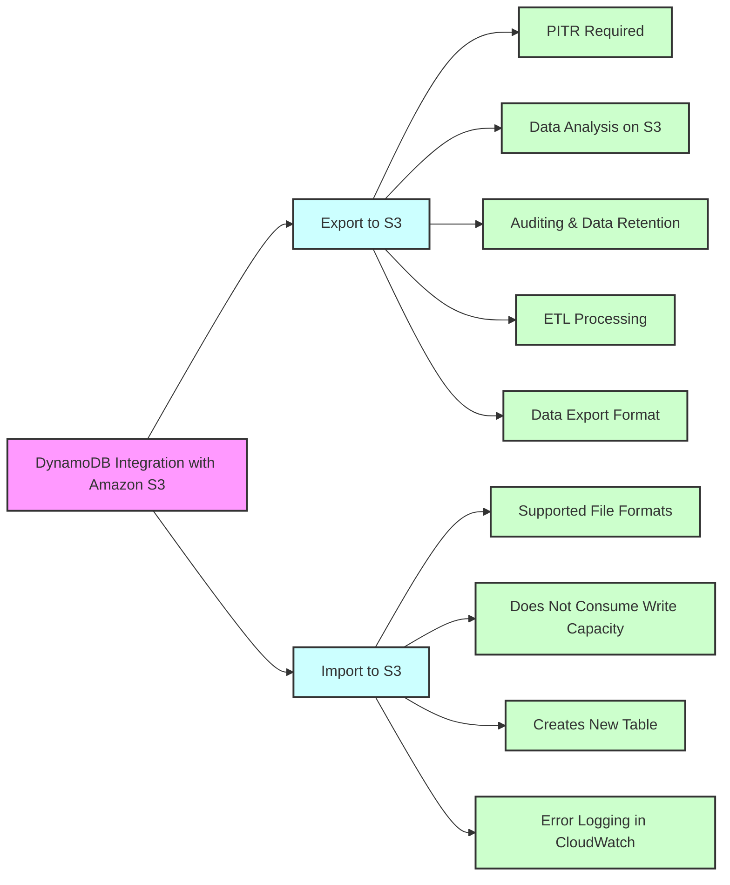

## Amazon DynamoDB

## DynamoDB - Basics

## Capacity Modes in DynamoDB

## DynamoDB Accelerator (DAX)

## In-Memory Caching Services

## DynamoDB Global Tables

## DynamoDB TTL

## DynamoDB Backup Options

## DynamoDB Integration with Amazon S3

