# Lambda

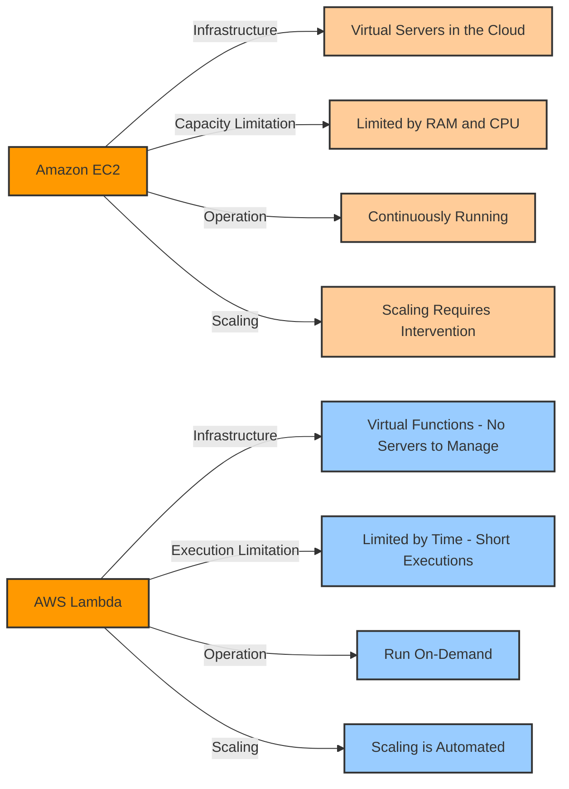

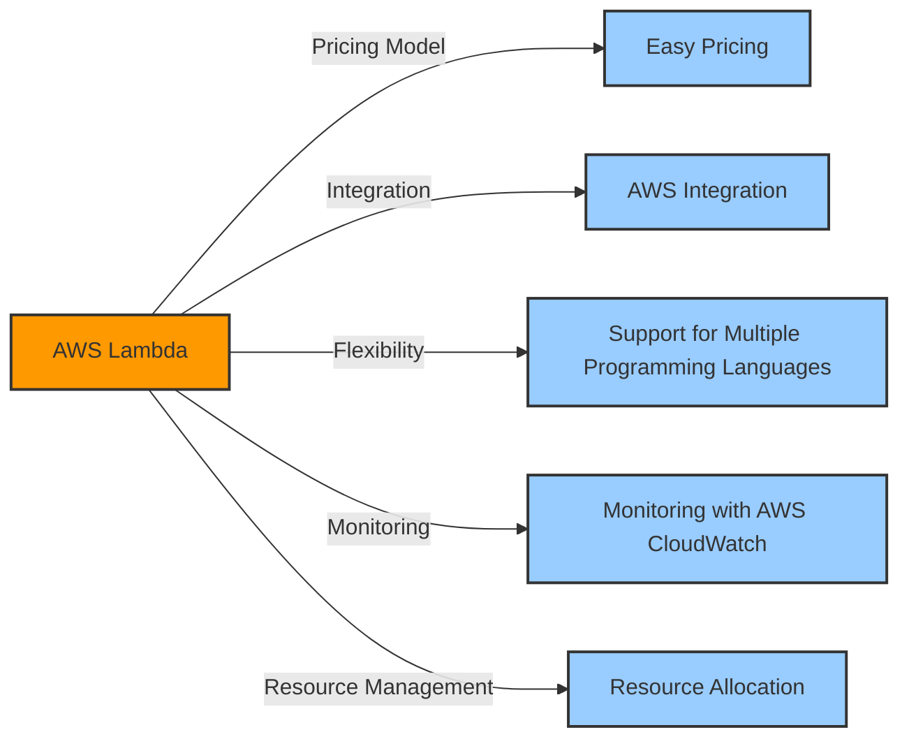

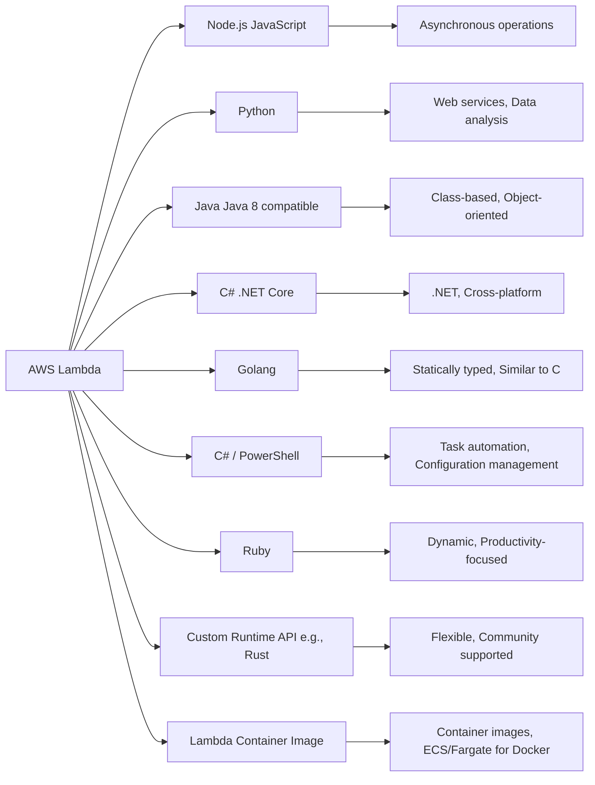

## Integrations
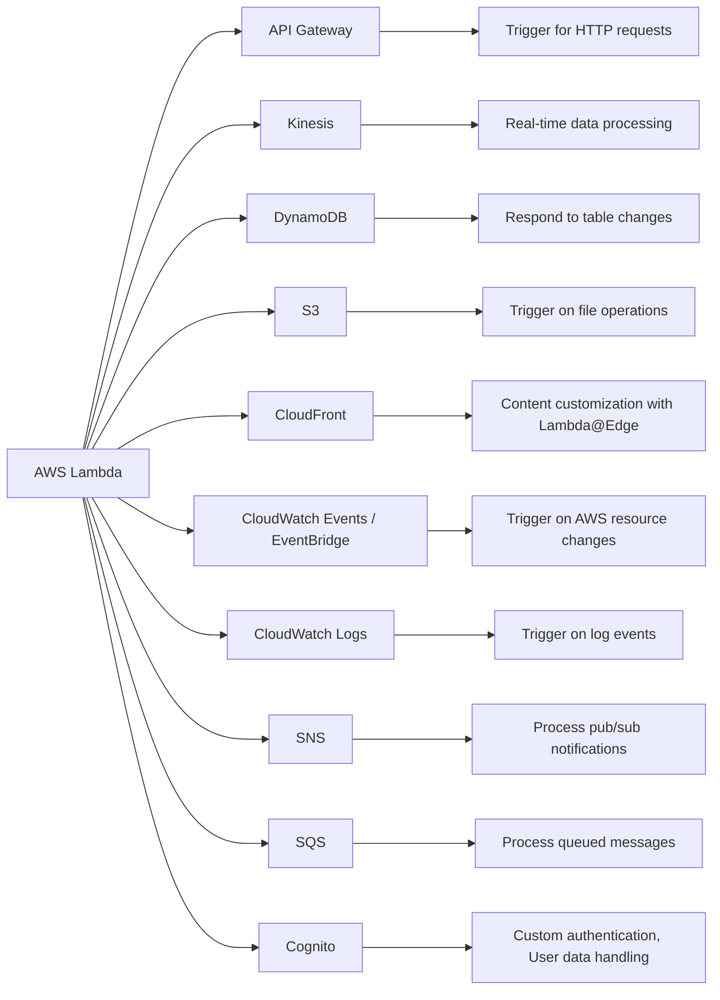
## Use cases
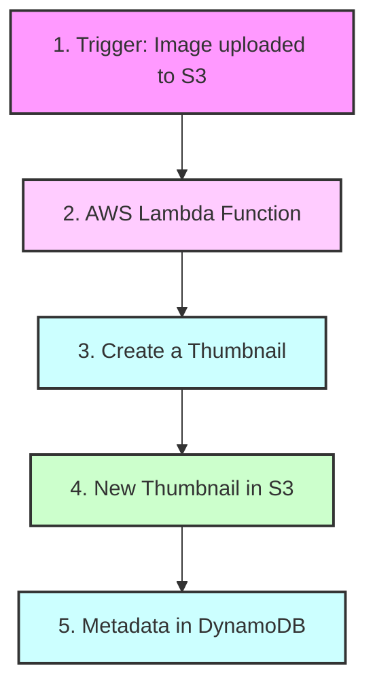
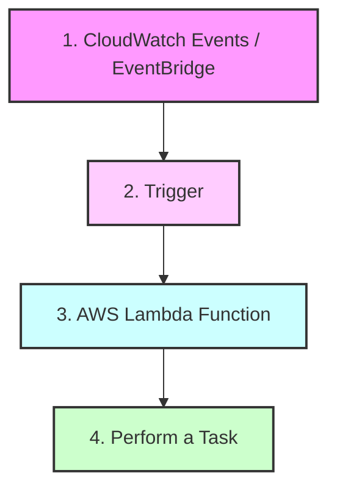
## AWS Lambda Pricing

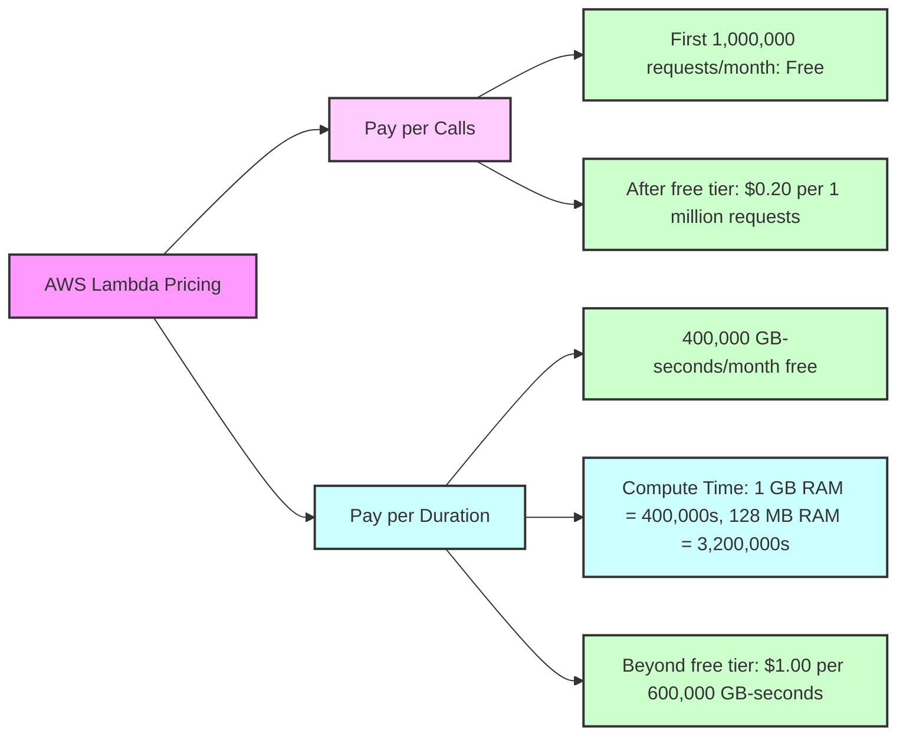


## AWS Lambda Limits

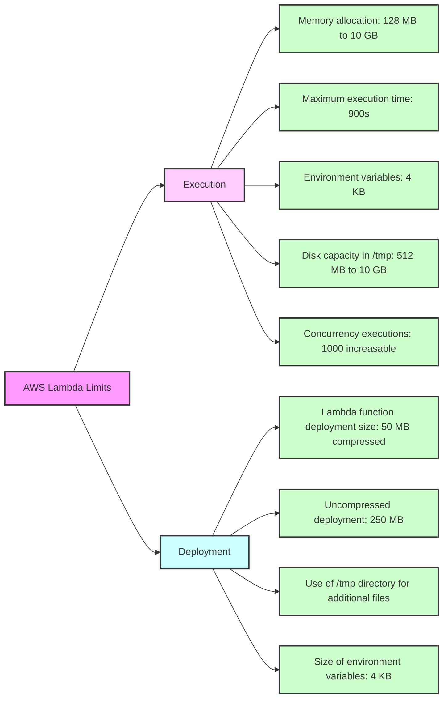

## Customization At The Edge

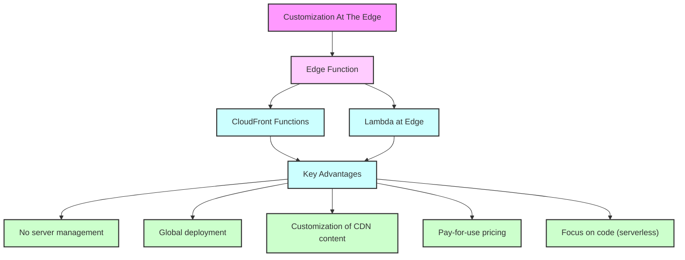

## AWS Services: CloudFront Functions & Lambda at Edge

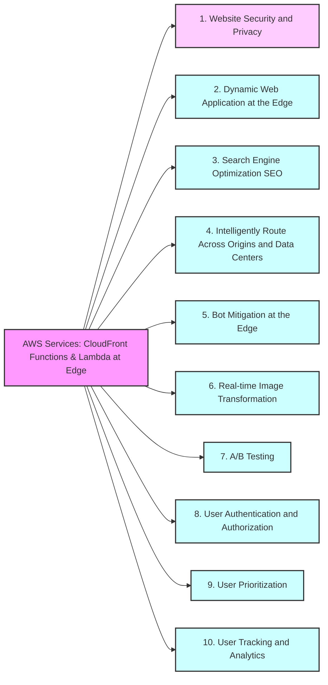

## CloudFront Functions

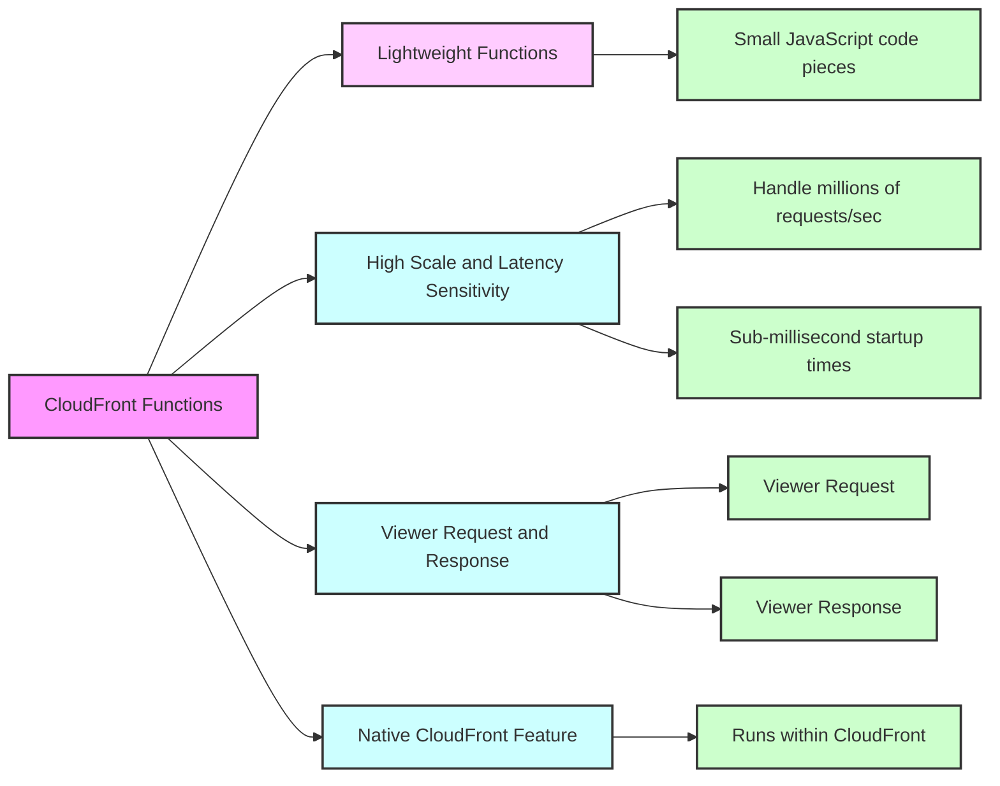


## Lambda at Edge

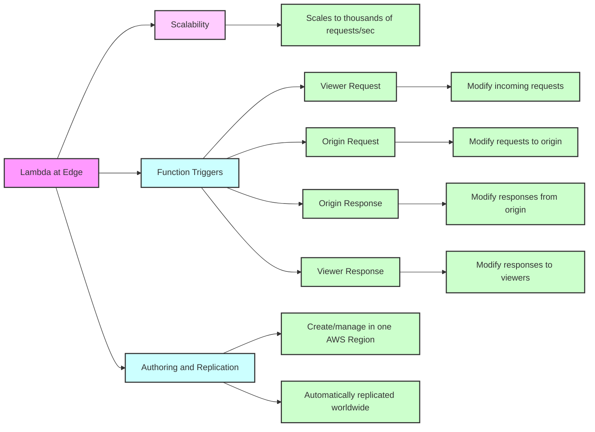

# CloudFront Functions vs. Lambda@Edge Comparison

| Feature                 | CloudFront Functions        | Lambda@Edge                |
|-------------------------|-----------------------------|----------------------------|
| **Runtime Support**     | JavaScript                  | Node.js, Python            |
| **# of Requests**       | Millions per second         | Thousands per second       |
| **CloudFront Triggers** | Viewer Request/Response     | Viewer Request/Response, Origin Request/Response |
| **Max. Execution Time** | < 1 ms                      | 5 – 10 seconds             |
| **Max. Memory**         | 2 MB                        | 128 MB up to 10 GB         |
| **Total Package Size**  | 10 KB                       | 1 MB – 50 MB               |
| **Network Access**      | No                          | Yes                        |
| **File System Access**  | No                          | Yes                        |
| **Access to Request Body** | No                       | Yes                        |
| **Pricing**             | Free tier available, 1/6th price of Lambda@Edge | No free tier, charged per request & duration |

## Notes
- CloudFront Functions are designed for high-scale, latency-sensitive CDN customizations.
- Lambda@Edge allows for more complex computing at the edge with higher computational and memory capacity.
- Pricing models differ significantly, with CloudFront Functions aimed at cost efficiency for simple tasks.


## CloudFront Functions Lambda@Edge

```mermaid
graph LR
subgraph CloudFront_Functions [CloudFront Functions]
Cache_Key_Normalization[Cache Key Normalization]
Header_Manipulation[Header Manipulation]
URL_Rewrites_Redirects[URL Rewrites or Redirects]
Request_Auth[Request Authentication & Authorization]
end

    subgraph Lambda_Edge [Lambda@Edge]
    Longer_Execution[Longer Execution Time]
    Adjustable_CPU_Memory[Adjustable CPU or Memory]
    Code_Dependencies[Code Dependencies]
    Network_Access[Network Access]
    FileSystem_Access[File System Access]
    end

    style CloudFront_Functions fill:#f9f,stroke:#333,stroke-width:2px
    style Cache_Key_Normalization fill:#cfc,stroke:#333,stroke-width:2px
    style Header_Manipulation fill:#cfc,stroke:#333,stroke-width:2px
    style URL_Rewrites_Redirects fill:#cfc,stroke:#333,stroke-width:2px
    style Request_Auth fill:#cfc,stroke:#333,stroke-width:2px

    style Lambda_Edge fill:#fcf,stroke:#333,stroke-width:2px
    style Longer_Execution fill:#cff,stroke:#333,stroke-width:2px
    style Adjustable_CPU_Memory fill:#cff,stroke:#333,stroke-width:2px
    style Code_Dependencies fill:#cff,stroke:#333,stroke-width:2px
    style Network_Access fill:#cff,stroke:#333,stroke-width:2px
    style FileSystem_Access fill:#cff,stroke:#333,stroke-width:2px
```

## Lambda by Default

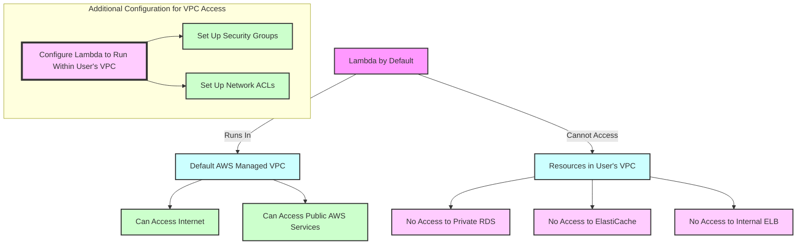
## Lambda in VPC

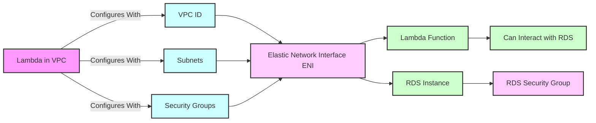

## Lambda with RDS Proxy

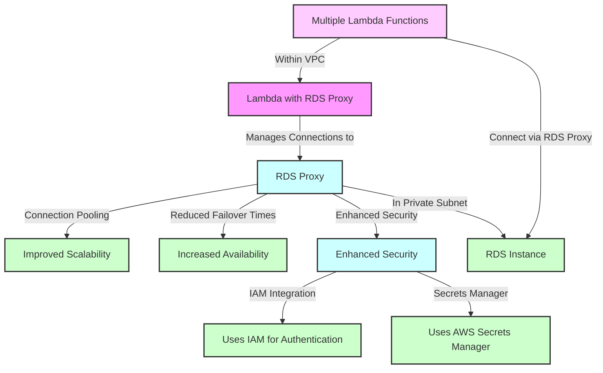

