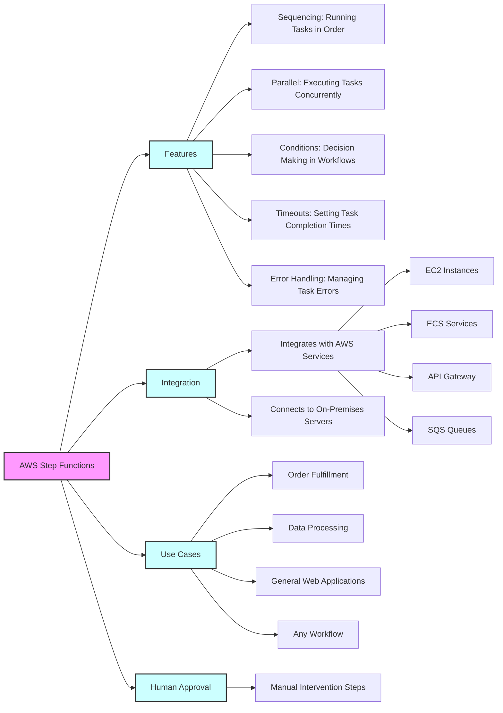

# AWS Step Functions

```mermaid
graph LR
    Step_Functions[AWS Step Functions] --> Features[Features]
    Step_Functions --> Integration[Integration]
    Step_Functions --> Use_Cases[Use Cases]
    Step_Functions --> Human_Approval[Human Approval]

    Features --> Sequencing[Sequencing: Running Tasks in Order]
    Features --> Parallel[Parallel: Executing Tasks Concurrently]
    Features --> Conditions[Conditions: Decision Making in Workflows]
    Features --> Timeouts[Timeouts: Setting Task Completion Times]
    Features --> Error_Handling[Error Handling: Managing Task Errors]

    Integration --> AWS_Services[Integrates with AWS Services]
    Integration --> On_Premises[Connects to On-Premises Servers]

    AWS_Services --> EC2[EC2 Instances]
    AWS_Services --> ECS[ECS Services]
    AWS_Services --> API_Gateway[API Gateway]
    AWS_Services --> SQS[SQS Queues]

    Use_Cases --> Order_Fulfillment[Order Fulfillment]
    Use_Cases --> Data_Processing[Data Processing]
    Use_Cases --> Web_Applications[General Web Applications]
    Use_Cases --> Any_Workflow[Any Workflow]

    Human_Approval --> Manual_Intervention[Manual Intervention Steps]

    style Step_Functions fill:#f9f,stroke:#333,stroke-width:2px
    style Features fill:#cff,stroke:#333,stroke-width:2px
    style Integration fill:#cff,stroke:#333,stroke-width:2px
    style Use_Cases fill:#cff,stroke:#333,stroke-width:2px
    style Human_Approval fill:#cff,stroke:#333,stroke-width:2px


```

