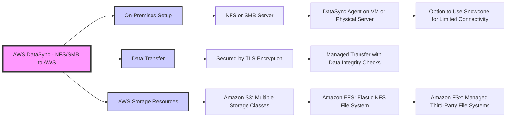
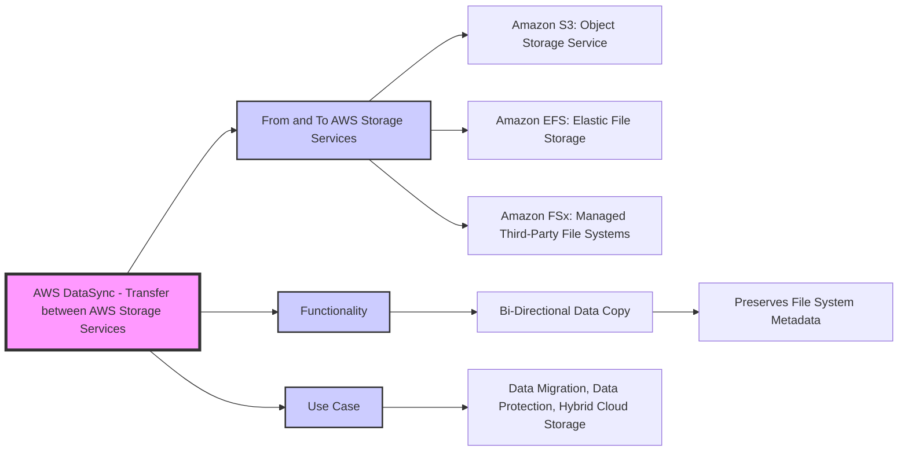

# AWS DataSync

# AWS  DataSync - NFS/SMB to AWS

# AWS DataSync - Transfer between AWS Storage Services

# AWS DataSync - Transfer between AWS Storage Services

| Feature                   | AWS Storage Gateway                                    | AWS DataSync                                        |
|---------------------------|--------------------------------------------------------|-----------------------------------------------------|
| **Primary Use Case**      | Hybrid storage service that enables on-premises access to virtually unlimited cloud storage. | High-speed online data transfer service between on-premises storage and AWS services. |
| **Integration**           | Integrates with existing applications via standard storage protocols (NFS, SMB, iSCSI). | Integrates with NFS, SMB, and object storage protocols for data transfer. |
| **Data Transfer**         | Suitable for scenarios where on-premises applications need frequent access to data stored in AWS. | Optimized for moving large volumes of data into and out of AWS rapidly and efficiently. |
| **Performance**           | Depends on the chosen gateway type and local resources. | High-performance data transfers; scales to transfer petabytes of data. |
| **Storage Services**      | Works with Amazon S3, EBS, and Glacier. | Works primarily with Amazon S3, EFS, and FSx for Windows File Server. |
| **Cost**                  | Charges for gateway usage, data storage, and data retrieval costs. | Charges based on the amount of data transferred. |
| **Deployment**            | Deployed as a virtual machine or hardware appliance on-premises. | Deployed as an agent on-premises or in the cloud. |
| **Caching**               | Supports local caching for frequently accessed data. | No local caching; focuses on efficient data transfer. |
| **Backup and Archiving**  | Supports backup and archival solutions, integrating with existing backup applications. | More focused on data transfer than backup/archiving. However, can be used for initial backup transfers. |
| **Data Synchronization**  | Not specifically designed for data synchronization tasks. | Designed for efficient, periodic data synchronization tasks. |
| **Encryption and Security** | Data encrypted in transit and at rest; integrates with AWS IAM for access control. | Data encrypted in transit; integrates with AWS IAM and Key Management Service for encryption and access control. |
