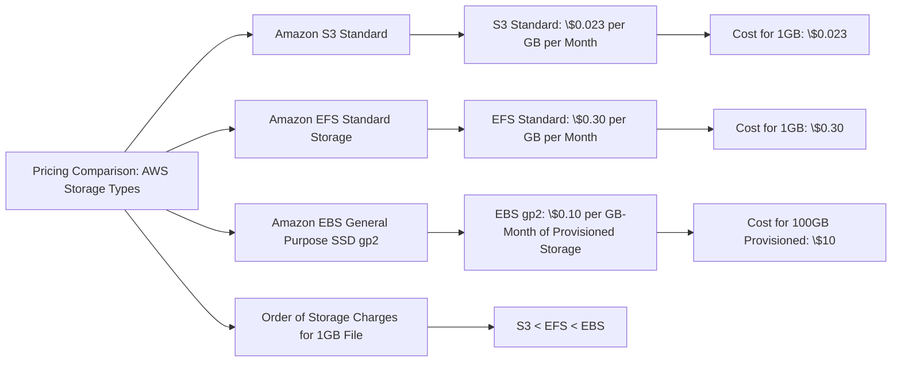

# EBS vs EFS

| Feature                      | Amazon EBS                                                   | Amazon EFS                                                      |
|------------------------------|--------------------------------------------------------------|-----------------------------------------------------------------|
| Storage Type                 | Block storage                                                | File storage                                                    |
| Use Case                     | Single EC2 instance; persistent block storage                | Multiple EC2 instances; shared file storage                     |
| Performance                  | High performance, especially with provisioned IOPS volumes   | Lower performance than EBS; performance mode can be adjusted    |
| Scalability                  | Must be manually scaled                                      | Automatically scales, pay for what you use                      |
| Data Consistency             | Consistent for a single instance                             | Strongly consistent for multiple instances                      |
| Throughput                   | Depends on volume type, up to 1,000 MiB/s (io2 Block Express)| Standard: 50 MiB/s per TB, scalable to 500+ MiB/s (Bursting)    |
| Durability                   | High durability (99.999%)                                    | High durability (99.999999999%)                                 |
| Availability                 | Availability tied to specific EC2 instance                   | High availability across multiple AZs                           |
| Accessibility                | Accessible from attached EC2 instance                        | Accessible from multiple EC2 instances and on-premises servers  |
| Snapshot/Backup              | Snapshot feature available                                   | EFS-to-EFS backup solutions or third-party backup tools         |
| Pricing                      | Volume size, provisioned IOPS, and throughput                | Storage capacity used, and additional charge for Infrequent Access (IA) |
| File System Interfaces       | Not applicable, as it is block-based                         | POSIX-compliant file system                                     |
| Operating Systems Compatibility | Compatible with any OS that supports block storage      | Compatible with Linux-based AMIs that support NFSv4             |
| Max Storage Capacity         | Up to 64 TiB per volume                                      | Petabyte-scale storage capacity                                 |
| Multi-Attach Capable         | Yes, for io1/io2 volumes                                     | Natively multi-attach capable                                   |

## For exam
1. A technology blogger wants to write a review on the comparative pricing for various storage types available on AWS Cloud. The blogger has created a test file of size 1 gigabytes with some random data. Next he copies this test file into AWS S3 Standard storage class, provisions an Amazon EBS volume (General Purpose SSD (gp2)) with 100 gigabytes of provisioned storage and copies the test file into the Amazon EBS volume, and lastly copies the test file into an Amazon EFS Standard Storage filesystem. At the end of the month, he analyses the bill for costs incurred on the respective storage types for the test file.

What is the correct order of the storage charges incurred for the test file on these three storage types?

***Answer:*** Explanation
Correct option:

Cost of test file storage on Amazon S3 Standard < Cost of test file storage on Amazon EFS < Cost of test file storage on Amazon EBS

With Amazon EFS Elastic Volumes, you pay only for the resources that you use. The Amazon EFS Standard Storage pricing is $0.30 per GB per month. Therefore the cost for storing the test file on EFS is $0.30 for the month.

For Amazon EBS General Purpose SSD (gp2) volumes, the charges are $0.10 per GB-month of provisioned storage. Therefore, for a provisioned storage of 100GB for this use-case, the monthly cost on EBS is $0.10*100 = $10. This cost is irrespective of how much storage is actually consumed by the test file.

For S3 Standard storage, the pricing is $0.023 per GB per month. Therefore, the monthly storage cost on S3 for the test file is $0.023.

Therefore this is the correct option.

