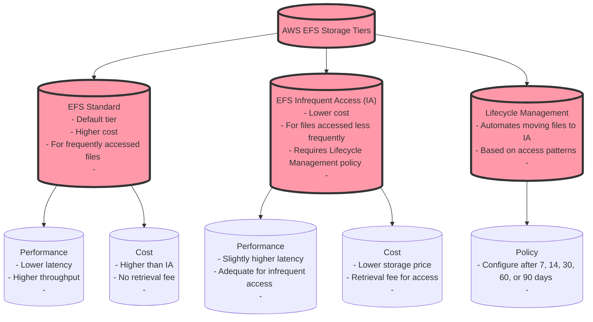

# EFS Storage Tiers

```mermaid
graph TD;
    EFS_Storage_Tiers[("AWS EFS Storage Tiers")]
    EFS_Storage_Tiers --> Standard[("EFS Standard\n- Default tier\n- Higher cost\n- For frequently accessed files \n-")]
    EFS_Storage_Tiers --> IA[("EFS Infrequent Access (IA)\n- Lower cost\n- For files accessed less frequently\n- Requires Lifecycle Management policy \n-")]

    Standard --> Performance_Standard[("Performance\n- Lower latency\n- Higher throughput \n-")]
    Standard --> Cost_Standard[("Cost\n- Higher than IA\n- No retrieval fee \n-")]

    IA --> Performance_IA[("Performance\n- Slightly higher latency\n- Adequate for infrequent access \n-")]
    IA --> Cost_IA[("Cost\n- Lower storage price\n- Retrieval fee for access \n-")]

    EFS_Storage_Tiers --> Lifecycle_Management[("Lifecycle Management\n- Automates moving files to IA\n- Based on access patterns \n-")]
    Lifecycle_Management --> Policy[("Policy\n- Configure after 7, 14, 30, 60, or 90 days \n-")]

    classDef important fill:#f9a,stroke:#333,stroke-width:4px;
    class EFS_Storage_Tiers,Standard,IA,Lifecycle_Management important;


```

