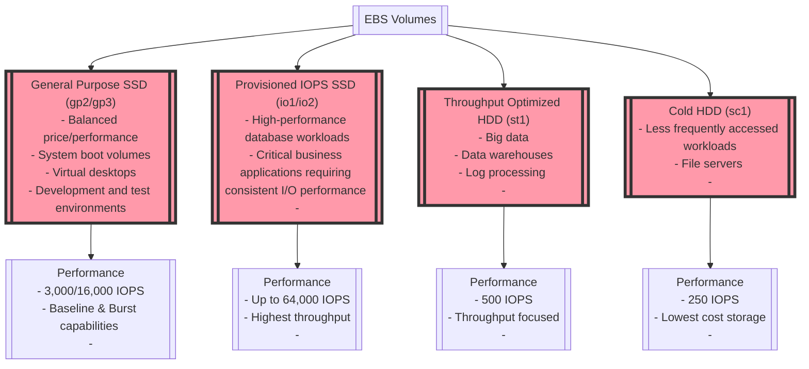

# EBS Volume Types

## General Purpose SSD
### gp2/gp3

| Feature                     | gp2                               | gp3                                 |
|-----------------------------|-----------------------------------|-------------------------------------|
| Volume Type                 | General Purpose SSD               | General Purpose SSD                 |
| Use Cases                   | System boot volumes, Development and test environments, Low-latency interactive apps | System boot volumes, Virtual desktops, Development and test environments |
| Max Volume Size             | 16 TiB                            | 16 TiB                              |
| Max IOPS per Volume         | 10,000 IOPS                       | 16,000 IOPS                         |
| Max Throughput per Volume   | 160 MiB/s                         | 1000 MiB/s                          |
| IOPS per GiB                | 3 IOPS/GiB                        | Baseline of 3,000 IOPS up to 16,000 IOPS regardless of volume size |
| Throughput per GiB          | -                                 | 125 MiB/s throughput per TiB, up to a maximum of 1,000 MiB/s |
| Durability                  | < 0.2% annual failure rate        | < 0.2% annual failure rate          |
| Pricing                     | Based on the volume size          | More cost-effective than gp2; pricing based on the size, IOPS, and throughput |
| Provisioned IOPS            | No, performance scales with volume size | Yes, can provision IOPS separately from storage size |
| Provisioned Throughput      | No, performance scales with volume size | Yes, can provision throughput independently of IOPS |
| Bootable                    | Yes                               | Yes                                 |
| API Name                    | `gp2`                             | `gp3`                               |

## Provisioned IOPS SSD 
### io1/io2

| Feature                    | io1                               | io2                                |
|----------------------------|-----------------------------------|------------------------------------|
| Volume Type                | Provisioned IOPS SSD              | Provisioned IOPS SSD               |
| Use Cases                  | Critical business applications that require sustained IOPS performance, large database workloads | Mission-critical applications, databases that need higher durability, and IOPS intensive workloads |
| Max Volume Size            | 16 TiB                            | 16 TiB                             |
| Max IOPS per Volume        | 64,000 IOPS                       | 64,000 IOPS                        |
| Max Throughput per Volume  | 1,000 MiB/s                       | 1,000 MiB/s                        |
| IOPS:GiB Ratio             | 50:1                              | 500:1                              |
| Durability                 | < 0.1-0.2% annual failure rate    | 99.999% durability, higher than io1 |
| Multi-Attach Capable       | No                                | Yes, with io2 Block Express volumes |
| Pricing                    | Higher cost, based on provisioned storage and IOPS | Higher cost than io1, based on provisioned storage and IOPS |
| Provisioned IOPS           | Yes, can provision IOPS over and above the volume size | Yes, can provision IOPS over and above the volume size |
| Bootable                   | Yes                               | Yes                                |
| API Name                   | `io1`                             | `io2`                              |
| Additional Benefits        | -                                 | io2 Block Express volumes offer sub-millisecond latency and are designed for the largest, most I/O intensive, mission-critical deployments |

## HDD volumes offered by AWS EBS
### sc1/st1

| Feature                    | sc1 (Cold HDD)                    | st1 (Throughput Optimized HDD)      |
|----------------------------|-----------------------------------|-------------------------------------|
| Volume Type                | Cold HDD                          | Throughput Optimized HDD            |
| Use Cases                  | Infrequently accessed data, colder workloads | Frequently accessed, throughput-intensive workloads such as big data, data warehouses, log processing |
| Max Volume Size            | 16 TiB                            | 16 TiB                              |
| Max IOPS per Volume        | 250 IOPS                          | 500 IOPS                            |
| Max Throughput per Volume  | 250 MiB/s                         | 500 MiB/s                           |
| IOPS:GiB Ratio             | Not Applicable; IOPS are not performance determinant for sc1 volumes | Not Applicable; IOPS are not performance determinant for st1 volumes |
| Durability                 | < 0.2-0.5% annual failure rate    | < 0.2-0.5% annual failure rate      |
| Multi-Attach Capable       | No                                | No                                  |
| Pricing                    | Lowest cost storage for infrequently accessed workloads | Cost-efficient for throughput rather than IOPS |
| Provisioned IOPS           | No                                | No                                  |
| Bootable                   | No                                | No                                  |
| API Name                   | `sc1`                             | `st1`                              |
| Additional Benefits        | Designed for scenarios where data is infrequently accessed, and where the lowest storage cost is important | Optimized for large, sequential I/O - it offers high throughput at a low cost |
