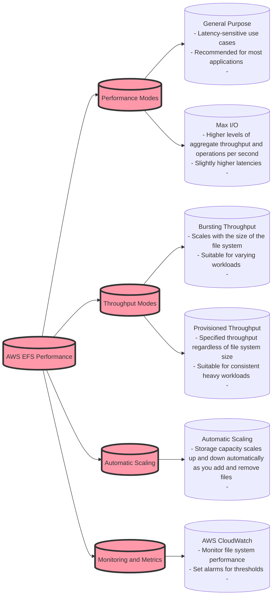

# AWS EFS Performance

```mermaid
graph LR;
    EFS_Performance[("AWS EFS Performance")]
    EFS_Performance --> Performance_Modes[("Performance Modes")]
    EFS_Performance --> Throughput_Modes[("Throughput Modes")]
    EFS_Performance --> Scaling[("Automatic Scaling")]
    EFS_Performance --> Metrics[("Monitoring and Metrics")]

    Performance_Modes --> General_Purpose[("General Purpose\n- Latency-sensitive use cases\n- Recommended for most applications \n-")]
    Performance_Modes --> Max_IO[("Max I/O\n- Higher levels of aggregate throughput and operations per second\n- Slightly higher latencies \n-")]

    Throughput_Modes --> Bursting[("Bursting Throughput\n- Scales with the size of the file system\n- Suitable for varying workloads \n-")]
    Throughput_Modes --> Provisioned[("Provisioned Throughput\n- Specified throughput regardless of file system size\n- Suitable for consistent heavy workloads \n-")]

    Scaling --> Auto_Scaling[("Automatic Scaling\n- Storage capacity scales up and down automatically as you add and remove files \n-")]

    Metrics --> CloudWatch[("AWS CloudWatch\n- Monitor file system performance\n- Set alarms for thresholds \n-")]

    classDef important fill:#f9a,stroke:#333,stroke-width:4px;
    class EFS_Performance,Performance_Modes,Throughput_Modes,Scaling,Metrics important;


```

