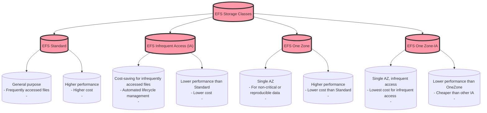

# EFS Storage Classes

```mermaid
graph TD;
    EFS_Storage_Classes[("EFS Storage Classes")]
    EFS_Storage_Classes --> Standard[("EFS Standard")]
    EFS_Storage_Classes --> IA[("EFS Infrequent Access (IA)")]
    EFS_Storage_Classes --> OneZone[("EFS One Zone")]
    EFS_Storage_Classes --> OneZone_IA[("EFS One Zone-IA")]

    Standard --> Standard_Use[("General purpose\n- Frequently accessed files \n-")]
    Standard --> Standard_Performance[("Higher performance\n- Higher cost \n-")]

    IA --> IA_Use[("Cost-saving for infrequently accessed files\n- Automated lifecycle management \n-")]
    IA --> IA_Performance[("Lower performance than Standard\n- Lower cost \n-")]

    OneZone --> OneZone_Use[("Single AZ\n- For non-critical or reproducible data \n-")]
    OneZone --> OneZone_Performance[("Higher performance\n- Lower cost than Standard \n-")]

    OneZone_IA --> OneZone_IA_Use[("Single AZ, infrequent access\n- Lowest cost for infrequent access \n-")]
    OneZone_IA --> OneZone_IA_Performance[("Lower performance than OneZone\n- Cheaper than other IA \n-")]

    classDef important fill:#f9a,stroke:#333,stroke-width:4px;
    class EFS_Storage_Classes,Standard,IA,OneZone,OneZone_IA important;


```

