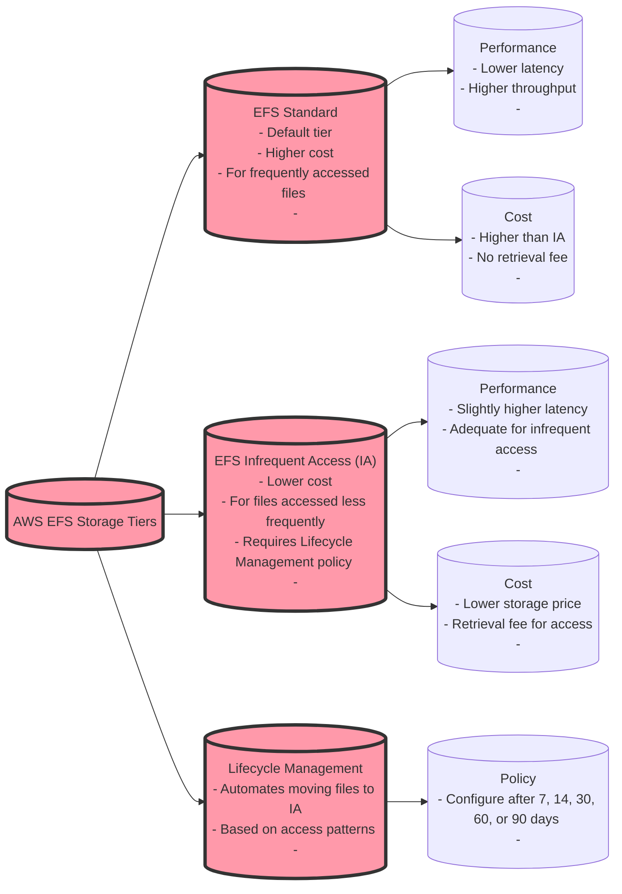
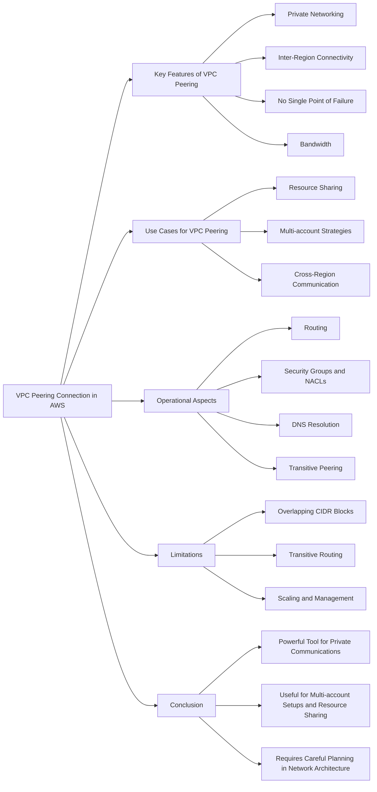

# EFS Storage Tiers

## For exam

1. The sourcing team at the US headquarters of a global e-commerce company is preparing a spreadsheet of the new product catalog. The spreadsheet is saved on an Amazon Elastic File System (Amazon EFS) created in us-east-1 region. The sourcing team counterparts from other AWS regions such as Asia Pacific and Europe also want to collaborate on this spreadsheet.

As a solutions architect, what is your recommendation to enable this collaboration with the LEAST amount of operational overhead?

***Answer:*** The spreadsheet on the Amazon Elastic File System (Amazon EFS) can be accessed in other AWS regions by using an inter-region VPC peering connection

Amazon Elastic File System (Amazon EFS) provides a simple, scalable, fully managed elastic NFS file system for use with AWS Cloud services and on-premises resources.

Amazon EFS is a regional service storing data within and across multiple Availability Zones (AZs) for high availability and durability. Amazon EC2 instances can access your file system across AZs, regions, and VPCs, while on-premises servers can access using AWS Direct Connect or AWS VPN.

You can connect to Amazon EFS file systems from EC2 instances in other AWS regions using an inter-region VPC peering connection, and from on-premises servers using an AWS VPN connection. So this is the correct option.

