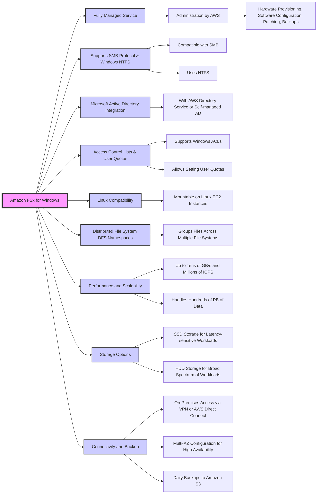
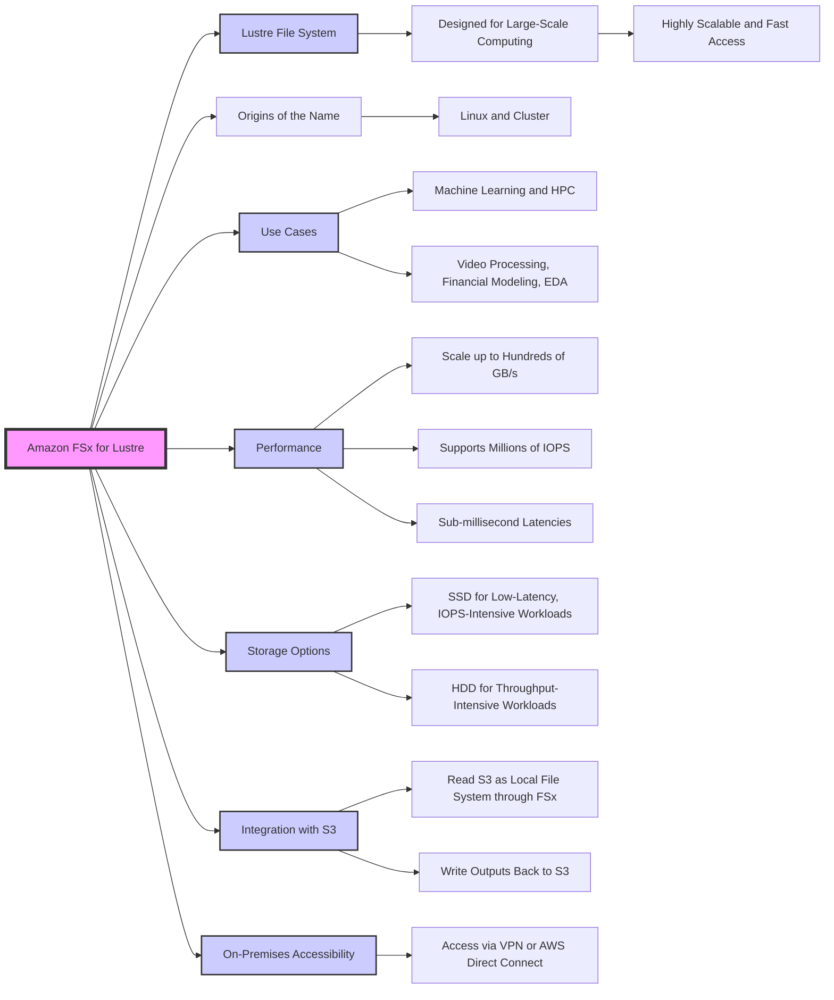
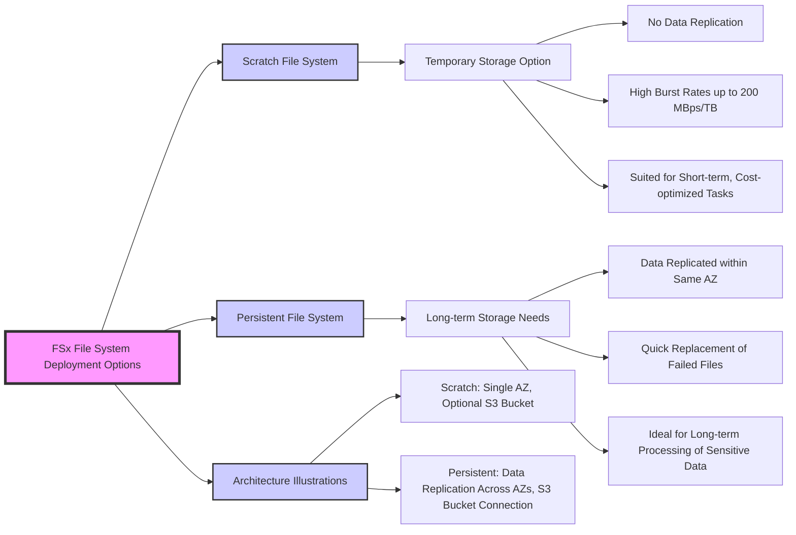
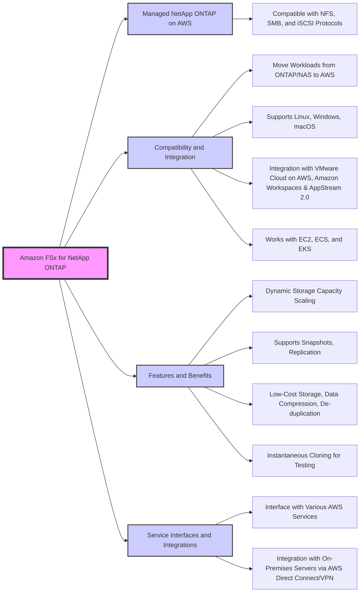
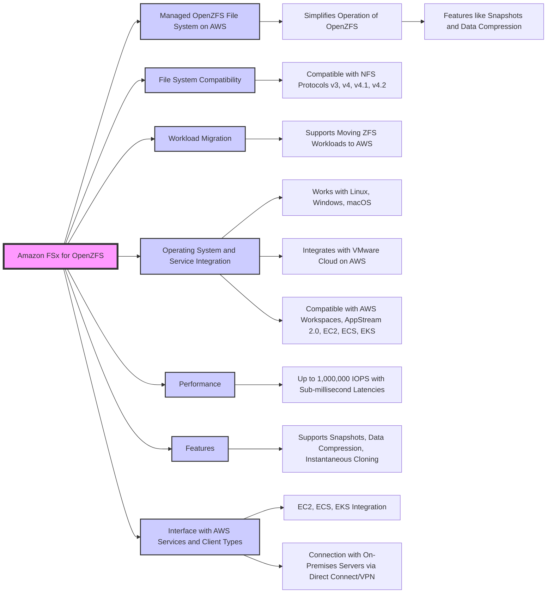
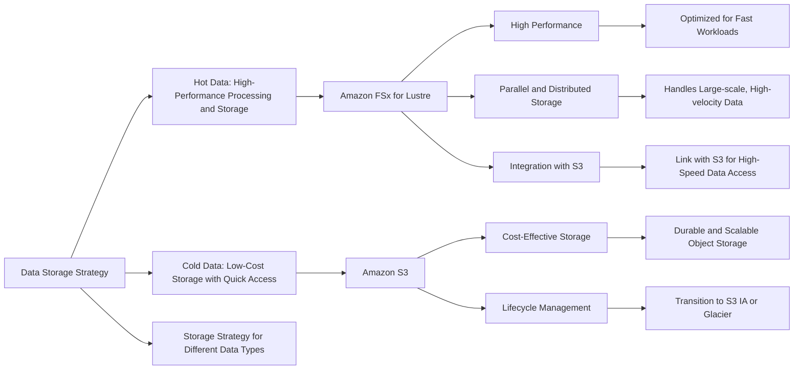

# Amazon FSx for Windows

## Amazon FSx for Lustre

## Amazon FSx File System Deployment Options

| Feature | Scratch File System | Persistent File System |
|---------|---------------------|------------------------|
| **Durability** | Data is not replicated (data loss if the system fails) | Data is replicated within the same AZ |
| **Data Persistence** | Temporary storage (data does not persist if file server fails) | Long-term storage (designed to replace failed files quickly) |
| **Performance** | High burst (6x faster, 200MBps per TiB) | Performance suitable for long-term processing needs |
| **Use Case** | Short-term processing, cost optimization | Long-term processing, sensitive data |
| **Replication** | None | Within the same AZ |
| **Data Recovery** | Not available | Replace failed files within minutes |
| **Integration with S3** | Optional data repository | Optional data repository |
| **Best Suited For** | Workloads where data durability is less critical | Workloads requiring data durability and high availability |

## Amazon FSx for NetApp ONTAP

## Amazon FSx for OpenZFS

| Feature / Service | FSx for Lustre | FSx for Windows File Server | FSx for NetApp ONTAP | FSx for OpenZFS |
|-------------------|----------------|----------------------------|----------------------|-----------------|
| **Use Case** | High-performance computing, machine learning, big data analytics | General purpose file storage, business applications | Enterprise applications, databases, storage consolidation | High-performance file storage, databases, virtualization |
| **File System** | Lustre | Windows File Server | NetApp ONTAP | OpenZFS |
| **Protocols Supported** | NFS, Lustre | SMB, NFS | NFS, SMB, iSCSI | NFS, SMB, iSCSI |
| **Workload Compatibility** | Linux-based workloads | Windows-based workloads | Mixed enterprise workloads | Linux, Windows, macOS workloads |
| **Performance** | Scale-out, designed for fast processing and high throughput | Scale-up, consistent performance for broad applications | High performance, data management features | High performance, rich feature set |
| **Management** | Fully managed, integrated with S3 for storage tiering | Fully managed, integrates with Active Directory | Fully managed, advanced data management features | Fully managed, advanced file system capabilities |
| **Data Services** | Snapshots, S3 integration | Deduplication, compression, encryption | Snapshots, cloning, replication, tiering to S3 | Snapshots, compression, encryption, cloning |
| **Integration** | AWS services, seamless S3 integration | AWS Directory Service, seamless S3 integration | Multi-protocol support, S3 integration | AWS services, seamless S3 integration |
| **Scalability** | Petabyte-scale, grows and shrinks automatically | Storage capacity tied to the file server | Flexibly scales, supports multi-AZ deployment | Petabyte-scale, automatic tiering |

## EFS vs FSx

| Feature                      | Amazon EFS                                  | Amazon FSx                                  |
|------------------------------|---------------------------------------------|---------------------------------------------|
| **Purpose**                  | General-purpose file storage for Linux-based applications. | Specialized file systems optimized for specific workloads. |
| **File Systems**             | POSIX-compliant file system.                | Multiple file system options (Windows File Server, Lustre, NetApp ONTAP, OpenZFS). |
| **Performance**              | Scalable performance, multiple throughput modes available. | Varies by FSx type, can be optimized for high-performance or specific application needs. |
| **Protocols**                | NFS.                                        | NFS, SMB, iSCSI (varies by FSx type).       |
| **Scalability**              | Elastic, scales with usage.                 | Preset scaling options, some FSx types can auto-scale. |
| **Integration**              | Integrated with AWS Cloud services, suitable for Linux environments. | Deep integration with AWS services, supports Windows environments, HPC, and others. |
| **Data Management Features** | Lifecycle management policies for automatic archiving. | Snapshots, data deduplication, compression, and more (varies by FSx type). |
| **Pricing Model**            | Pay for storage used.                       | Pay for provisioned storage and throughput, with additional features influencing cost. |
| **Use Cases**                | Web serving, content management, data sharing across instances. | Database workloads, enterprise applications, HPC, machine learning, etc. |
| **Management**               | Fully managed, no hardware to manage.       | Fully managed, specific FSx types offer additional data management features. |
| **Durability and Availability** | Designed for high durability, availability depends on chosen performance mode. | High durability, availability options vary by FSx service type (e.g., multi-AZ deployment for FSx for Windows File Server). |
| **Compute Integration**      | Can be mounted on EC2 instances and other AWS compute services. | Can be mounted on EC2 instances, integrates with AWS compute services, supports on-premises servers (varies by FSx type). |

## For exam:

1. An Electronic Design Automation (EDA) application produces massive volumes of data that can be divided into two categories. The 'hot data' needs to be both processed and stored quickly in a parallel and distributed fashion. The 'cold data' needs to be kept for reference with quick access for reads and updates at a low cost.

Which of the following AWS services is BEST suited to accelerate the aforementioned chip design process?

***Answer:*** Amazon FSx for Lustre makes it easy and cost-effective to launch and run the world’s most popular high-performance file system. It is used for workloads such as machine learning, high-performance computing (HPC), video processing, and financial modeling. The open-source Lustre file system is designed for applications that require fast storage – where you want your storage to keep up with your compute. FSx for Lustre integrates with Amazon S3, making it easy to process data sets with the Lustre file system. When linked to an S3 bucket, an FSx for Lustre file system transparently presents S3 objects as files and allows you to write changed data back to S3.

FSx for Lustre provides the ability to both process the 'hot data' in a parallel and distributed fashion as well as easily store the 'cold data' on Amazon S3. Therefore this option is the BEST fit for the given problem statement.

