# S3


## Amazon S3 Use Case

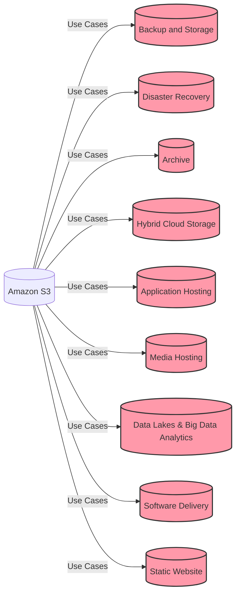

## Amazon S3 Buckets

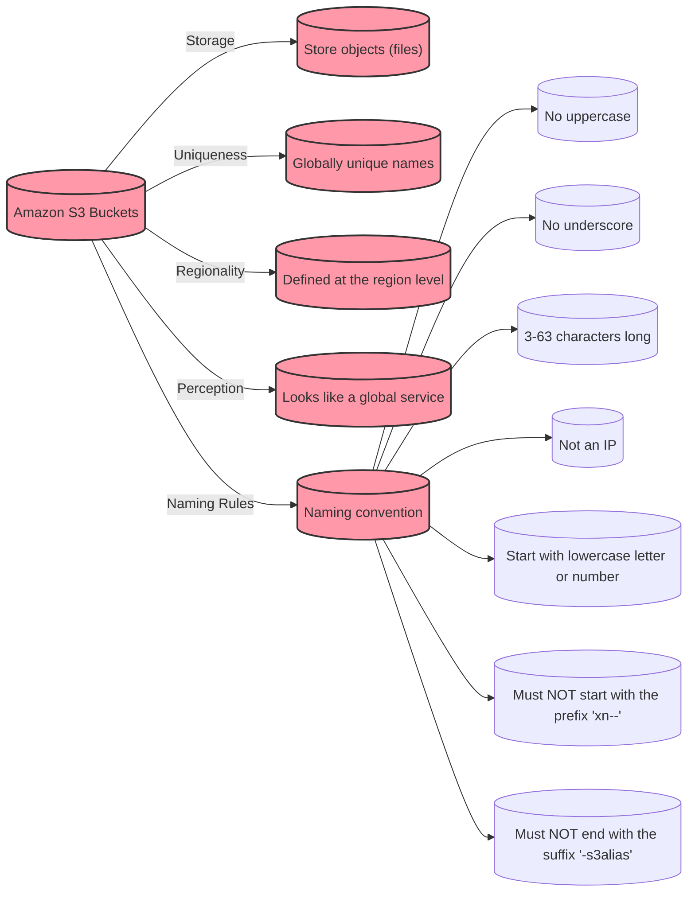

## Amazon S3 Objects

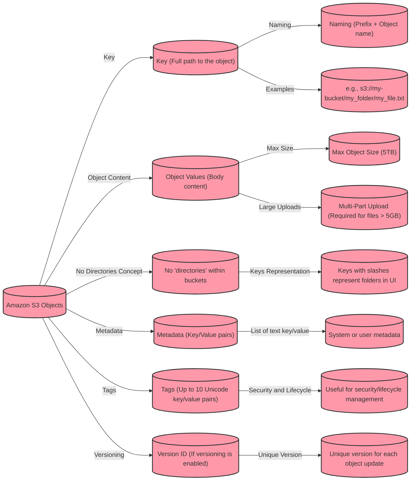


## Amazon S3 Security

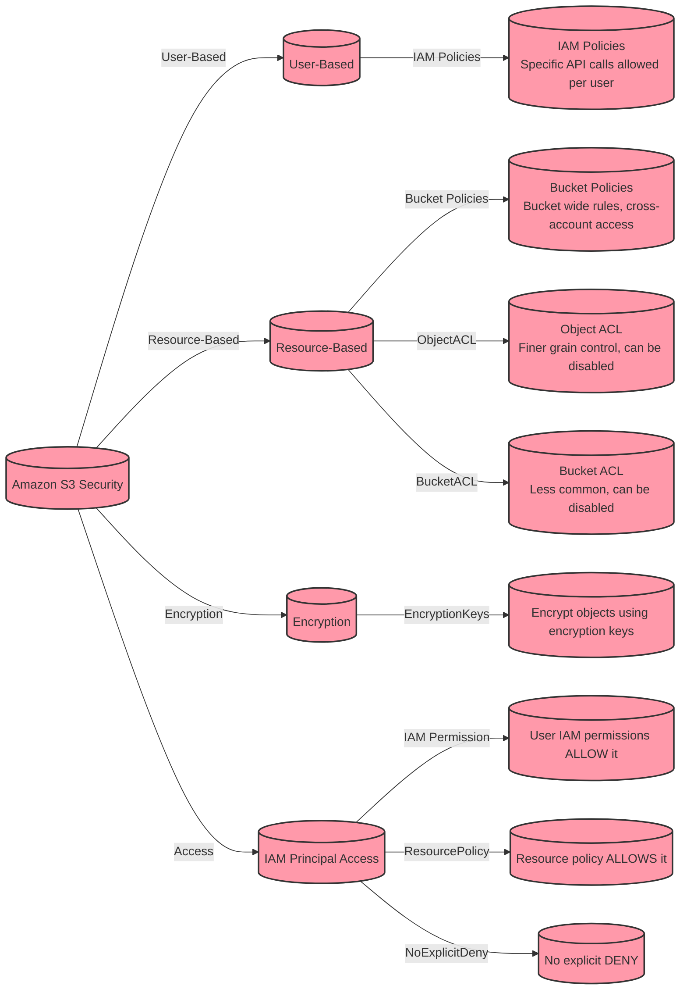

## Amazon S3 Security

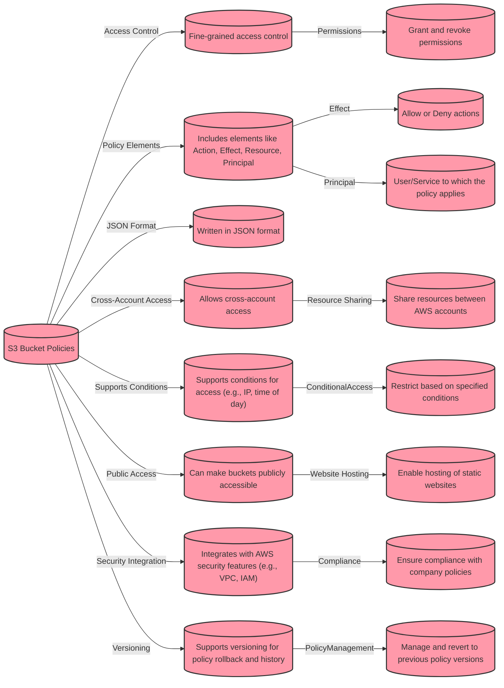

## Amazon S3 Security

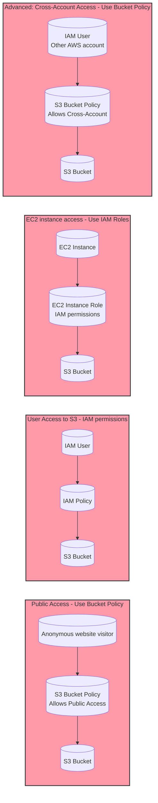


| Feature                  | S3 Bucket Policy (Public Access) | IAM User Policy | IAM Role for EC2 | S3 Bucket Policy (Cross-Account Access) |
|--------------------------|----------------------------------|-----------------|------------------|-----------------------------------------|
| **Access Type**          | Bucket-level                     | User-level      | Role-level       | Bucket-level                            |
| **Principal**            | Anonymous users                  | Specific IAM users | EC2 instance      | IAM user from another AWS account      |
| **Permissions**          | Read/Write, List, etc.           | API calls specified in policy | Delegated permissions from IAM Role | Specified actions allowed for cross-account user |
| **Use Case**             | Public websites, open data       | Individual AWS user access | Applications running on EC2 | Sharing resources with external AWS accounts |
| **Scope**                | Global access                    | Specific to the user | Attached to EC2 instance | Global or limited to certain accounts |
| **Management**           | Managed in S3 bucket settings    | Managed in IAM   | Managed in IAM and EC2 | Managed in S3 bucket settings         |
| **Security Concerns**    | Potential overexposure of data   | Fine-grained access control | Use of temporary credentials | Explicit trust between accounts required |
| **Flexibility**          | Can be overly permissive         | Highly customizable per user | Roles can be switched dynamically | Can be restrictive or permissive depending on policy |
| **Identity Federation**  | Not applicable                   | Possible with IAM users | Supported through IAM roles | Requires trust relationship setup    |
| **Visibility**           | Visible in S3 bucket policy      | Visible in IAM policies | Visible in IAM roles | Visible in S3 bucket policy          |
| **Encryption Support**   | Can specify encryption requirements | Can specify encryption requirements | Can specify encryption requirements | Can specify encryption requirements |


## Amazon S3 - Versioning

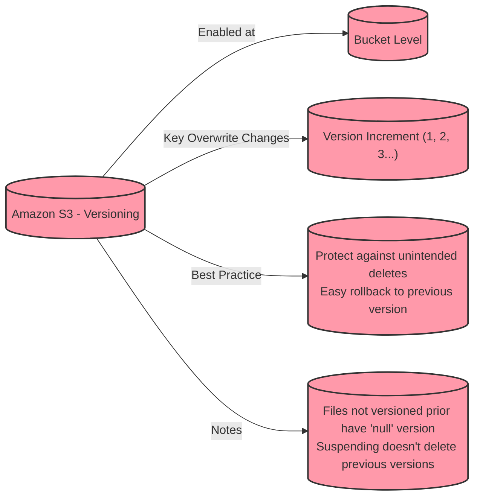

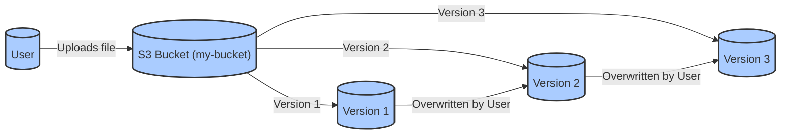

## Amazon S3 Delete Marker

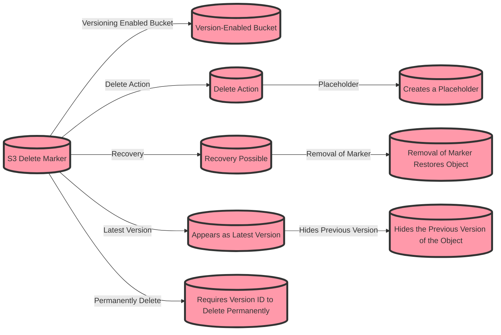

| Feature/Action                   | Permanently Deleting Object                                    | Delete Marker in S3                                        |
|----------------------------------|-----------------------------------------------------------------|-----------------------------------------------------------|
| **Action Description**           | Removal of the object and all its versions from the bucket.    | A marker indicating that an object was deleted.           |
| **Versioning Requirement**       | Must be versioned to delete specific object versions.          | Only applicable if versioning is enabled on the bucket.    |
| **Visibility**                   | The object and its versions are no longer visible.             | The object is hidden, but not removed.                     |
| **Recovery**                     | Cannot be recovered once permanently deleted.                  | The object can be recovered by removing the delete marker. |
| **Version ID**                   | Requires specifying the version ID to delete.                  | Delete marker has its own version ID.                      |
| **Effect on Storage**            | Frees up storage as the object is completely removed.          | Storage is still used as the object versions are retained. |
| **Use Case**                     | To free up space or remove sensitive data completely.          | To temporarily remove access to an object.                 |
| **Billing**                      | No longer billed for storage of the deleted object.             | Still billed for the storage of the noncurrent versions.   |
| **Access**                       | No version of the object can be accessed post deletion.        | Previous versions of the object can be accessed.           |
| **Lifecycle Policies**           | Can be used to automatically delete old versions or expired objects. | Can be used to automatically clean up delete markers.       |
| **Best Practice**                | Used for final, irrevocable removal.                           | Used for reversible deletion, maintaining a clean state.   |
| **Audit Trail**                  | Deletion event can be logged in S3 access logs for tracking.    | Creation of delete marker is logged, not the actual deletion of data. |


## Amazon S3 Replication

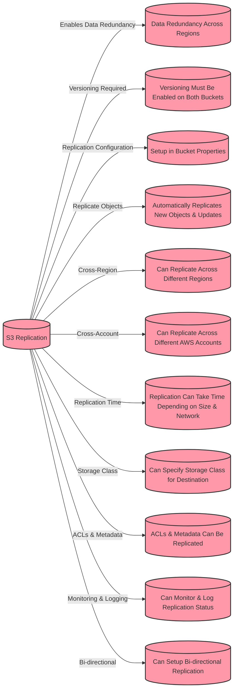


## Amazon S3 Storage Classes

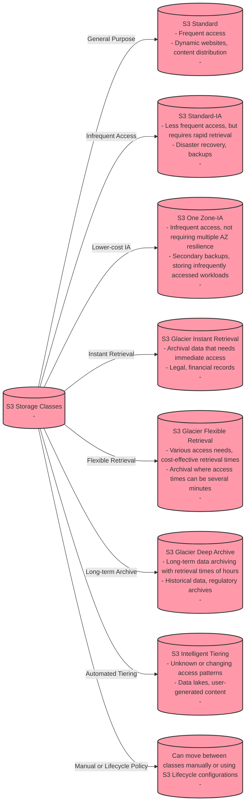

## Amazon S3 Standard - General Purpose

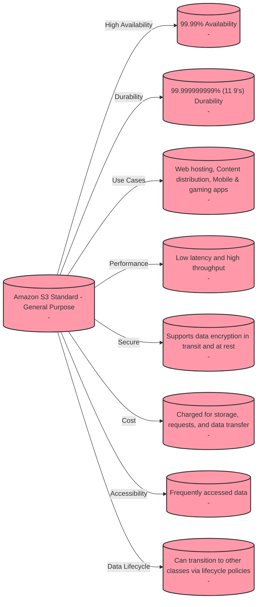


## Amazon S3 Standard-IA

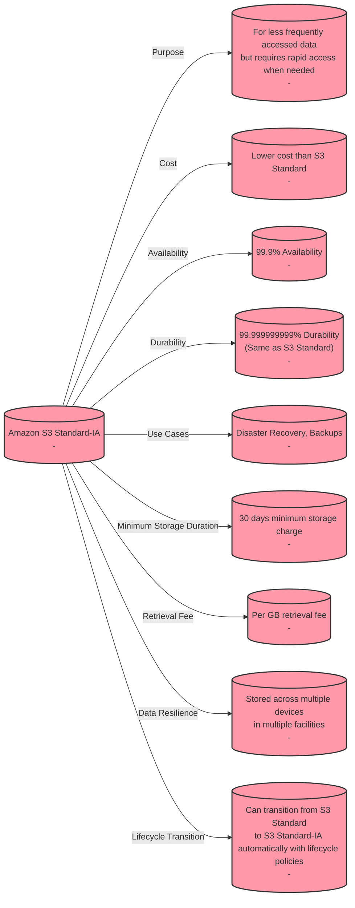


## Amazon S3 One Zone-IA

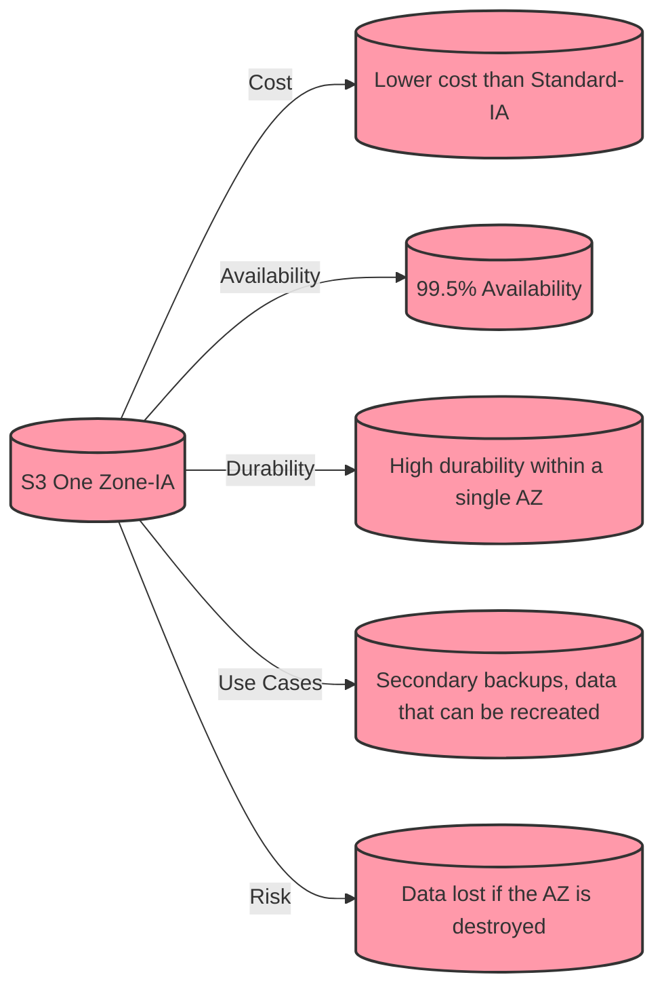

## Amazon S3 One Zone-IA

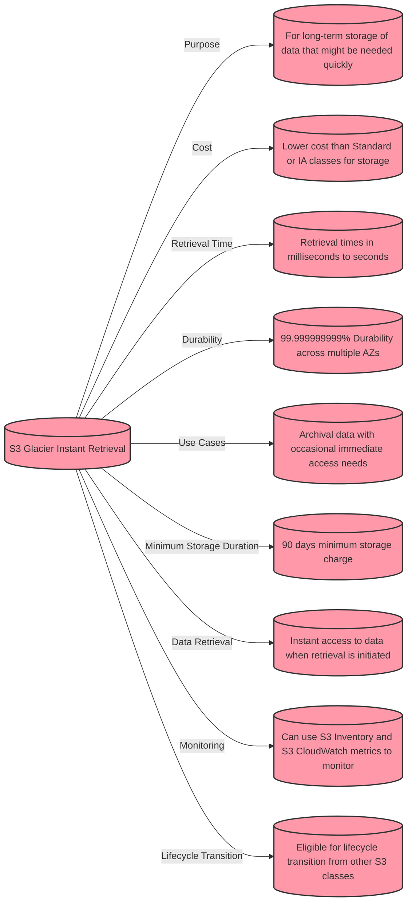

## Amazon S3 Glacier Flexible Retrieval

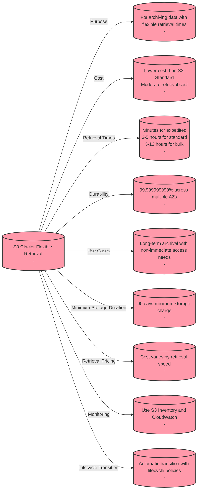

## Amazon S3 Glacier Deep Archive

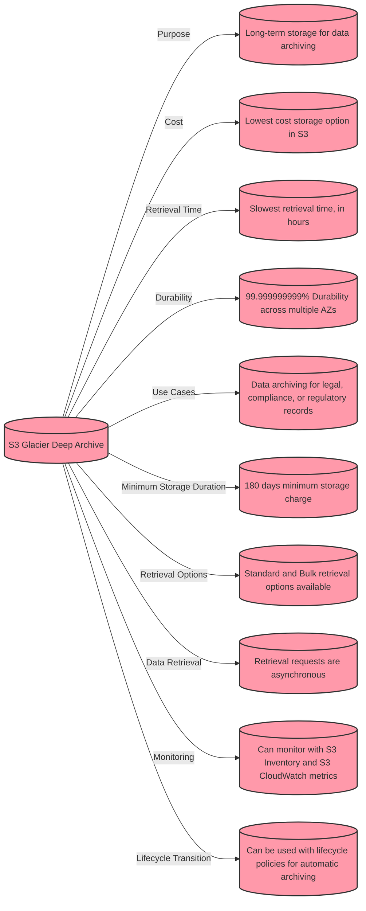

## Amazon S3 Intelligent-Tiering

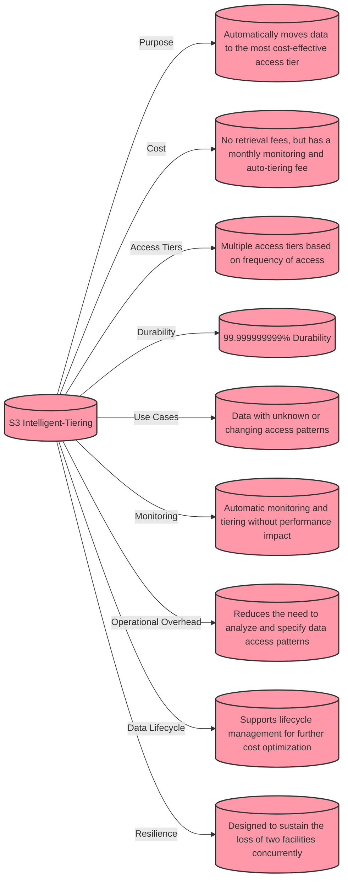

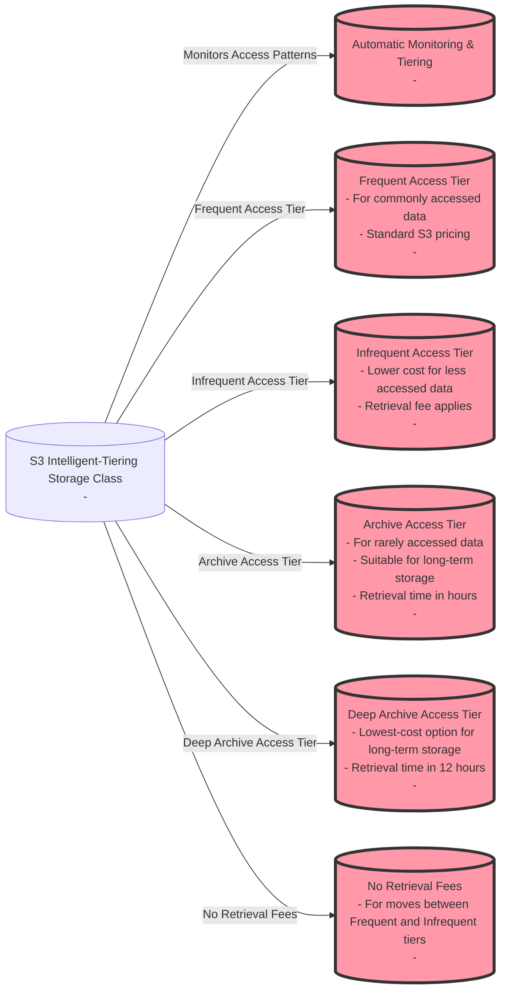


| Feature                          | S3 Standard     | S3 Standard-IA  | S3 One Zone-IA  | S3 Glacier Instant Retrieval | S3 Glacier Flexible Retrieval | S3 Glacier Deep Archive | S3 Intelligent-Tiering |
|----------------------------------|-----------------|-----------------|-----------------|------------------------------|-------------------------------|-------------------------|------------------------|
| Designed For                     | General purpose | Infrequently accessed data | Infrequently accessed data, single AZ | Archival data with immediate access | Archival data with flexible access | Long-term archival data | Data with unknown or changing access patterns |
| Durability                       | 99.999999999%   | 99.999999999%   | 99.999999999%   | 99.999999999%                | 99.999999999%                 | 99.999999999%           | 99.999999999%          |
| Availability                     | 99.99%          | 99.9%           | 99.5%           | -                            | -                             | -                       | -                      |
| Minimum Storage Duration         | None            | 30 days         | 30 days         | 90 days                      | 90 days                       | 180 days                | None                   |
| Retrieval Time                   | Milliseconds    | Milliseconds    | Milliseconds    | Milliseconds to seconds      | Minutes to hours              | Hours to a day          | Milliseconds (auto-tiered) |
| Use Cases                        | Frequently accessed data | Data that is accessed less frequently, but requires rapid access when needed | Data that is accessed less frequently and can tolerate availability of only one AZ | Data that requires immediate access | Cost-effective storage for long-lived, infrequently accessed data | Archive data that is rarely accessed | Data with unpredictable access patterns |
| Lifecycle Transition             | Yes              | Yes              | Yes              | Yes                          | Yes                           | Yes                     | Yes                     |
| Cost                             | Higher           | Lower than Standard | Lower than Standard-IA | Higher than Flexible Retrieval | Lower than Instant Retrieval | Lowest of all options   | Varies based on access |


## Amazon S3 Lifecycle Rules

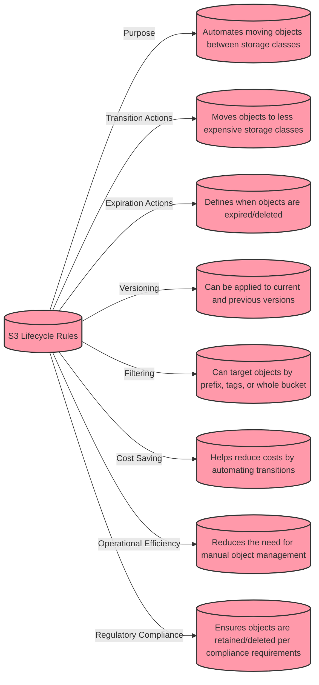


| Action Type   | Description                                                 | Use Case                           | Additional Notes                                         |
|---------------|-------------------------------------------------------------|------------------------------------|----------------------------------------------------------|
| Transition    | Moves objects between storage classes for cost savings.     | Access frequency changes over time.| Can transition to Standard-IA, One Zone-IA, Glacier, or Intelligent-Tiering. |
| Expiration    | Specifies when objects are to be deleted.                   | Compliance with data retention policies. | Can be used to delete old versions or incomplete multipart uploads. |
| Noncurrent Version Transition | Moves previous versions of objects to less expensive storage. | Versioning is enabled, and older versions are accessed less frequently. | Useful for versioned buckets to save costs on older data. |
| Noncurrent Version Expiration | Defines when noncurrent object versions should be deleted. | To comply with regulatory requirements for data lifecycle. | Helps manage the lifecycle of versioned objects. |
| Abort Incomplete Multipart Upload | Deletes multipart uploads that haven't been completed. | Multipart uploads that are started but not completed. | Prevents storage costs from accruing for incomplete uploads. |


## Amazon S3 Lifecycle Rules

```mermaid
graph LR;
S3RequesterPays[("S3 Requester Pays Model")]
S3RequesterPays -->|Definition| Definition[("Requesters bear the cost of data egress and requests.")]
S3RequesterPays -->|Use Case| UseCase[("Ideal for sharing large datasets with external entities.")]
S3RequesterPays -->|Authentication| Authentication[("Requesters must be authenticated AWS users.")]
S3RequesterPays -->|Owner Costs| OwnerCosts[("Bucket owner pays only for the storage of data.")]
S3RequesterPays -->|Requester Costs| RequesterCosts[("Requester pays for data requests and transfer.")]
S3RequesterPays -->|Bucket Configuration| BucketConfiguration[("Bucket must be configured to enable Requester Pays.")]
S3RequesterPays -->|API Identification| APIIdentification[("API operations must include a flag to indicate Requester Pays.")]
S3RequesterPays -->|Data Sharing| DataSharing[("Facilitates data sharing without owner incurring transfer costs.")]
S3RequesterPays -->|Anonymous Access| AnonymousAccess[("Anonymous access is not allowed with Requester Pays.")]

    classDef classSection fill:#f9a,stroke:#333,stroke-width:2px;
    class S3RequesterPays,Definition,UseCase,Authentication,OwnerCosts,RequesterCosts,BucketConfiguration,APIIdentification,DataSharing,AnonymousAccess classSection;

```
## Amazon S3 Event Notifications

```mermaid

graph LR;
S3EventNotifications[("S3 Event Notifications")]
S3EventNotifications -->|Purpose| Purpose[("To respond to changes in S3 objects")]
S3EventNotifications -->|Triggers| Triggers[("PUT, POST, COPY, DELETE, Multipart Upload events")]
S3EventNotifications -->|Delivery Methods| DeliveryMethods[("SNS, SQS, Lambda")]
S3EventNotifications -->|Use Cases| UseCases[("Process/analyze data, replicate objects, trigger workflows")]
S3EventNotifications -->|Configuration| Configuration[("Bucket level, can filter by object prefix/suffix")]
S3EventNotifications -->|Reliability| Reliability[("Delivers event notifications reliably and at scale")]
S3EventNotifications -->|Real-time Processing| RealTimeProcessing[("Enables real-time processing of changes")]
S3EventNotifications -->|Integration| Integration[("Integrates with AWS services for extended workflows")]
S3EventNotifications -->|Considerations| Considerations[("Understanding event structure, ensuring idempotency")]

    classDef classSection fill:#f9a,stroke:#333,stroke-width:2px;
    class S3EventNotifications,Purpose,Triggers,DeliveryMethods,UseCases,Configuration,Reliability,RealTimeProcessing,Integration,Considerations classSection;

```


## Amazon S3 baseline performance

```mermaid
graph LR;
S3[("Amazon S3")]
S3 -->|Scales Automatically| HighRequestRates[("High Request Rates")]
S3 -->|Latency| Latency[("100-200 ms")]
S3 -->|Performance| Performance[("3,500 PUT/COPY/POST/DELETE requests/s per prefix")]
S3 -->|More Performance| MorePerformance[("5,500 GET/HEAD requests/s per prefix")]
S3 -->|No Prefix Limit| NoPrefixLimit[("No limits on number of prefixes")]

    HighRequestRates -->|Distributed Prefixes| DistributedPrefixes[("Distribute requests across prefixes for higher performance")]

    DistributedPrefixes -->|Example| Example1[("bucket/folder1/sub1/file")]
    DistributedPrefixes -->|Example| Example2[("bucket/folder1/sub2/file")]
    DistributedPrefixes -->|Example| Example3[("bucket/1/file")]
    DistributedPrefixes -->|Example| Example4[("bucket/2/file")]

    DistributedPrefixes -->|Aggregated Performance| AggregatedPerformance[("22,000 GET/HEAD requests/s when evenly spread across 4 prefixes")]

    classDef classSection fill:#f9a,stroke:#333,stroke-width:2px;
    class S3,HighRequestRates,Latency,Performance,MorePerformance,NoPrefixLimit,DistributedPrefixes,AggregatedPerformance classSection;
```

## Amazon S3 baseline performance

```mermaid
graph LR;
A[S3 Performance Features]
A -->|Multi-Part Upload| B[Multi-Part Upload]
B -->|Recommended for| B1[Files > 100MB]
B -->|Required for| B2[Files > 5GB]
B -->|Benefits| B3[Parallel Uploads]
A -->|S3 Transfer Acceleration| C[S3 Transfer Acceleration]
C -->|Function| C1[Uses AWS Edge Locations]
C -->|Benefits| C2[Increases Transfer Speed]
C -->|Compatibility| C3[Works with Multi-Part Upload]

    classDef classSection fill:#f9a,stroke:#333,stroke-width:2px;
    class A,B,C,B1,B2,B3,C1,C2,C3 classSection;

```

## Amazon S3 Byte-Range Fetches

```mermaid
graph LR;
S3ByteRangeFetches[S3 Byte-Range Fetches]
S3ByteRangeFetches -->|Parallelize GETs| ParallelizeGETs[Parallel GET requests by byte ranges]
S3ByteRangeFetches -->|Resilience| Resilience[Better resilience in case of failures]
S3ByteRangeFetches -->|Speed Up Downloads| SpeedUpDownloads[Can speed up downloads]
S3ByteRangeFetches -->|Partial Retrieval| PartialRetrieval[Retrieve only partial data, e.g., file header]

    ParallelizeGETs -->|Example| Example[File is divided into Part 1, Part 2, ..., Part N]
    PartialRetrieval -->|Use Case| UseCase[Retrieving the head of a file, such as the first XX bytes]

    classDef classSection fill:#f9a,stroke:#333,stroke-width:2px;
    class S3ByteRangeFetches,ParallelizeGETs,Resilience,SpeedUpDownloads,PartialRetrieval,Example,UseCase classSection;
```

## Amazon S3 Select & Glacier Select

```mermaid
graph LR
    S3SelectGlacierSelect[S3 Select & Glacier Select]
    ServerSideFiltering[Server-Side Filtering]
    RetrieveLessData[Retrieve Less Data Using SQL]
    FilterRowsColumns[Can Filter by Rows & Columns]
    LessNetworkTransfer[Less Network Transfer]
    LessCPUClientSide[Less CPU Cost Client-Side]
    FasterCheaper[Up to 400% Faster & Up to 80% Cheaper]
    CSVFile[Get CSV with S3 Select]
    SendFilteredDataset[Send Filtered Dataset]

    S3SelectGlacierSelect -->|Retrieve less data| RetrieveLessData
    S3SelectGlacierSelect -->|Filtering| FilterRowsColumns
    S3SelectGlacierSelect -->|Performance boost| FasterCheaper
    FasterCheaper -->|Server-side filtering| ServerSideFiltering
    ServerSideFiltering -->|Less data transfer| LessNetworkTransfer
    ServerSideFiltering -->|Less CPU usage client-side| LessCPUClientSide
    ServerSideFiltering -->|Retrieve specific file parts| CSVFile
    CSVFile -->|Send to client| SendFilteredDataset

```

## Amazon S3 Batch Operations

```mermaid
graph TB
subgraph "Amazon S3 Batch Operations"
inv[S3 Inventory] -->|Generate object listings| select[S3 Select]
select -->|Filter objects based on queries| batchOps[Batch Operations]
batchOps -->|Perform specified actions on objects| manage[Manage Retries & Track Progress]
manage --> notif[Completion Notifications]
manage --> reports[Generate Reports]
end
user[User] -->|Initiates Batch Job| batchOps
user -->|Sets up| inv
user -->|Defines filtering criteria| select
batchOps -->|Processes| objs[Processed Objects]
objs -->|Result| user
notif -->|Inform user| user
reports -->|Detailed job report| user

    subgraph "Actions Performed by Batch Operations"
        copy[Copy Objects]
        encrypt[Encrypt Objects]
        tag[Modify Tags]
        restore[Restore from Glacier]
        lambda[Invoke Lambda]
    end
    
    batchOps --> copy
    batchOps --> encrypt
    batchOps --> tag
    batchOps --> restore
    batchOps --> lambda

```

## Amazon S3 Object Encryption

```mermaid
graph TD
A[Amazon S3 Object Encryption]
A -->|Server-Side Encryption| B(SSE-S3)
B -->|AWS Managed Keys| F
A -->|Server-Side Encryption| C(SSE-KMS)
C -->|AWS KMS Managed Keys| G
A -->|Server-Side Encryption| D(SSE-C)
D -->|Customer Managed Keys| H
A -->|Client-Side Encryption| E
E -->|Client manages encryption process| I

```

## Amazon S3 Encryption

```mermaid
graph LR
A[Amazon S3 Encryption] --> B[Server-Side Encryption]
B --> C[SSE-S3]
C --> D[Key Management]
D --> E[S3-Managed Keys]
E --> F[Automatic Encryption]
C --> G[Data at Rest Protection]
C --> H[Transparent to User]
C --> I[Integration with AWS Services]
I --> J[AWS CloudTrail]
I --> K[AWS IAM Policies]
C --> L[Encryption Strength]
L --> M[256-bit AES]
C --> N[Access Control]
N --> O[Object Level Permissions]
N --> P[Bucket Policies]
C --> Q[Performance Impact]
Q --> R[Minimal Overhead]
C --> S[Cost Implications]
S --> T[No Additional Cost]
C --> U[HTTP Headers]
U --> V[x-amz-server-side-encryption: AES256]
U --> W[Not Used: x-amz-server-side-encryption-aws-kms-key-id]
U --> X[Response Header: x-amz-server-side-encryption]

    style A fill:#f9f,stroke:#333,stroke-width:2px
    style B fill:#ccf,stroke:#333,stroke-width:2px
    style C fill:#ccf,stroke:#f66,stroke-width:2px,dashed
    style U fill:#cff,stroke:#333,stroke-width:2px
```

## Amazon S3 Server-Side Encryption with KMS Keys SSE-KMS

```mermaid

graph LR
A[Server-Side Encryption with KMS Keys SSE-KMS] --> B[Encryption Method]
B --> C[Server-Side Encryption in AWS]
C --> D[AWS Key Management Service KMS]

    A --> E[KMS Advantages]
    E --> F[Audit with AWS CloudTrail]
    E --> G[Additional Control and Security]

    A --> H[Encryption Process]
    H --> I[Upload Object to S3 Bucket]
    I --> J["Include Header 'x-amz-server-side-encryption:aws:kms'"]

    A --> K[Encryption Keys]
    K --> L[Default Service-Managed Keys]
    K --> M[Customer-Managed Keys]
    M --> N[More Control and Auditing]

    A --> O[AES-256 Encryption]
    O --> P[Strong Encryption Standard]
    O --> Q[Securely Protects Data]

    style A fill:#f9f,stroke:#333,stroke-width:2px
    style B fill:#ccf,stroke:#333,stroke-width:2px
    style E fill:#ccf,stroke:#333,stroke-width:2px
    style H fill:#ccf,stroke:#333,stroke-width:2px
    style K fill:#ccf,stroke:#333,stroke-width:2px
    style O fill:#ccf,stroke:#333,stroke-width:2px
```

## Amazon S3 SSE-KMS Limitations for Amazon S3

```mermaid
graph LR
A[SSE-KMS Limitations for Amazon S3] --> B[KMS Limits Impact]
B --> C[Throughput Limits on Encryption/Decryption]
C --> D[Constrained Frequency and Volume]

    A --> E[API Calls for Upload/Download]
    E --> F[Upload: Call GenerateDataKey API]
    E --> G[Download: Call Decrypt API]

    A --> H[KMS Quota per Second]
    H --> I[Cap on Requests]
    I --> J[Varies by Region e.g., 5500, 10000, 30000 req/sec]

    A --> K[Quota Increase Requests]
    K --> L[Request via AWS Service Quotas Console]

    style A fill:#f9f,stroke:#333,stroke-width:2px
    style B fill:#ccf,stroke:#333,stroke-width:2px
    style E fill:#ccf,stroke:#333,stroke-width:2px
    style H fill:#ccf,stroke:#333,stroke-width:2px
    style K fill:#ccf,stroke:#333,stroke-width:2px
```

## Amazon Limitations of SSE-KMS for Amazon S3

```mermaid
graph LR
A[Limitations of SSE-KMS for Amazon S3] --> B[KMS Limits Impact]
B --> C[Throughput Limits]
C --> D[Constrains Frequency & Volume of Operations]

    A --> E[API Calls for Operations]
    E --> F[GenerateDataKey for Upload]
    E --> G[Decrypt for Download]

    A --> H[KMS Quota per Second]
    H --> I[Cap on KMS Requests]
    I --> J[Varies by Region]
    J --> K[Example Quotas: 5500, 10000, 30000 req/sec]

    A --> L[Handling Quota Limitations]
    L --> M[Quota Increase Requests]
    M --> N[Via AWS Service Quotas Console]
    L --> O[Optimizing Application Design]

    style A fill:#f9f,stroke:#333,stroke-width:2px
    style B fill:#ccf,stroke:#333,stroke-width:2px
    style E fill:#ccf,stroke:#333,stroke-width:2px
    style H fill:#ccf,stroke:#333,stroke-width:2px
    style L fill:#ccf,stroke:#333,stroke-width:2px

```


## Amazon S3 Server-Side Encryption with Customer-Provided Keys SSE-C

```mermaid
graph LR
A[Server-Side Encryption with Customer-Provided Keys SSE-C] --> B[Customer-Managed Keys]
B --> C[Customer Responsibility]
C --> D[Key Management: Generation, Storage, Rotation, Deletion]

    A --> E[No Storage of Keys by Amazon S3]
    E --> F[Keys Not Stored by S3]
    F --> G[Customer Retains Complete Control]

    A --> H[HTTPS Requirement]
    H --> I[Mandatory for SSE-C]
    I --> J[Secure Transmission of Keys]

    A --> K[Key in HTTP Headers]
    K --> L[Include in Every HTTP Request]
    L --> M[Applies to Upload and Download Operations]

    style A fill:#f9f,stroke:#333,stroke-width:2px
    style B fill:#ccf,stroke:#333,stroke-width:2px
    style E fill:#ccf,stroke:#333,stroke-width:2px
    style H fill:#ccf,stroke:#333,stroke-width:2px
    style K fill:#ccf,stroke:#333,stroke-width:2px

```


## Amazon S3 Client-Side Encryption

```mermaid

graph LR
A[Amazon S3 Client-Side Encryption] --> B[Client Libraries]
B --> C[Amazon S3 Client-Side Encryption Library]

    A --> D[Encryption and Decryption by Client]
    D --> E[Encrypt Before Sending to S3]
    D --> F[Decrypt When Retrieving from S3]

    A --> G[Customer-Managed Keys]
    G --> H[Responsibility for Lifecycle]
    H --> I[Creation, Rotation, Deletion]

    A --> J[Encryption Process]
    J --> K[Combine File with Client Key]
    K --> L[Upload Encrypted Data to S3]
    L --> M[Decrypt File After Retrieval]

    style A fill:#f9f,stroke:#333,stroke-width:2px
    style B fill:#ccf,stroke:#333,stroke-width:2px
    style D fill:#ccf,stroke:#333,stroke-width:2px
    style G fill:#ccf,stroke:#333,stroke-width:2px
    style J fill:#ccf,stroke:#333,stroke-width:2px
```


## Amazon S3 Enforcing Encryption in Amazon S3

```mermaid
graph LR
A[Enforcing Encryption in Amazon S3] --> B[Using Bucket Policies]
B --> C[JSON Document Defining Permissions]
C --> D[Deny PutObject without AES-256 Encryption]
D --> E[Forces Encryption by Denying Unencrypted Uploads]

    A --> F[Using Default Encryption]
    F --> G[Bucket-Level Setting]
    G --> H[Automatically Encrypts New Objects]
    H --> I[No Need for Encryption in PUT Request]

    A --> J[Important Note]
    J --> K[Bucket Policies Precede Default Encryption]
    K --> L[Policy Evaluated Before Encryption Setting]
    L --> M[Policy Denial Overrides Default Encryption]

    style A fill:#f9f,stroke:#333,stroke-width:2px
    style B fill:#ccf,stroke:#333,stroke-width:2px
    style F fill:#ccf,stroke:#333,stroke-width:2px
    style J fill:#ccf,stroke:#333,stroke-width:2px
```

## Amazon S3 CORS

```mermaid
graph LR
A[Amazon S3 CORS] --> B[CORS Overview]
B --> C[Allows Cross-Origin Requests]
C --> D[Resource Sharing Between Different Domains]

    A --> E[CORS Configuration]
    E --> F[Defined in a CORS Rule]
    F --> G[Set in S3 Bucket Policy]

    A --> H[Key CORS Headers]
    H --> I[Access-Control-Allow-Origin]
    H --> J[Access-Control-Allow-Methods]
    H --> K[Access-Control-Allow-Headers]
    H --> L[Access-Control-Max-Age]

    A --> M[Use Cases]
    M --> N[Web Applications Accessing S3]
    M --> O[Loading Assets Across Domains]

    A --> P[Security Considerations]
    P --> Q[Control Access via Origins]
    P --> R[Specify Allowed Methods and Headers]

    style A fill:#f9f,stroke:#333,stroke-width:2px
    style B fill:#ccf,stroke:#333,stroke-width:2px
    style E fill:#ccf,stroke:#333,stroke-width:2px
    style H fill:#ccf,stroke:#333,stroke-width:2px
    style M fill:#ccf,stroke:#333,stroke-width:2px
    style P fill:#ccf,stroke:#333,stroke-width:2px

```

## MFA in Amazon S3

```mermaid

graph LR
A[MFA in Amazon S3] --> B[Multi-Factor Authentication]
B --> C[Requires Two or More Verification Factors]
C --> D[Enhances Security for Accessing Resources]

    A --> E[Usage of MFA for S3 Operations]
    E --> F[Required for Critical Operations]
    F --> G[Permanently Deleting an Object Version]
    F --> H[Suspending Versioning on a Bucket]
    E --> I[Not Required for Regular Operations]
    I --> J[Enabling Versioning]
    I --> K[Listing Deleted Versions of Files]

    A --> L[Bucket Owner's Permissions]
    L --> M[Only Root Account Can Enable/Disable MFA Delete]

    A --> N[Versioning Requirement]
    N --> O[Versioning Must Be Enabled for MFA Delete]
    O --> P[Keeps Track of All Object Versions]

    style A fill:#f9f,stroke:#333,stroke-width:2px
    style B fill:#ccf,stroke:#333,stroke-width:2px
    style E fill:#ccf,stroke:#333,stroke-width:2px
    style L fill:#ccf,stroke:#333,stroke-width:2px
    style N fill:#ccf,stroke:#333,stroke-width:2px
```

## Amazon S3 Access Logs

```mermaid

graph LR
A[Amazon S3 Access Logs] --> B[Auditing Purposes]
B --> C[Record All Requests]
C --> D[GET, PUT, POST, DELETE]

    A --> E[Log Storage]
    E --> F[Stored in a Different S3 Bucket]
    F --> G[Separate Logs from Data]

    A --> H[Data Analysis]
    H --> I[Analyze Using Data Analysis Tools]
    I --> J[Useful for Security, Resource Tracking, User Behavior]

    A --> K[Regional Considerations]
    K --> L[Store Logs in Same AWS Region]

    A --> M[Log Format Documentation]
    M --> N[Available in AWS Documentation]

    A --> O[Warning: S3 Access Logs]
    O --> P[Do Not Log to Same Bucket]
    P --> Q[Prevent Logging Loop]
    Q --> R[Exponential Growth and Costs]

    style A fill:#f9f,stroke:#333,stroke-width:2px
    style B fill:#ccf,stroke:#333,stroke-width:2px
    style E fill:#ccf,stroke:#333,stroke-width:2px
    style H fill:#ccf,stroke:#333,stroke-width:2px
    style K fill:#ccf,stroke:#333,stroke-width:2px
    style M fill:#ccf,stroke:#333,stroke-width:2px
    style O fill:#ccf,stroke:#333,stroke-width:2px

```

## Amazon S3 Pre-Signed URLs

```mermaid
graph LR
A[Amazon S3 Pre-Signed URLs] --> B[Generation of Pre-Signed URLs]
B --> C[Using S3 Console, AWS CLI, AWS SDK]
C --> D[Specify Expiration Time]

    A --> E[URL Expiration]
    E --> F[1 to 720 minutes via S3 Console]
    E --> G[Up to 604800 seconds via AWS CLI]

    A --> H[Inheritance of Permissions]
    H --> I[Based on User's Permissions]
    I --> J[Allows GET/PUT Operations]

    A --> K[Use Cases]
    K --> L[Download Premium Content from Private Bucket]
    K --> M[Temporary Links for Changing User Lists]
    K --> N[Grant Temporary Upload Permissions]

    style A fill:#f9f,stroke:#333,stroke-width:2px
    style B fill:#ccf,stroke:#333,stroke-width:2px
    style E fill:#ccf,stroke:#333,stroke-width:2px
    style H fill:#ccf,stroke:#333,stroke-width:2px
    style K fill:#ccf,stroke:#333,stroke-width:2px

```

## Amazon S3 Glacier Vault Lock

```mermaid
graph LR
A[S3 Glacier Vault Lock] --> B[WORM Model]
B --> C[Write Once Read Many]
C --> D[Prevents Data Alteration, Allows Multiple Reads]

    A --> E[Vault Lock Policy]
    E --> F[Defines Actions Permitted on Data]
    F --> G[Immutable Once Locked]

    A --> H[Policy Lock]
    H --> I[Review and Alteration Period]
    I --> J[Lock Policy to Make Immutable]

    A --> K[Compliance and Data Retention]
    K --> L[Meets Regulatory Requirements]
    L --> M[SEC, FINRA, HIPAA, etc.]

    style A fill:#f9f,stroke:#333,stroke-width:2px
    style B fill:#ccf,stroke:#333,stroke-width:2px
    style E fill:#ccf,stroke:#333,stroke-width:2px
    style H fill:#ccf,stroke:#333,stroke-width:2px
    style K fill:#ccf,stroke:#333,stroke-width:2px

```


## Amazon S3 Object Lock Feature

```mermaid
graph LR
A[S3 Object Lock Feature] --> B[WORM Model]
B --> C[Write Once Read Many]
C --> D[Ensures Data Immutability]

    A --> E[Versioning Requirement]
    E --> F[Must Be Enabled on S3 Bucket]

    A --> G[Retention Modes]
    G --> H[Compliance Mode]
    H --> I[Locked Object Can't Be Changed or Deleted]
    G --> J[Governance Mode]
    J --> K[Permissions to Override Lock Settings]

    A --> L[Retention Period]
    L --> M[Fixed or Extendable Duration]
    M --> N[Not Shortenable in Compliance Mode]

    A --> O[Legal Hold]
    O --> P[Protection Regardless of Retention Period]
    P --> Q[Placed/Removed with Appropriate IAM Permission]

    style A fill:#f9f,stroke:#333,stroke-width:2px
    style B fill:#ccf,stroke:#333,stroke-width:2px
    style E fill:#ccf,stroke:#333,stroke-width:2px
    style G fill:#ccf,stroke:#333,stroke-width:2px
    style L fill:#ccf,stroke:#333,stroke-width:2px
    style O fill:#ccf,stroke:#333,stroke-width:2px
```

## Amazon S3 Object Lambda

```mermaid
graph LR
A[S3 Object Lambda] --> B[Use AWS Lambda Functions]
B --> C[Transform Data on Retrieval]
C --> D[Manipulate Data for Caller Application]

    A --> E[Only One S3 Bucket Needed]
    E --> F[Create S3 Access Points]
    F --> G[Manage Access and Transformations]

    A --> H[Use Cases]
    H --> I[Redacting PII]
    H --> J[Converting Data Formats]
    H --> K[Resizing and Watermarking Images]

    A --> L[Process Flow in AWS Cloud]
    L --> M[Original Object Requested]
    L --> N[Redacted Object for Analytics]
    N --> O[Redacting Lambda Function]
    L --> P[Enriched Object for Marketing]
    P --> Q[Enriching Lambda Function]

    style A fill:#f9f,stroke:#333,stroke-width:2px
    style B fill:#ccf,stroke:#333,stroke-width:2px
    style E fill:#ccf,stroke:#333,stroke-width:2px
    style H fill:#ccf,stroke:#333,stroke-width:2px
    style L fill:#ccf,stroke:#333,stroke-width:2px
```
| Feature                                  | S3 Access Points                                        | S3 Object Lambda Access Points                                                                 |
|------------------------------------------|---------------------------------------------------------|-------------------------------------------------------------------------------------------------|
| **Functionality**                        | Provide a way to manage access to shared data sets.      | Add custom processing to data retrieved from S3 using AWS Lambda functions.                     |
| **Data Processing**                      | No data processing, only access control.                | Can transform or process data as it is retrieved, e.g., data filtering, transformation.         |
| **Access Control**                       | Fine-grained access control policies.                   | Inherits access control from underlying S3 Access Point.                                        |
| **Integration**                          | Integrated with IAM for user/group access management.   | Integrated with AWS Lambda for executing functions on data retrieval.                           |
| **Use Case**                             | Ideal for managing access for different user groups.    | Suitable for scenarios requiring real-time data processing during retrieval.                    |
| **Configuration Complexity**             | Relatively simpler to set up.                           | Requires Lambda function setup and configuration in addition to access point setup.             |
| **Performance**                          | Direct access to S3 objects without additional latency. | Additional latency due to Lambda function execution.                                            |
| **Cost Implications**                    | Standard S3 access costs.                               | Additional costs for Lambda execution on top of standard S3 access costs.                       |
| **DNS Naming**                           | Each access point has its own DNS name.                 | Each Object Lambda Access Point has its own DNS name.                                           |
| **Policy Management**                    | One policy per access point.                            | Policy defined in Lambda function, along with the S3 Access Point policy.                       |
| **Typical Scenarios**                    | Restricting access based on user roles, data subsets.   | Data format conversion, redaction of sensitive information, image processing on the fly.        |


| Feature                       | S3 Bucket Policies                                | Amazon S3 Access Points                        |
|-------------------------------|---------------------------------------------------|-----------------------------------------------|
| **Scope**                     | Applied at the bucket level.                      | Applied at the access point level.            |
| **Use Case**                  | Broad control over the entire bucket.             | Fine-grained control for specific use cases.  |
| **Policy Complexity**         | Can become complex for large-scale applications.  | Simplifies management with focused policies.  |
| **Access Control**            | Governs all types of access to the bucket.        | Tailored to specific access patterns.         |
| **DNS Naming**                | Uses the bucket's DNS name.                       | Each access point has its own DNS name.       |
| **IAM Integration**           | Can be integrated with IAM policies.              | Direct association with specific IAM users/groups. |
| **Granularity**               | Less granular, governs bucket-wide permissions.   | More granular, governs specific access points.|
| **Best Suited For**           | General bucket-wide policies and rules.           | Specific scenarios, user groups, or data types. |
| **Ease of Management**        | Can be challenging with complex rules.            | Easier to manage due to isolated policies.    |
| **Typical Use Scenarios**     | General permissions for all users and applications. | Specific permissions for different groups or applications. |
