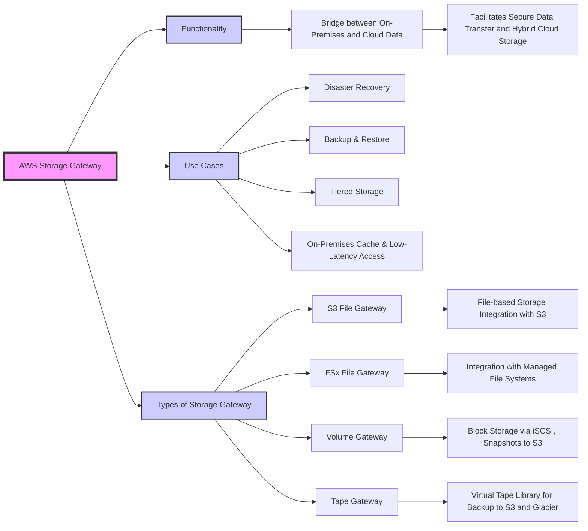
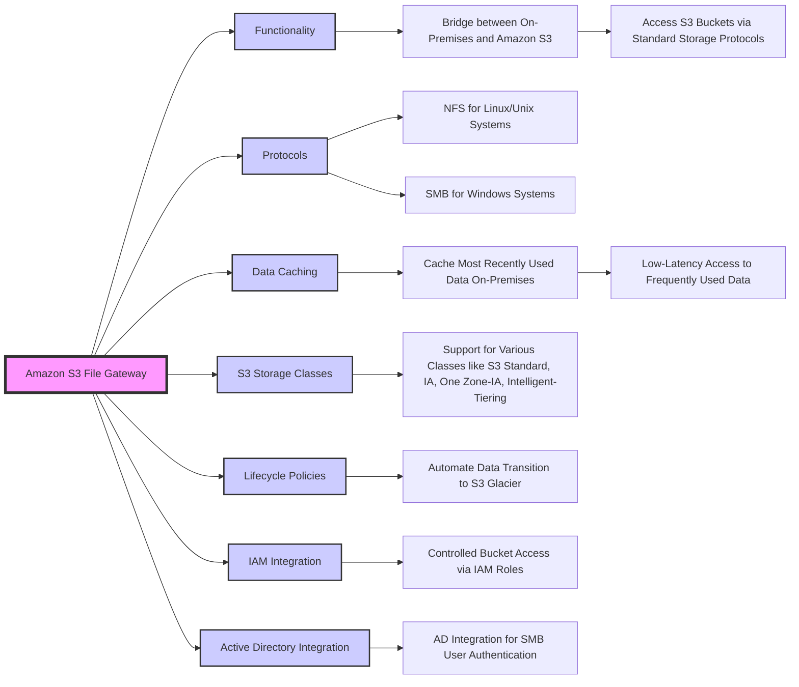
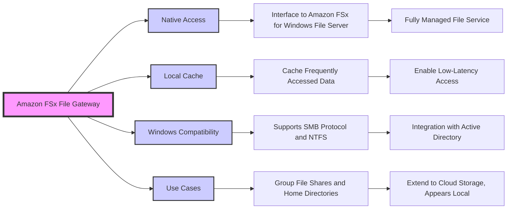
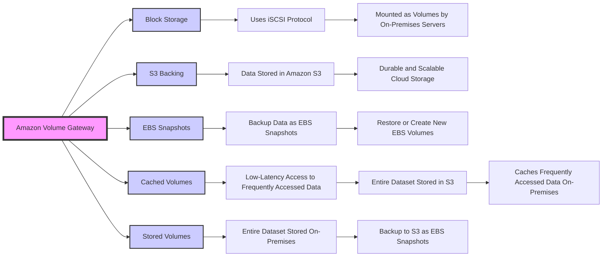
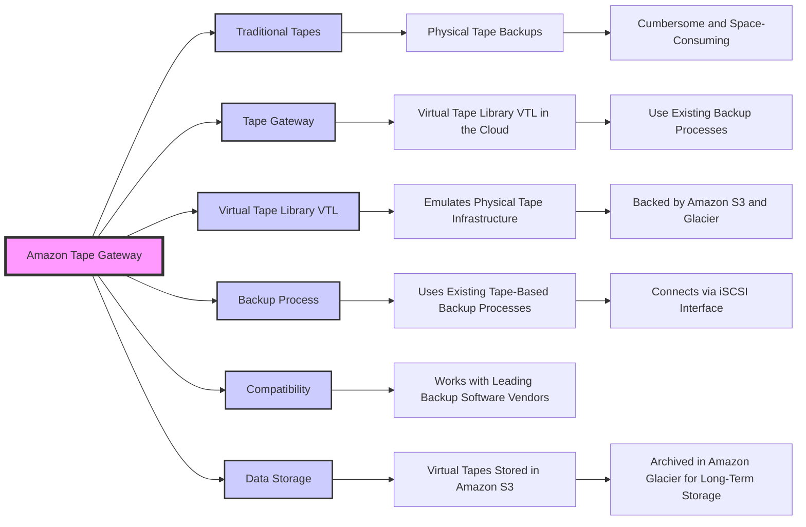
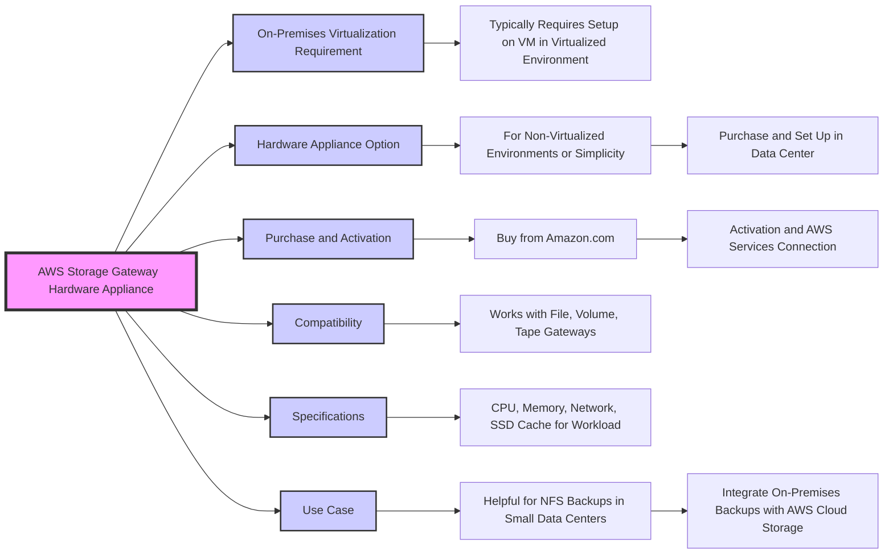
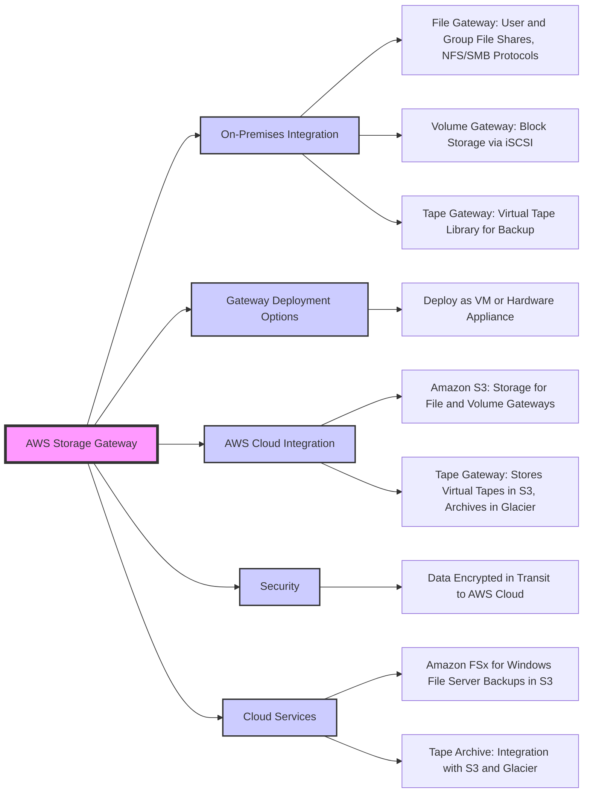
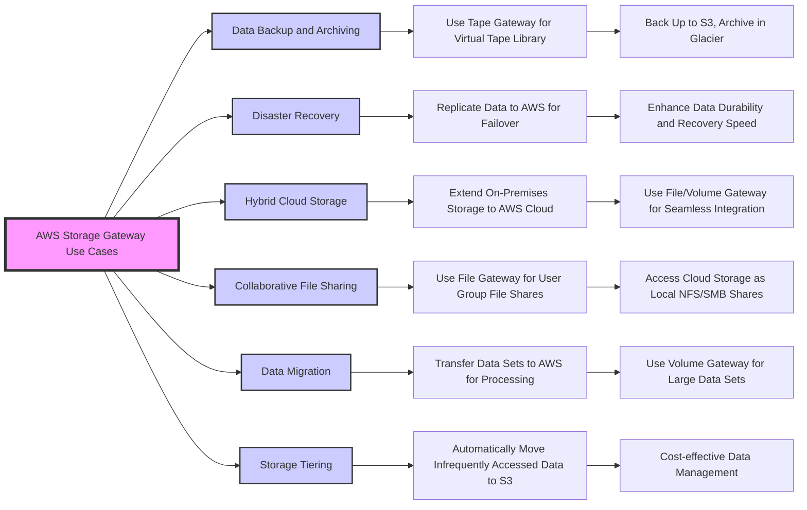

# AWS Storage Gateway

## Amazon S3 File Gateway

## Amazon FSx File Gateway

## Amazon Volume Gateway

## Amazon Tape Gateway

## AWS Storage Gateway  Hardware Appliance

## AWS Storage Gateway Appliance

## AWS Storage Gateway Use Cases

| Feature / Gateway Type | File Gateway                        | Volume Gateway                     | Tape Gateway                         |
|------------------------|-------------------------------------|------------------------------------|--------------------------------------|
| **Primary Use**        | Integrates with file-based storage. | Provides block storage volumes.    | Emulates a physical tape library.    |
| **Data Interface**     | NFS, SMB                            | iSCSI                              | iSCSI VTL                            |
| **AWS Storage Backend**| Amazon S3                           | Amazon S3, Amazon EBS Snapshots    | Amazon S3, Glacier, Glacier Deep Archive |
| **Local Cache**        | Yes, for frequently accessed files. | Yes, for frequently accessed data. | Yes, for virtual tapes.              |
| **Deployment**         | VM or hardware appliance.           | VM or hardware appliance.          | VM or hardware appliance.            |
| **Typical Use Cases**  | File shares, user/group directories.| Databases, ERP systems.            | Long-term backup and archiving.      |
| **Protocols**          | NFS/SMB for file shares.            | iSCSI for block storage.           | iSCSI for tape data access.         |
| **Backup Integration** | Works with existing file-based backup solutions. | Supports backup and snapshot features. | Compatible with existing tape-based backup systems. |
| **Encryption**         | Encryption in transit.              | Encryption in transit.             | Encryption in transit.               |
| **Data Management**    | Lifecycle policies, tiering to different S3 classes. | Snapshot management, EBS integration for backups. | Tape archiving, retrieval from Glacier. |
