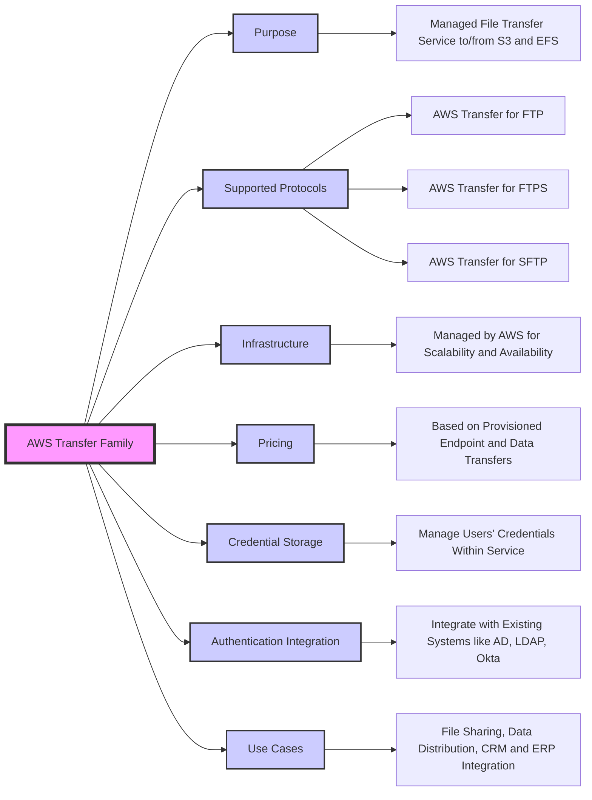

# AWS Transfer Family

```mermaid
graph LR
    A[AWS Transfer Family] --> B[Purpose]
    B --> C[Managed File Transfer Service to/from S3 and EFS]

    A --> D[Supported Protocols]
    D --> E[AWS Transfer for FTP]
    D --> F[AWS Transfer for FTPS]
    D --> G[AWS Transfer for SFTP]

    A --> H[Infrastructure]
    H --> I[Managed by AWS for Scalability and Availability]

    A --> J[Pricing]
    J --> K[Based on Provisioned Endpoint and Data Transfers]

    A --> L[Credential Storage]
    L --> M[Manage Users' Credentials Within Service]

    A --> N[Authentication Integration]
    N --> O[Integrate with Existing Systems like AD, LDAP, Okta]

    A --> P[Use Cases]
    P --> Q[File Sharing, Data Distribution, CRM and ERP Integration]

    style A fill:#f9f,stroke:#333,stroke-width:4px
    style B fill:#ccf,stroke:#333,stroke-width:2px
    style D fill:#ccf,stroke:#333,stroke-width:2px
    style H fill:#ccf,stroke:#333,stroke-width:2px
    style J fill:#ccf,stroke:#333,stroke-width:2px
    style L fill:#ccf,stroke:#333,stroke-width:2px
    style N fill:#ccf,stroke:#333,stroke-width:2px
    style P fill:#ccf,stroke:#333,stroke-width:2px


```

