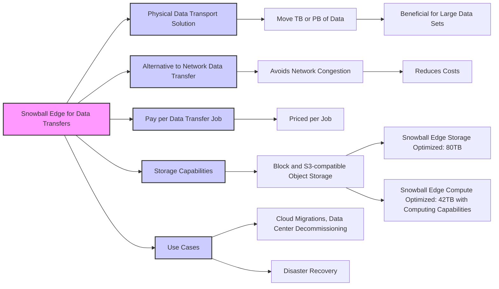
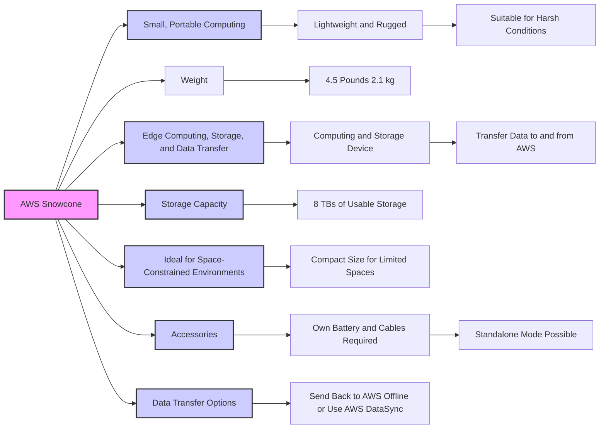
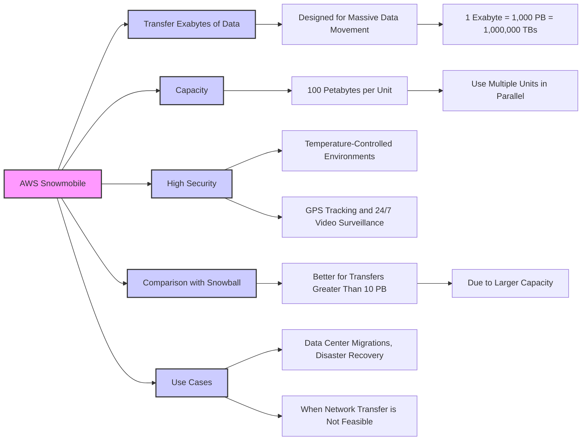
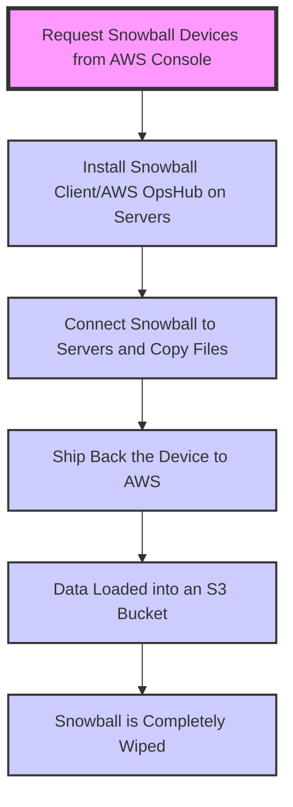
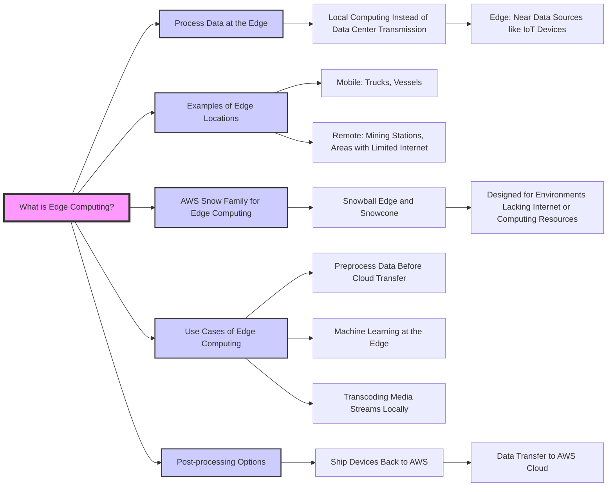
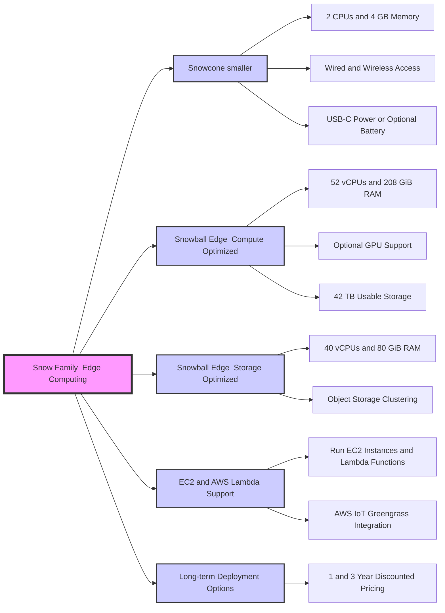
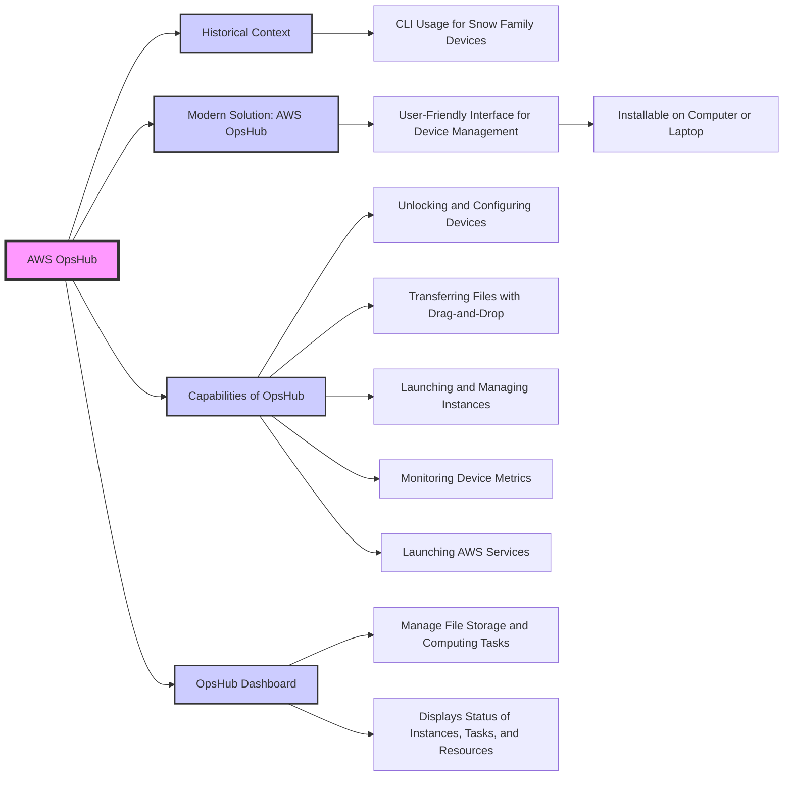
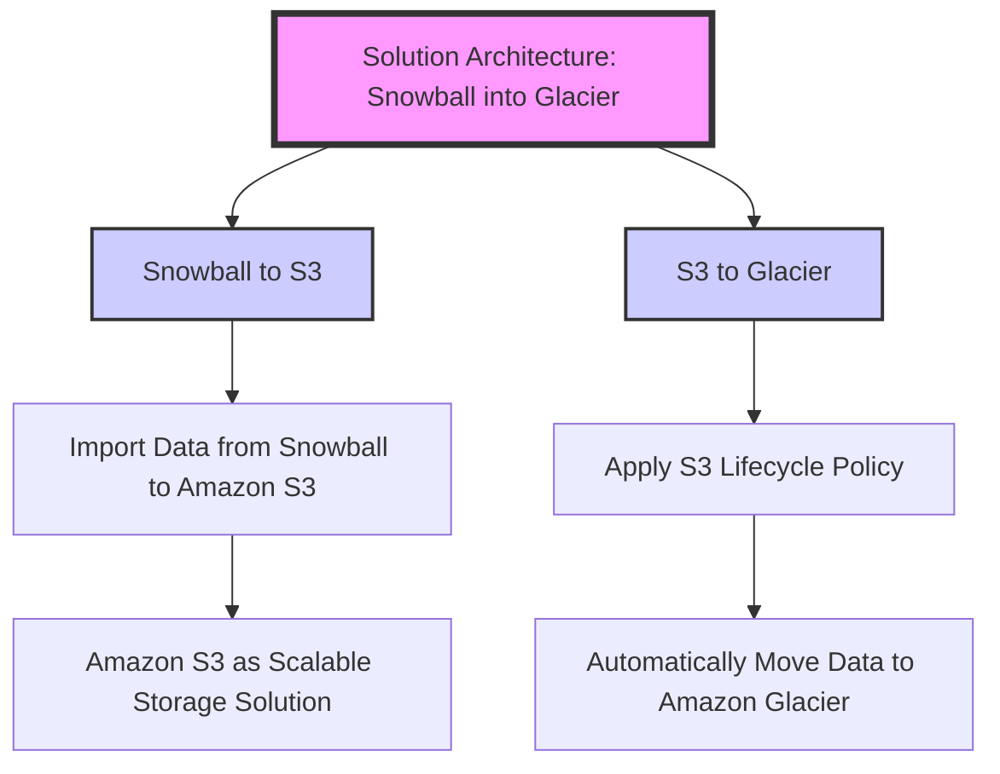

# Snow Family

## Snowball Edge

## AWS Snowcone

## AWS Snowmobile

| Feature | Snowball | Snowcone | Snowmobile |
|---------|----------|----------|------------|
| **Size and Portability** | Portable, but larger and heavier than Snowcone. | Small, light, and highly portable. | Massive, requires a 45-foot long shipping container and a truck for transportation. |
| **Data Capacity** | 50 TB or 80 TB options. | 8 TB of usable storage. | 100 PB per unit. |
| **Primary Use Case** | Data transfer for TBs of data, edge computing. | Edge computing, storage, data transfer in space-constrained environments. | Transferring extremely large datasets, such as exabytes of data. |
| **Data Transfer Method** | Physically shipped to and from AWS. | Physically shipped or can transfer data online using AWS DataSync. | Physically shipped on a truck. |
| **Computing Capabilities** | Compute-optimized and storage-optimized options available. | Limited computing capabilities. | Primarily for data transfer, no computing capabilities. |
| **Security** | AES-256 encryption, GPS tracking, and secure erasure. | Similar to Snowball with encryption and secure data erasure. | High security with temperature-controlled environment, GPS tracking, and 24/7 video surveillance. |
| **Ideal for** | Medium to large-scale data transfer and situations needing local compute power. | Use in remote, space-constrained environments, and for less data-intensive tasks. | Very large-scale data transfers like data center migrations or disaster recovery. |

## AWS Request Snowball Devices from AWS Console

## What is Edge Computing?

## Snow Family  Edge Computing

## AWS OpsHub

## Solution Architecture: Snowball into Glacier

